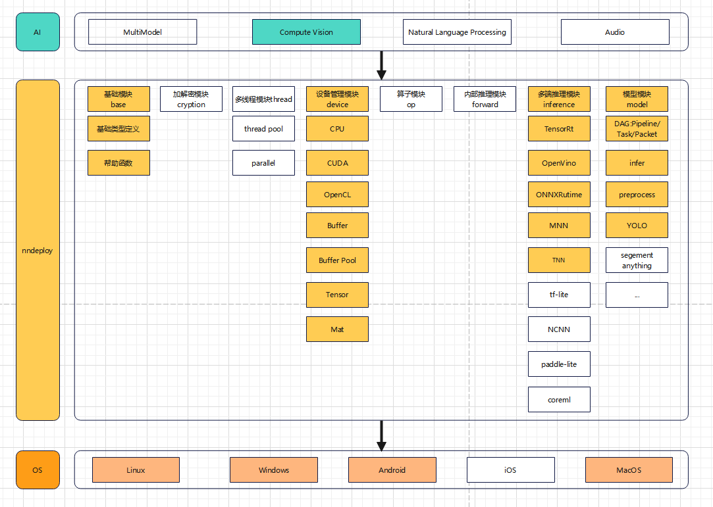

## 介绍
nndeploy是一款支持多平台、简单易用、高性能的机器学习部署框架，一套实现可在多端(云、边、端)完成模型的高性能部署。目前已完成YOLO系列模型的部署，后续会源源不断的去部署开源模型（如果你有需要部署的开源模型，可以联系我）

## 架构简介

注：未着色的为尚未实现

## 特性简介
### 支持多平台
支持的平台和推理框架如下表所示
|                      OS/Inference                       | Linux | Windows | Android | MacOS |  iOS  |                 开发人员                  | 备注  |
| :-----------------------------------------------------: | :---: | :-----: | :-----: | :---: | :---: | :---------------------------------------: | :---: |
|     [TensorRT](https://github.com/NVIDIA/TensorRT)      |  yes  |   yes   |   no    |  no   |  no   | [Always](https://github.com/Alwaysssssss) |       |
| [OpenVINO](https://github.com/openvinotoolkit/openvino) |  yes  |   yes   |   no    |  no   |  no   | [Always](https://github.com/Alwaysssssss) |       |
| [ONNXRuntime](https://github.com/microsoft/onnxruntime) |  yes  |   yes   |   no    |  no   |  no   | [Always](https://github.com/Alwaysssssss) |       |
|          [MNN](https://github.com/alibaba/MNN)          |  yes  |   no    |   yes   |  yes  |  no   | [Always](https://github.com/Alwaysssssss) |       |
|          [TNN](https://github.com/Tencent/TNN)          |  yes  |   no    |   yes   |  yes  |  no   | [02200059Z](https://github.com/02200059Z) |       |

## 直接可用的算法
|                       算法                       |               Inference               |                 开发人员                  | 备注  |
| :----------------------------------------------: | :-----------------------------------: | :---------------------------------------: | :---: |
| [YOLOV3](https://github.com/ultralytics/yolov3)  | TensorRt/OpenVINO/ONNXRuntime/MNN/TNN | [02200059Z](https://github.com/02200059Z) |       |
| [YOLOV5](https://github.com/ultralytics/yolov5)  | TensorRt/OpenVINO/ONNXRuntime/MNN/TNN | [02200059Z](https://github.com/02200059Z) |       |
|   [YOLOV6](https://github.com/meituan/YOLOv6)    | TensorRt/OpenVINO/ONNXRuntime/MNN/TNN | [Always](https://github.com/Alwaysssssss) |       |
|     [YOLOV8](https://github.com/ultralytics)     | TensorRt/OpenVINO/ONNXRuntime/MNN/TNN | [02200059Z](https://github.com/02200059Z) |       |
| [DETR](https://github.com/facebookresearch/detr) | TensorRt/OpenVINO/ONNXRuntime/MNN/TNN | [02200059Z](https://github.com/02200059Z) |       |

### 简单易用
- 通过切换推理配置，一套代码可在多端部署，算法接口简单易用
- 新增算法简单，将AI算法部署抽象为有向无环图Pipeline，前处理为一个节点Task，推理也为一个节点Task，后处理也为一个节点Task。提供了一组较为通用的前处理Task，通用的推理Infer，对于部署一个算法而言通常只需写一个特定后处理Task即可。对于多模型的算法而言，也可以将多个Pipeline组合成一个新的Pipeline。

### 高性能
- 具有各推理后端完全的配置的能力，不会因为对推理框架的抽象而带来性能损失
- 可直接操作理框架内部分配的输入输出，实现零拷贝（做了一部分）
- 多个模型可共享一份内存
- 线程池（TODO）
- 高性能的前后处理（做了一部分）

## 快速开始
[这里以YOLO检测模型为例](demo/detect/meituan_yolov6/demo.cc)
+ 创建YOLO推理Pipeline
  ```c++
  std::string name = "meituan_yolov6";  // 有向无环图Pipeline名称
  base::InferenceType inference_type = base::kInferenceTypeOpenVino; // 推理后端为OpenVINO
  // base::InferenceType inference_type = base::kInferenceTypeOnnxRuntime; // 推理后端为OnnxRuntime
  // base::InferenceType inference_type = base::kInferenceTypeTensorRt; // 推理后端为TensorRt
  base::DeviceType device_type = device::getDefaultHostDeviceType(); // 推理设备为Host(CPU/ARM/X86)
  // base::DeviceType device_type(base::kDeviceTypeCodeCuda); // 推理设备为CUDA:0
  bool is_path = true; // 模型存放方式为路径
  std::vector<std::string> model_value; // 模型文件存放路径
  model_value.push_back(
      "/home/always/github/public/nndeploy/model_zoo/model/meituan_yolov6/"
      "yolov6m.onnx");
  model::Packet input("detr_in"); // Pipeline的输入Packet，Packet不管理任何数据
  model::Packet output("detr_out"); // Pipeline的输出
  // 创建YoloV6 Pipeline
  model::Pipeline *pipeline = model::creatMeituanYolov6Pipeline(
      name, inference_type, device_type, &input, &output, true, model_value);
  if (pipeline == nullptr) {
    NNDEPLOY_LOGE("pipeline is nullptr");
    return -1;
  }
  ```
+ YOLO推理Pipeline初始化
  ```c++
  pipeline->init();
  ```
+ 给YOLO推理Pipeline写入输入输出
  ```c++
  cv::Mat input_mat =
      cv::imread("/home/always/github/YOLOv6/deploy/ONNX/OpenCV/sample.jpg"); // opencv读图
  input.set(input_mat); // 将图片设置进输入
  model::DetectResult result; // 检测网络的结果
  output.set(result); // 将检测网络的结果设置进输出
  ```
+ YOLO推理Pipeline运行
  ```c++
  pipeline->run();
  ```
+ YOLO推理Pipeline反初始化
  ```c++
  pipeline->deinit();
  ```
+ 释放YOLO推理Pipeline
  ```c++
  delete pipeline;
  ```

## 编译
+ 在根目录创建`build`目录，将`cmake/config.cmake`复制到该目录
  ```
  mkdir build
  cp cmake/config.cmake build
  cd build
  ```
+ 编辑`build/config.cmake`来定制编译选项
  + 将`set(ENABLE_NNDEPLOY_OPENCV OFF)`改为`set(ENABLE_NNDEPLOY_OPENCV PATH/linux/OpenCV)`，`nndeploy`会启用并链接`OpenCV`，如果你想启用并链接的其他第三方库，也是做同样的处理
  + 将`set(ENABLE_NNDEPLOY_DEVICE_CPU OFF)`改为`set(ENABLE_NNDEPLOY_DEVICE_CPU ON)`，`nndeploy`会启用`CPU`设备。如果你想启用其他设备（ARM、X86、CUDA …），也是做同样的处理
  + 将`set(ENABLE_NNDEPLOY_INFERENCE_ONNXRUNTIME OFF)`改为`set(ENABLE_NNDEPLOY_INFERENCE_ONNXRUNTIME "PATH/linux/onnxruntime-linux-x64-1.15.1")`，`nndeploy`会启用并链接推理后端`ONNXRuntime`。如果你想启用并链接其他推理后端（OpenVINO、TensorRT、TNN …），也是做同样的处理
  + `启用并链接第三方库有两种选择`
    + 开关`ON` - 当你安装了该库，并且可以通过find_package找到该库，可以采用该方式，例如CUDA、CUDNN、OpenCV、TenosrRT
    + 路径`PATH` - 头文件以及库的根路径，其形式必须为
      + 头文件：`PATH/include`
      + 库：`PATH/lib `
+ 开始`make nndeploy`库
  ```
  cmake ..
  make -j4
  ```
+ 安装，将nndeploy相关库可执行文件、第三方库安装至`build/install`
  ```
  make install
  ```

### 第三方库
|                        第三方库                         |  主版本  |                                          编译文档                                           |                            官方库下载链接                             |       备注       |
| :-----------------------------------------------------: | :------: | :-----------------------------------------------------------------------------------------: | :-------------------------------------------------------------------: | :--------------: |
|       [opencv](https://github.com/opencv/opencv)        |  4.8.0   |                           [链接](https://opencv.org/get-started/)                           |                [链接](https://opencv.org/get-started/)                |                  |
|     [TensorRT](https://github.com/NVIDIA/TensorRT)      | 8.6.0.12 |  [链接](https://docs.nvidia.com/deeplearning/tensorrt/install-guide/index.html#installing)  |                                [链接]                                 | 支持TensorRT 7， |
| [OpenVINO](https://github.com/openvinotoolkit/openvino) | 2023.0.1 |      [链接](https://github.com/openvinotoolkit/openvino/blob/master/docs/dev/build.md)      |                                [链接]                                 |                  |
| [ONNXRuntime](https://github.com/microsoft/onnxruntime) | v1.15.1  | [链接](https://github.com/DefTruth/lite.ai.toolkit/blob/main/docs/ort/ort_useful_api.zh.md) | [链接](https://github.com/microsoft/onnxruntime/releases/tag/v1.15.1) |                  |
|          [MNN](https://github.com/alibaba/MNN)          |  2.6.2   |            [链接](https://mnn-docs.readthedocs.io/en/latest/compile/engine.html)            |                                [链接]                                 |                  |
|          [TNN](https://github.com/Tencent/TNN)          |  v0.3.0  |          [链接](https://github.com/Tencent/TNN/blob/master/doc/cn/user/compile.md)          |      [链接](https://github.com/Tencent/TNN/releases/tag/v0.3.0)       |
|                                                         |
- 补充说明    
  - 我使用第三方库的上述版本，通常使用其他版本的也没有问题
  - TensorRT
    - [Windows链接](https://zhuanlan.zhihu.com/p/476679322)
    - 安装前请确保 显卡驱动、cuda、cudnn均已安装且版本一致

## 参考
- [TNN](https://github.com/Tencent/TNN)
- [FastDeploy](https://github.com/PaddlePaddle/FastDeploy)
- [mmdeploy](https://github.com/open-mmlab/mmdeploy)
- [opencv](https://github.com/opencv/opencv)
- [CGraph](https://github.com/ChunelFeng/CGraph)
- [tvm](https://github.com/apache/tvm)

## 联系方式
- 微信：titian5566 (备注：nndeploy + 姓名)