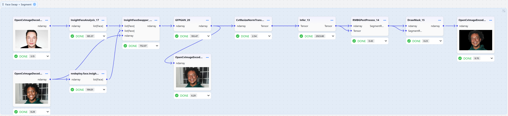
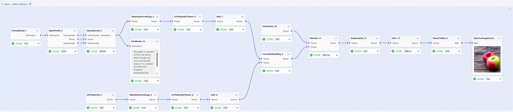
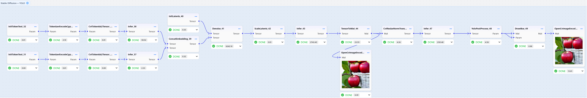

[简体中文](README_CN.md) | English

<h3 align="center">
Workflow-based Multi-platform AI Deployment Tool
</h3>

<p align="center">
<a href="https://github.com/nndeploy/nndeploy/actions/workflows/linux.yml">
  
</a>
 <a href="https://github.com/nndeploy/nndeploy/actions/workflows/windows.yml">
  
</a>
 <a href="https://github.com/nndeploy/nndeploy/actions/workflows/android.yml">
  
</a>
 <a href="https://github.com/nndeploy/nndeploy/actions/workflows/macos.yml">
  
</a>
 <a href="https://github.com/nndeploy/nndeploy/actions/workflows/ios.yml">
  
</a>
</p>

<p align="center">
<a href="https://nndeploy-zh.readthedocs.io/zh-cn/latest/"><b>Documentation</b></a> 
| <a href="docs/zh_cn/knowledge_shared/wechat.md"><b>WeChat</b></a> 
| <a href="https://www.zhihu.com/column/c_1690464325314240512"><b>Zhihu</b></a> 
| <a href="https://discord.gg/9rUwfAaMbr"><b>Discord</b></a> 
| <a href="https://www.bilibili.com/video/BV1HU7CznE39/?spm_id_from=333.1387.collection.video_card.click&vd_source=c5d7760172919cd367c00bf4e88d6f57"><b>Bilibili</b></a> 
| <a href="https://deepwiki.com/nndeploy/nndeploy"><b>Ask DeepWiki</b></a>
</p>


<p align="center">
  <picture>
    <source media="(prefers-color-scheme: dark)" srcset="docs/image/workflow.png">
    
  </picture>
</p>

---

## Latest Updates
- [2025/07/20] 🔥 **Visual Workflow**: Deploy AI algorithms through drag-and-drop interface
- [2025/07/20] 🔥 **Python API**: Quick start and convenient development ([Documentation](https://nndeploy-zh.readthedocs.io/zh-cn/latest/quick_start/python.html))
- [2025/05/29] 🔥 **Collaboration with Huawei Ascend Inference Framework Course**: Official certification with professional guidance ([Link](https://www.hiascend.com/developer/courses/detail/1923211251905150977))

---

## Quick Start

### Launch Visual Workflow
```bash
pip install nndeploy
nndeploy-app --port 8000
```

Access `http://localhost:8000` in your browser to get started

### Docs
- [How to Build](docs/zh_cn/quick_start/build.md)
- [How to Get Models](docs/zh_cn/quick_start/model.md)
- [How to Execute](docs/zh_cn/quick_start/example.md)
- [Python Quick Start](docs/zh_cn/quick_start/python.md)
- [Visual Workflow Quick Start](docs/zh_cn/quick_start/workflow.md)
- [C++ API](https://nndeploy-zh.readthedocs.io/zh-cn/latest/cpp_api/doxygen.html)
- [Python++ API](https://nndeploy-zh.readthedocs.io/zh-cn/latest/python_api/index.html)

---

## Deploy Models

| Model Category | Supported Models |
|---------|---------|
| **Image Classification** | ResNet, MobileNet, EfficientNet, PPLcNet, GhostNet, ShuffleNet, SqueezeNet |
| **Object Detection** | YOLOv5, YOLOv6, YOLOv7, YOLOv8, YOLOv11, YOLOx |
| **Object Tracking** | FairMot |
| **Image Segmentation** | RBMGv1.4, PPMatting |
| **Generative Models** | Stable Diffusion 1.5 |
| **Large Language Models** | QWen-0.5B |
| **Face Swapping** | deep-live-cam |

> [Detailed Model List](docs/zh_cn/quick_start/model_list.md)

## Introduction

nndeploy is a workflow-based multi-platform AI deployment tool with the following capabilities:

### 1. Efficiency Tool for AI Deployment

- **Visual Workflow**: Deploy AI algorithms through drag-and-drop interface

- **Function Calls**: Export workflows as JSON configuration files, supporting Python/C++ API calls

- **Multi-platform Inference**: One workflow, multi-platform deployment. Zero-abstraction cost integration with 13 mainstream inference frameworks, covering cloud, desktop, mobile, and edge platforms

  | Framework | Support Status |
  | :------- | :------ |
  | [PyTorch](https://pytorch.org/) | ✅ |
  | [TensorRT](https://github.com/NVIDIA/TensorRT) | ✅ |
  | [OpenVINO](https://github.com/openvinotoolkit/openvino) | ✅ |
  | [ONNXRuntime](https://github.com/microsoft/onnxruntime) | ✅ |
  | [MNN](https://github.com/alibaba/MNN) | ✅ |
  | [TNN](https://github.com/Tencent/TNN) | ✅ |
  | [ncnn](https://github.com/Tencent/ncnn) | ✅ |
  | [CoreML](https://github.com/apple/coremltools) | ✅ |
  | [AscendCL](https://www.hiascend.com/zh/) | ✅ |
  | [RKNN](https://www.rock-chips.com/a/cn/downloadcenter/BriefDatasheet/index.html) | ✅ |
  | [TVM](https://github.com/apache/tvm) | ✅ |
  | [SNPE](https://developer.qualcomm.com/software/qualcomm-neural-processing-sdk) | ✅ |
  | [Custom Inference Framework](docs/zh_cn/inference/README_INFERENCE.md) | ✅ |

### 2. Performance Tool for AI Deployment

- **Parallel Optimization**: Support for serial, pipeline parallel, and task parallel execution modes

- **Memory Optimization**: Zero-copy, memory pools, memory reuse and other optimization strategies
  
- **High-Performance Optimization**: Built-in nodes optimized with C++/CUDA/SIMD implementations

### 3. Creative Tool for AI Deployment

- **Custom Nodes**: Support Python/C++ custom nodes with seamless integration into visual interface without frontend code

- **Algorithm Composition**: Flexible combination of different algorithms to rapidly build innovative AI applications

- **What You Tune Is What You See**: Frontend visual adjustment of all node parameters in AI algorithm deployment with quick preview of post-tuning effects

  

  

  

## Roadmap

- [Workflow Ecosystem](https://github.com/nndeploy/nndeploy/issues/191)
- [Edge-side Large Model Inference](https://github.com/nndeploy/nndeploy/issues/161)
- [AI Box](https://github.com/nndeploy/nndeploy/issues/190)
- [Architecture Optimization](https://github.com/nndeploy/nndeploy/issues/189)

## Contact Us
- Welcome to join our community! WeChat: titian5566 (Please provide brief personal information ^_^)
  
  

## Acknowledgments

- Thanks to the following projects: [TNN](https://github.com/Tencent/TNN), [FastDeploy](https://github.com/PaddlePaddle/FastDeploy), [opencv](https://github.com/opencv/opencv), [CGraph](https://github.com/ChunelFeng/CGraph), [CThreadPool](https://github.com/ChunelFeng/CThreadPool), [tvm](https://github.com/apache/tvm), [mmdeploy](https://github.com/open-mmlab/mmdeploy), [FlyCV](https://github.com/PaddlePaddle/FlyCV), [oneflow](https://github.com/Oneflow-Inc/oneflow), [flowgram.ai](https://github.com/bytedance/flowgram.ai), [deep-live-cam](https://github.com/hacksider/Deep-Live-Cam).

- Thanks to [HelloGithub](https://hellogithub.com/repository/nndeploy/nndeploy) for the recommendation

  <a href="https://hellogithub.com/repository/314bf8e426314dde86a8c62ea5869cb7" target="_blank"></a>

## Contributors

<a href="https://github.com/nndeploy/nndeploy/graphs/contributors">
  
</a>

[](https://star-history.com/#nndeploy/nndeploy)
