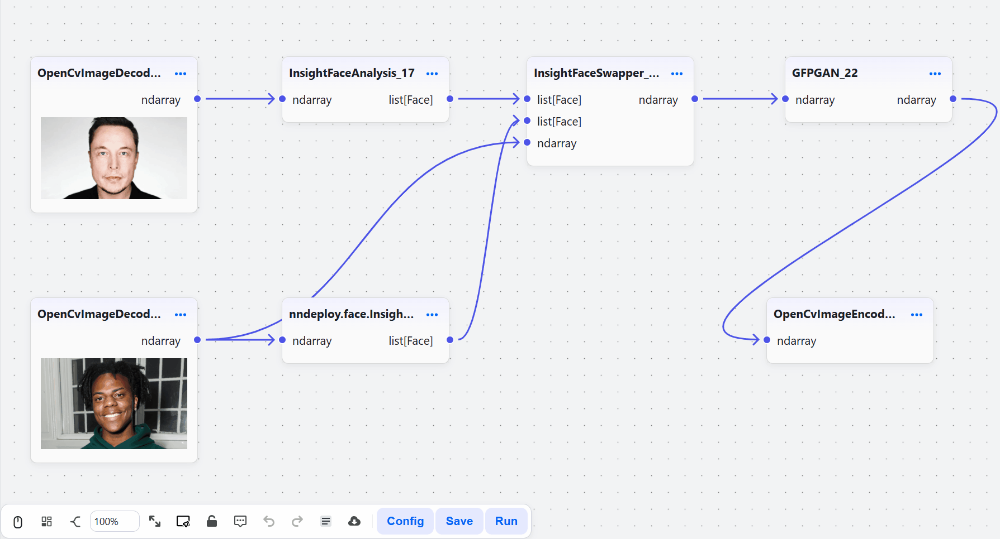
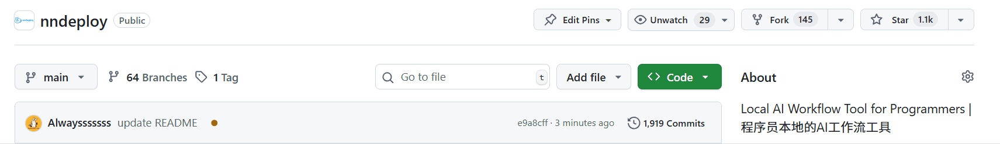

[English](README_EN.md) | 简体中文

<h3 align="center">
nndeploy：一款简单易用且高性能的AI部署框架
</h3>

<p align="center">
<a href="https://github.com/nndeploy/nndeploy/actions/workflows/linux.yml">
  
</a>
 <a href="https://github.com/nndeploy/nndeploy/actions/workflows/windows.yml">
  
</a>
 <a href="https://github.com/nndeploy/nndeploy/actions/workflows/android.yml">
  
</a>
 <a href="https://github.com/nndeploy/nndeploy/actions/workflows/macos.yml">
  
</a>
 <a href="https://github.com/nndeploy/nndeploy/actions/workflows/ios.yml">
  
</a>
 <!-- <a href="https://pepy.tech/projects/nndeploy">
  
</a> -->
</p>

<p align="center">
<a href="https://nndeploy-zh.readthedocs.io/zh-cn/latest/"><b>文档</b></a> 
| <a href="https://deepwiki.com/nndeploy/nndeploy"><b>Ask DeepWiki</b></a>
| <a href="docs/zh_cn/knowledge_shared/wechat.md"><b>微信</b></a> 
| <a href="https://discord.gg/9rUwfAaMbr"><b>Discord</b></a> 
<!-- | <a href="https://www.zhihu.com/column/c_1690464325314240512"><b>知乎</b></a>  -->
<!-- | <a href="https://www.bilibili.com/video/BV1HU7CznE39/?spm_id_from=333.1387.collection.video_card.click&vd_source=c5d7760172919cd367c00bf4e88d6f57"><b>哔哩哔哩</b></a>  -->
</p>

<p align="center">
  <picture>
    <source media="(prefers-color-scheme: dark)" srcset="docs/image/workflow.png">
    
  </picture>
</p>

---

## 最新动态

- [2025/01/29] 🔥 与昇腾官方合作推出推理框架免费课程！课程基于nndeploy内部推理框架讲解，帮助开发者快速掌握AI推理部署技术。[昇腾平台学习](https://www.hiascend.com/developer/courses/detail/1923211251905150977) | [B站学习](https://space.bilibili.com/435543077?spm_id_from=333.788.0.0)

---

## 介绍

nndeploy是一款简单易用且高性能的AI部署框架。基于可视化工作流和多端推理的设计理念，开发者可以快速从算法仓库开发出指定平台和硬件所需的SDK，大幅节省开发时间。此外，框架已部署包括LLM、AIGC生成、换脸、目标检测、图像分割等众多AI模型，开箱即用。

### **简单易用**

- **可视化工作流**：通过拖拉拽操作就能部署 AI 算法，前端可视化调节 AI 算法的所有节点参数，快速预览算法调参后的效果
- **自定义节点**：支持 Python/C++自定义节点，无需前端代码，无缝集成到可视化界面
- **算法组合**：灵活组合不同算法，快速构建创新 AI 应用
- **一键部署**：搭建完成的工作流可一键导出为 JSON 配置文件，支持 Python/C++ API 直接调用，实现从开发环境到生产环境的无缝衔接，全面支持 Linux、Windows、macOS、Android、iOS 等平台。

### **高性能**

- **并行优化**：支持串行、流水线并行、任务并行等执行模式
- **内存优化**：零拷贝、内存池、内存复用等优化策略
- **高性能优化**：内置 C++/CUDA/Ascend C/SIMD 等优化实现的节点
- **多端推理**：一套工作流，多端推理。通过零抽象成本接入了 13 种主流推理框架，覆盖云端、桌面、移动、边缘等全平台

  | 推理框架                                                                         | 适用场景                 | 状态 |
  | :------------------------------------------------------------------------------- | :----------------------- | :--- |
  | [ONNXRuntime](https://github.com/microsoft/onnxruntime)                          | 跨平台推理               | ✅   |
  | [TensorRT](https://github.com/NVIDIA/TensorRT)                                   | NVIDIA GPU 高性能推理    | ✅   |
  | [OpenVINO](https://github.com/openvinotoolkit/openvino)                          | Intel CPU/GPU 优化       | ✅   |
  | [MNN](https://github.com/alibaba/MNN)                                            | 阿里推出的移动端推理引擎 | ✅   |
  | [TNN](https://github.com/Tencent/TNN)                                            | 腾讯推出的移动端推理引擎 | ✅   |
  | [ncnn](https://github.com/Tencent/ncnn)                                          | 腾讯推出的移动端推理引擎 | ✅   |
  | [CoreML](https://github.com/apple/coremltools)                                   | iOS/macOS 原生加速       | ✅   |
  | [AscendCL](https://www.hiascend.com/zh/)                                         | 华为昇腾 AI 芯片推理框架 | ✅   |
  | [RKNN](https://www.rock-chips.com/a/cn/downloadcenter/BriefDatasheet/index.html) | 瑞芯微 NPU 推理框架      | ✅   |
  | [SNPE](https://developer.qualcomm.com/software/qualcomm-neural-processing-sdk)   | 高通骁龙 NPU 推理框架    | ✅   |
  | [TVM](https://github.com/apache/tvm)                                             | 深度学习编译栈           | ✅   |
  | [PyTorch](https://pytorch.org/)                                                  | 快速原型/云端落地        | ✅   |
  | [自研推理框架](docs/zh_cn/inference/README_INFERENCE.md)                         | 缺省推理框架             | ✅   |

### **开箱即用的算法**

已部署模型列表，并制作**100+节点**，我们将持续部署更多高价值的 AI 算法。如果您有需要部署的算法，请通过[issue](https://github.com/nndeploy/nndeploy/issues)告诉我们。

| 应用场景       | 可用模型                                                                         | 备注                                                |
| -------------- | -------------------------------------------------------------------------------- | --------------------------------------------------- |
| **大语言模型** | **QWen-0.5B**                                                                    |                                                     |
| **图片生成**   | Stable Diffusion 1.5, Stable Diffusion XL, Stable Diffusion 3, HunyuanDiT 等模型 | 支持文生图、图生图、图像修复，基于**diffusers**实现 |
| **换脸**       | **deep-live-cam**                                                                |                                                     |
| **OCR**        | **Paddle OCR**                                                                   |                                                     |
| **目标检测**   | **YOLOv5, YOLOv6, YOLOv7, YOLOv8, YOLOv11, YOLOx**                               |                                                     |
| **目标追踪**   | FairMot                                                                          |                                                     |
| **图像分割**   | RBMGv1.4, PPMatting, **Segment Anything**                                        |                                                     |
| **分类**       | ResNet, MobileNet, EfficientNet, PPLcNet, GhostNet, ShuffleNet, SqueezeNet       |                                                     |
| **API 服务**   | OPENAI, DeepSeek, Moonshot                                                       | 支持 LLM 和 AIGC 服务                              |

> 更多查看[已部署模型列表详解](docs/zh_cn/quick_start/model_list.md)

## 快速开始

+ **安装**

  ```bash
  pip install --upgrade nndeploy
  ```

+ **启动可视化界面**

  ```bash
  nndeploy-app --port 8000
  ```

  启动成功后，打开 http://localhost:8000 即可访问工作流界面

  <p align="left">
    <picture>
      <source media="(prefers-color-scheme: dark)" srcset="quick_start.gif">
      
    </picture>
  </p>  

+ **导出工作流并命令行执行**

  完成工作流搭建后，保存为 JSON 文件并通过命令行执行：

  ```bash
  # Python CLI
  nndeploy-run-json --json_file path/to/workflow.json
  # C++ CLI
  nndeploy_demo_run_json --json_file path/to/workflow.json
  ```

- **导出工作流并API加载运行**  

  在可视化界面中完成工作流搭建后，可保存为 JSON 文件，然后通过 Python/C++ API 加载执行

  - Python API加载运行LLM工作流
    ```Python
    graph = nndeploy.dag.Graph("")
    graph.remove_in_out_node()
    graph.load_file("path/to/llm_workflow.json")
    graph.init()
    input = graph.get_input(0)    
    text = nndeploy.tokenizer.TokenizerText()
    text.texts_ = [ "<|im_start|>user\nPlease introduce NBA superstar Michael Jordan<|im_end|>\n<|im_start|>assistant\n" ]
    input.set(text)
    status = graph.run()
    output = graph.get_output(0)
    result = output.get_graph_output()  
    graph.deinit()
    ```
  - C++ API加载运行LLM工作流
    ```C++
    std::shared_ptr<dag::Graph> graph = std::make_shared<dag::Graph>("");
    base::Status status = graph->loadFile("path/to/llm_workflow.json");
    graph->removeInOutNode();
    status = graph->init();
    dag::Edge* input = graph->getInput(0);
    tokenizer::TokenizerText* text = new tokenizer::TokenizerText();
    text->texts_ = {
        "<|im_start|>user\nPlease introduce NBA superstar Michael Jordan<|im_end|>\n<|im_start|>assistant\n"};
    input->set(text, false);
    status = graph->run();
    dag::Edge* output = graph->getOutput(0);
    tokenizer::TokenizerText* result =
        output->getGraphOutput<tokenizer::TokenizerText>();
    status = graph->deinit();
    ```

  更多加载并运行工作流，示例代码：[Python LLM](demo/llm/demo.py) | [C++ LLM](demo/llm/demo.cc) | [Python 目标检测](demo/detect/demo.py) | [C++ 目标检测](demo/detect/demo.cc) | 


**推荐流程**

- 开发阶段：通过可视化工作流进行设计和调试，在可视化界面中验证算法的效果和性能。**必要时需开发自定义节点**
- 部署阶段：将验证通过的工作流一键导出为 JSON 配置文件，通过 Python/C++ API 在生产环境中直接加载运行

无论是通过可视化前端界面还是 API 调用，最终都会在底层统一的高性能 C++ 计算引擎中执行。这种架构设计确保了工作流在开发调试和生产部署环境中具有完全一致的执行行为和性能表现，实现了"一次开发，处处运行"的理念。

> 要求 Python 3.10+，默认包含 PyTorch 和 ONNXRuntime。更多推理后端请采用开发者模式。

### 文档

- [如何构建](docs/zh_cn/quick_start/build.md)
- [如何获取模型](docs/zh_cn/quick_start/model.md)
- [可视化工作流](docs/zh_cn/quick_start/workflow.md)
- [Python++ API](https://nndeploy-zh.readthedocs.io/zh-cn/latest/python_api/index.html)
- [Python自定义节点开发手册](docs/zh_cn/quick_start/plugin_python.md)
- [C++ API](https://nndeploy-zh.readthedocs.io/zh-cn/latest/cpp_api/doxygen.html)
- [C++自定义节点开发手册](docs/zh_cn/quick_start/plugin.md)

## 性能测试

测试环境：Ubuntu 22.04，i7-12700，RTX3060

- **流水线并行加速**。以 YOLOv11s 端到端工作流总耗时，串行 vs 流水线并行

  

  | 运行方式\推理引擎 | ONNXRuntime | OpenVINO  | TensorRT  |
  | ----------------- | ----------- | --------- | --------- |
  | 串行              | 54.803 ms   | 34.139 ms | 13.213 ms |
  | 流水线并行        | 47.283 ms   | 29.666 ms | 5.681 ms  |
  | 性能提升          | 13.7%       | 13.1%     | 57%       |

- **任务并行加速**。组合任务(分割 RMBGv1.4+检测 YOLOv11s+分类 ResNet50)的端到端总耗时，串行 vs 任务并行

  

  | 运行方式\推理引擎 | ONNXRuntime | OpenVINO   | TensorRT  |
  | ----------------- | ----------- | ---------- | --------- |
  | 串行              | 654.315 ms  | 489.934 ms | 59.140 ms |
  | 任务并行          | 602.104 ms  | 435.181 ms | 51.883 ms |
  | 性能提升          | 7.98%       | 11.2%      | 12.2%     |

## 关注项目

如果您觉得 nndeploy 对您有帮助，欢迎在 GitHub 上给我们 Star，这将帮助我们持续改进项目。



## 下一步计划

- [工作流生态](https://github.com/nndeploy/nndeploy/issues/191)
- [端侧大模型推理](https://github.com/nndeploy/nndeploy/issues/161)
- [架构优化](https://github.com/nndeploy/nndeploy/issues/189)
- [AI Box](https://github.com/nndeploy/nndeploy/issues/190)

## 联系我们

- 当前 nndeploy 正处于发展阶段，如果您热爱开源、喜欢折腾，不论是出于学习目的，抑或是有更好的想法，欢迎加入我们。

- 微信：Always031856（欢迎加好友，进群交流，备注：nndeploy\_姓名）

  

## 致谢

- 感谢以下项目：[TNN](https://github.com/Tencent/TNN)、[FastDeploy](https://github.com/PaddlePaddle/FastDeploy)、[opencv](https://github.com/opencv/opencv)、[CGraph](https://github.com/ChunelFeng/CGraph)、[tvm](https://github.com/apache/tvm)、[mmdeploy](https://github.com/open-mmlab/mmdeploy)、[FlyCV](https://github.com/PaddlePaddle/FlyCV)、[oneflow](https://github.com/Oneflow-Inc/oneflow)、[flowgram.ai](https://github.com/bytedance/flowgram.ai)、[deep-live-cam](https://github.com/hacksider/Deep-Live-Cam)。

- 感谢[HelloGithub](https://hellogithub.com/repository/nndeploy/nndeploy)推荐

  <a href="https://hellogithub.com/repository/314bf8e426314dde86a8c62ea5869cb7" target="_blank"></a>

## 贡献者

<a href="https://github.com/nndeploy/nndeploy/graphs/contributors">
  
</a>

[](https://star-history.com/#nndeploy/nndeploy)
