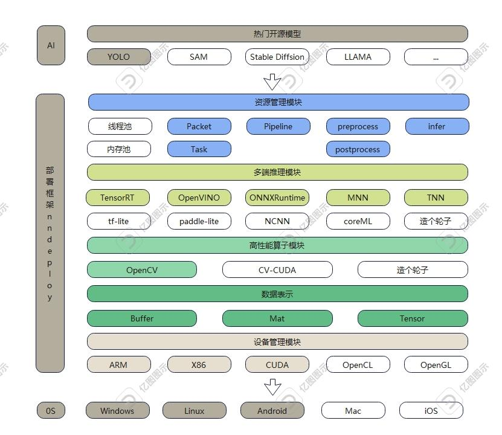

## 介绍
nndeploy是一款最新上线的支持多平台、简单易用、高性能的机器学习部署框架，一套实现可在多端(云、边、端)完成模型的高性能部署。作为一个多平台模型部署工具，我们的框架最大的宗旨就是简单贴心(^‹^)，如果您需要部署自己的模型，目前nndeploy可帮助您在一个文件（大概只要200行代码）之内完成多端部署，还提供了丰富的前后处理和推理模板可供选择帮助您简化流程。

同时在热门的开源模型当中，目前nndeploy已完成YOLO系列等多个开源模型的部署，可供直接使用，目前我们还在积极部署其它开源模型（如果您或团队有需要部署的开源模型或者其他部署相关的问题，随时欢迎来和我们探讨(^-^)）

## 架构简介


``注：白色部分为相关功能正在开发验证中，即将上线``

## 特性简介
### 支持多平台
支持的平台和推理框架如下表所示
|                      OS/Inference                       | Linux | Windows | Android | MacOS |  iOS  |                 开发人员                  | 备注  |
| :-----------------------------------------------------: | :---: | :-----: | :-----: | :---: | :---: | :---------------------------------------: | :---: |
|     [TensorRT](https://github.com/NVIDIA/TensorRT)      |  yes  |   no    |   no    |  no   |  no   | [Always](https://github.com/Alwaysssssss) |       |
| [OpenVINO](https://github.com/openvinotoolkit/openvino) |  yes  |   yes   |   no    |  no   |  no   | [Always](https://github.com/Alwaysssssss) |       |
| [ONNXRuntime](https://github.com/microsoft/onnxruntime) |  yes  |   yes   |   no    |  no   |  no   | [Always](https://github.com/Alwaysssssss) |       |
|          [MNN](https://github.com/alibaba/MNN)          |  yes  |   yes   |   yes   |  no   |  no   | [Always](https://github.com/Alwaysssssss) |       |
|          [TNN](https://github.com/Tencent/TNN)          |  yes  |   yes   |   yes   |  no   |  no   | [02200059Z](https://github.com/02200059Z) |       |

``注: yes：完成在该平台的验证，no：目前正在验证中``

## 直接可用的算法
|                      算法                       |             Inference             |                                       开发人员                                       | 备注  |
| :---------------------------------------------: | :-------------------------------: | :----------------------------------------------------------------------------------: | :---: |
| [YOLOV5](https://github.com/ultralytics/yolov5) | TensorRt/OpenVINO/ONNXRuntime/MNN | [02200059Z](https://github.com/02200059Z)、[Always](https://github.com/Alwaysssssss) |       |
|   [YOLOV6](https://github.com/meituan/YOLOv6)   |   TensorRt/OpenVINO/ONNXRuntime   | [02200059Z](https://github.com/02200059Z)、[Always](https://github.com/Alwaysssssss) |       |
|    [YOLOV8](https://github.com/ultralytics)     | TensorRt/OpenVINO/ONNXRuntime/MNN | [02200059Z](https://github.com/02200059Z)、[Always](https://github.com/Alwaysssssss) |       |

### 简单易用
- 通过切换推理配置，一套代码可在多端部署，算法的使用接口简单易用
- 新增算法简单，将AI算法部署抽象为有向无环图Pipeline，前处理为一个任务Task，推理也为一个任务Task，后处理也为一个任务Task。提供了一组较为通用的前处理Task，通用的推理Infer，对于部署一个算法而言通常只需写一个特定后处理Task即可。对于多模型的算法而言，也可以将多个Pipeline组合成一个新的Pipeline
- 通用的推理模块
- 提供一组通用的前后处理模块（不断完善）

### 高性能
- 具有各推理后端完全的配置的能力，不会因为对推理框架的抽象而带来性能损失
- 可直接操作理框架内部分配的输入输出，实现零拷贝（TODO）
- 线程池（TODO）
- 内存池（TODO）
- 高性能的前后处理（TODO）

## 快速开始
### 使用demo
[以检测模型demo为例](demo\detect\demo.cc)
+ 创建检测模型有向无环图pipeline
  ```c++
  // 检测模型的有向无环图pipeline名称，例如:
  // NNDEPLOY_YOLOV5/NNDEPLOY_YOLOV6/NNDEPLOY_YOLOV8
  std::string name = demo::getName();
  // 推理后端类型，例如:
  // kInferenceTypeOpenVino/kInferenceTypeTensorRt/kInferenceTypeOnnxRuntime/...
  base::InferenceType inference_type = demo::getInferenceType();
  // 推理设备类型，例如:
  // kDeviceTypeCodeX86:0/kDeviceTypeCodeCuda:0/...
  base::DeviceType device_type = demo::getDeviceType();
  // 模型类型，例如:
  // kModelTypeOnnx/kModelTypeMnn/...
  base::ModelType model_type = demo::getModelType();
  // 模型是否是路径
  bool is_path = demo::isPath();
  // 模型路径或者模型字符串
  std::vector<std::string> model_value = demo::getModelValue();
  // 有向无环图pipeline的输入边packert
  model::Packet input("detect_in");
  // 有向无环图pipeline的输出边packert
  model::Packet output("detect_out");
  // 创建检测模型有向无环图pipeline
  model::Pipeline *pipeline =
      model::createPipeline(name, inference_type, device_type, &input, &output,
                            model_type, is_path, model_value);
  if (pipeline == nullptr) {
    NNDEPLOY_LOGE("pipeline is nullptr");
    return -1;
  }
  ```
+ 初始化有向无环图pipeline
  ```c++
  base::Status status = pipeline->init();
  if (status != base::kStatusCodeOk) {
    NNDEPLOY_LOGE("pipeline init failed");
    return -1;
  }
  ```
+ 给有向无环图pipeline写入输入边输出边
  ```c++
  // 有向无环图pipeline的输入图片路径
  std::string input_path = demo::getInputPath();
  // opencv读图
  cv::Mat input_mat = cv::imread(input_path);
  // 将图片写入有向无环图pipeline输入边
  input.set(input_mat);
  // 定义有向无环图pipeline的输出结果
  model::DetectResult result;
  // 将输出结果写入有向无环图pipeline输出边
  output.set(result);
  ```
+ 有向无环图pipelinez运行
  ```c++
  status = pipeline->run();
  if (status != base::kStatusCodeOk) {
    NNDEPLOY_LOGE("pipeline run failed");
    return -1;
  }
  ```
+ 有向无环图pipeline反初始化
  ```c++
  status = pipeline->deinit();
  if (status != base::kStatusCodeOk) {
    NNDEPLOY_LOGE("pipeline deinit failed");
    return -1;
  }
  ```
+ 有向无环图pipeline销毁
  ```c++
  delete pipeline;
  ```

### 部署模型
以YOLOV5为例。[源文件](source\nndeploy\model\detect\yolo\yolo.cc)，[头文件](include\nndeploy\model\detect\yolo\yolo.h)
+ 准备模型文件
+ 搭建模型部署的有向无环图
  ```c++
  model::Pipeline* createYoloV5Pipeline(const std::string& name,
                                      base::InferenceType inference_type,
                                      base::DeviceType device_type,
                                      Packet* input, Packet* output,
                                      base::ModelType model_type, bool is_path,
                                      std::vector<std::string>& model_value) {
    model::Pipeline* pipeline = new model::Pipeline(name, input, output); // 有向无环图
    model::Packet* infer_input = pipeline->createPacket("infer_input"); // infer任务的输入
    model::Packet* infer_output = pipeline->createPacket("infer_output"); // infer任务的输出
    // YOLOV5模型前处理任务model::CvtColrResize，输入边为input，输出边为infer_input
    model::Task* pre = pipeline->createTask<model::CvtColrResize>(
        "preprocess", input, infer_input);
    // YOLOV5模型推理任务model::Infer(通用模板)，输入边为infer_input，输出边为infer_output
    model::Task* infer = pipeline->createInfer<model::Infer>(
        "infer", inference_type, infer_input, infer_output);
    // YOLOV5模型后处理任务YoloPostProcess，输入边为infer_output，输出边为output
    model::Task* post = pipeline->createTask<YoloPostProcess>(
        "postprocess", infer_output, output);
    // YOLOV5模型前处理任务pre的参数配置
    model::CvtclorResizeParam* pre_param =
        dynamic_cast<model::CvtclorResizeParam*>(pre->getParam());
    pre_param->src_pixel_type_ = base::kPixelTypeBGR;
    pre_param->dst_pixel_type_ = base::kPixelTypeRGB;
    pre_param->interp_type_ = base::kInterpTypeLinear;
    // YOLOV5模型推理任务infer的参数配置
    inference::InferenceParam* inference_param =
        (inference::InferenceParam*)(infer->getParam());
    inference_param->is_path_ = is_path;
    inference_param->model_value_ = model_value;
    inference_param->device_type_ = device_type;

    // YOLOV5模型后处理任务post的参数配置
    YoloPostParam* post_param = dynamic_cast<YoloPostParam*>(post->getParam());
    post_param->score_threshold_ = 0.5;
    post_param->nms_threshold_ = 0.45;
    post_param->num_classes_ = 80;
    post_param->model_h_ = 640;
    post_param->model_w_ = 640;
    post_param->version_ = 5;

    return pipeline;
  }
  ```
  `注：前后处理任务有时候需要自己写`
+ 注册createYoloV5Pipeline
  ```c++
  #define NNDEPLOY_YOLOV5 "NNDEPLOY_YOLOV5"
  class TypePipelineRegister g_register_yolov5_pipeline(NNDEPLOY_YOLOV5,
                                                    createYoloV5Pipeline);
  ```

## 编译
+ 在根目录创建`build`目录，将`cmake/config.cmake`复制到该目录
  ```
  mkdir build
  cp cmake/config.cmake build
  cd build
  ```
+ 编辑`build/config.cmake`来定制编译选项
  + 将`set(ENABLE_NNDEPLOY_OPENCV OFF)`改为`set(ENABLE_NNDEPLOY_OPENCV PATH/linux/OpenCV)`，`nndeploy`会启用并链接`OpenCV`，如果你想启用并链接的其他第三方库，也是做同样的处理
  + 将`set(ENABLE_NNDEPLOY_DEVICE_CPU OFF)`改为`set(ENABLE_NNDEPLOY_DEVICE_CPU ON)`，`nndeploy`会启用`CPU`设备。如果你想启用其他设备（ARM、X86、CUDA …），也是做同样的处理
  + 将`set(ENABLE_NNDEPLOY_INFERENCE_ONNXRUNTIME OFF)`改为`set(ENABLE_NNDEPLOY_INFERENCE_ONNXRUNTIME "PATH/linux/onnxruntime-linux-x64-1.15.1")`，`nndeploy`会启用并链接推理后端`ONNXRuntime`。如果你想启用并链接其他推理后端（OpenVINO、TensorRT、TNN …），也是做同样的处理
  + `启用并链接第三方库有两种选择`
    + 开关`ON` - 当你安装了该库，并且可以通过find_package找到该库，可以采用该方式，例如CUDA、CUDNN、OpenCV、TenosrRT
    + 路径`PATH` - 头文件以及库的根路径，其形式必须为
      + 头文件：`PATH/include`
      + 库：`PATH/lib `
      + windows dll: `PATH/bin`
+ 开始`make nndeploy`库
  ```
  cmake ..
  make -j4
  ```
+ 安装，将nndeploy相关库可执行文件、第三方库安装至`build/install/lib`
  ```
  make install
  ```

### 第三方库
|                        第三方库                         |  主版本  |                                          编译文档                                           |                                                                               官方库下载链接                                                                               |                 备注                 |
| :-----------------------------------------------------: | :------: | :-----------------------------------------------------------------------------------------: | :------------------------------------------------------------------------------------------------------------------------------------------------------------------------: | :----------------------------------: |
|       [opencv](https://github.com/opencv/opencv)        |  4.8.0   |                           [链接](https://opencv.org/get-started/)                           |                                                                  [链接](https://opencv.org/get-started/)                                                                   |                                      |
|     [TensorRT](https://github.com/NVIDIA/TensorRT)      | 8.6.0.12 |  [链接](https://docs.nvidia.com/deeplearning/tensorrt/install-guide/index.html#installing)  |                                                            [链接](https://developer.nvidia.com/zh-cn/tensorrt)                                                             | 支持TensorRT 7、支持jetson-orin-nano |
| [OpenVINO](https://github.com/openvinotoolkit/openvino) | 2023.0.1 |      [链接](https://github.com/openvinotoolkit/openvino/blob/master/docs/dev/build.md)      | [链接](https://www.intel.com/content/www/us/en/developer/tools/openvino-toolkit/download.html?ENVIRONMENT=RUNTIME&OP_SYSTEM=MACOS&VERSION=v_2023_0_1&DISTRIBUTION=ARCHIVE) |                                      |
| [ONNXRuntime](https://github.com/microsoft/onnxruntime) | v1.15.1  | [链接](https://github.com/DefTruth/lite.ai.toolkit/blob/main/docs/ort/ort_useful_api.zh.md) |                                                   [链接](https://github.com/microsoft/onnxruntime/releases/tag/v1.15.1)                                                    |                                      |
|          [MNN](https://github.com/alibaba/MNN)          |  2.6.2   |            [链接](https://mnn-docs.readthedocs.io/en/latest/compile/engine.html)            |                                                         [链接](https://github.com/alibaba/MNN/releases/tag/2.6.0)                                                          |                                      |
|          [TNN](https://github.com/Tencent/TNN)          |  v0.3.0  |          [链接](https://github.com/Tencent/TNN/blob/master/doc/cn/user/compile.md)          |                                                         [链接](https://github.com/Tencent/TNN/releases/tag/v0.3.0)                                                         |
|                                                         |
- 补充说明    
  - 我使用第三方库的上述版本，通常使用其他版本的也没有问题
  - TensorRT
    - [Windows链接](https://zhuanlan.zhihu.com/p/476679322)
    - 安装前请确保 显卡驱动、cuda、cudnn均已安装且版本一致

## 补充说明
部分已验证模型、第三方库、测试数据下载链接如下，`但我们强烈建议您自己去管理自己的模型仓库、第三方库、测试数据`。
+ [模型仓库](https://huggingface.co/alwaysssss/nndeploy/tree/main/model_zoo)
+ [第三方库](https://huggingface.co/alwaysssss/nndeploy/tree/main/third_party)
+ [测试数据](https://huggingface.co/alwaysssss/nndeploy/tree/main/test_data)


## 参考
- [TNN](https://github.com/Tencent/TNN)
- [FastDeploy](https://github.com/PaddlePaddle/FastDeploy)
- [opencv](https://github.com/opencv/opencv)
- [CGraph](https://github.com/ChunelFeng/CGraph)
- [tvm](https://github.com/apache/tvm)
- [mmdeploy](https://github.com/open-mmlab/mmdeploy)


## 加入我们
* 欢迎大家参与，协同共建，打造最易用的机器学习部署框架
* 微信：titian5566，备注：nndeploy


