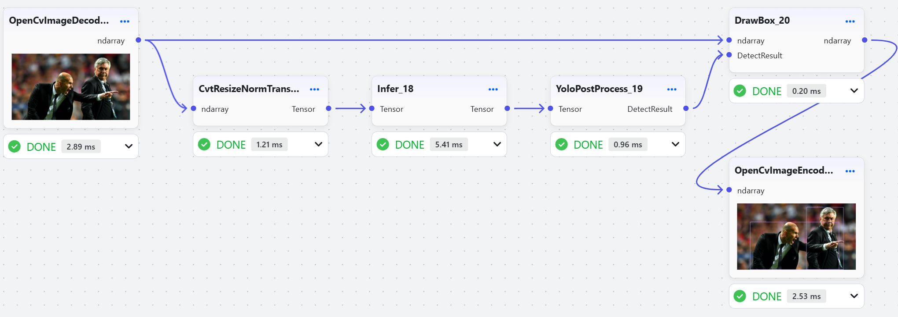

[English](README_EN.md) | 简体中文

<h3 align="center">
nndeploy：一款简单易用和高性能的AI部署框架
</h3>

<p align="center">
<a href="https://github.com/nndeploy/nndeploy/actions/workflows/linux.yml">
  
</a>
 <a href="https://github.com/nndeploy/nndeploy/actions/workflows/windows.yml">
  
</a>
 <a href="https://github.com/nndeploy/nndeploy/actions/workflows/android.yml">
  
</a>
 <a href="https://github.com/nndeploy/nndeploy/actions/workflows/macos.yml">
  
</a>
 <a href="https://github.com/nndeploy/nndeploy/actions/workflows/ios.yml">
  
</a>
 <!-- <a href="https://pepy.tech/projects/nndeploy">
  
</a> -->
</p>

<p align="center">
<a href="https://nndeploy-zh.readthedocs.io/zh-cn/latest/"><b>文档</b></a> 
| <a href="https://deepwiki.com/nndeploy/nndeploy"><b>Ask DeepWiki</b></a>
<!-- | <a href="docs/zh_cn/knowledge_shared/wechat.md"><b>微信</b></a>  -->
| <a href="https://discord.gg/9rUwfAaMbr"><b>Discord</b></a> 
<!-- | <a href="https://www.zhihu.com/column/c_1690464325314240512"><b>知乎</b></a>  -->
<!-- | <a href="https://www.bilibili.com/video/BV1HU7CznE39/?spm_id_from=333.1387.collection.video_card.click&vd_source=c5d7760172919cd367c00bf4e88d6f57"><b>哔哩哔哩</b></a>  -->
</p>

<p align="center">
  <picture>
    <source media="(prefers-color-scheme: dark)" srcset="docs/image/workflow.png">
    
  </picture>
</p>

---

## 介绍

nndeploy 是一款简单易用和高性能的 AI 部署框架。解决的是 AI 算法在端侧部署的问题，包含桌面端（Windows、macOS）、移动端（Android、iOS）、边缘计算设备（NVIDIA Jetson、Ascend310B、RK 等）以及单机服务器（RTX 系列、T4、Ascend310P 等），可让 AI 算法在上述平台和硬件更高效、更高性能的落地。

针对10B以上的大模型（如大语言模型和 AIGC 生成模型），nndeploy 适合作为一款可视化工作流工具。

### **简单易用**

- **可视化工作流**：拖拽节点即可部署 AI 算法，参数实时可调，效果一目了然。
- **自定义节点**：支持 Python/C++自定义节点，无论是用 Python 实现预处理，还是用 C++/CUDA 编写高性能节点，均可无缝集成到与可视化工作流。
- **一键部署**：工作流支持导出为 JSON，可通过 C++/Python API 调用，适用于 Linux、Windows、macOS、Android 等平台

  <table cellpadding="5" cellspacing="0" border="1">
  <tr>
    <td>桌面端搭建AI工作流</td>
    <td><a href="https://github.com/nndeploy/nndeploy/blob/main/app/android/README.md">移动端部署</a></td>
  </tr>
  <tr>
    <td></td>
    <td></td>
  </tr>
  </table>

### **高性能**

- **并行优化**：支持串行、流水线并行、任务并行等执行模式
- **内存优化**：零拷贝、内存池、内存复用等优化策略
- **高性能优化**：内置 C++/CUDA/Ascend C/SIMD 等优化实现的节点
- **多端推理**：一套工作流适配多端推理，深度集成 13 种主流推理框架，全面覆盖云端服务器、桌面应用、移动设备、边缘计算等全平台部署场景。框架支持灵活选择推理引擎，可按需编译减少依赖，同时支持接入自定义推理框架的独立运行模式。

  | 推理框架                                                                         | 状态 |
  | :------------------------------------------------------------------------------- | :--- |
  | [ONNXRuntime](https://github.com/microsoft/onnxruntime)                          | ✅    |
  | [TensorRT](https://github.com/NVIDIA/TensorRT)                                   | ✅    |
  | [OpenVINO](https://github.com/openvinotoolkit/openvino)                          | ✅    |
  | [MNN](https://github.com/alibaba/MNN)                                            | ✅    |
  | [TNN](https://github.com/Tencent/TNN)                                            | ✅    |
  | [ncnn](https://github.com/Tencent/ncnn)                                          | ✅    |
  | [CoreML](https://github.com/apple/coremltools)                                   | ✅    |
  | [AscendCL](https://www.hiascend.com/zh/)                                         | ✅    |
  | [RKNN](https://www.rock-chips.com/a/cn/downloadcenter/BriefDatasheet/index.html) | ✅    |
  | [SNPE](https://developer.qualcomm.com/software/qualcomm-neural-processing-sdk)   | ✅    |
  | [TVM](https://github.com/apache/tvm)                                             | ✅    |
  | [PyTorch](https://pytorch.org/)                                                  | ✅    |
  | [nndeploy内部推理子模块](docs/zh_cn/inference/README_INFERENCE.md)               | ✅    |

### **开箱即用的算法**

已部署多类 AI 模型，并开发 100+可视化节点，实现开箱即用体验。随着部署节点数量的增加，节点库的复用性不断提升，这将显著降低后续算法部署的开发成本。我们还将持续部署更多具有实用价值的算法。

| Application Scenario       | Available Models                                                                | Remarks                                                                         |
| -------------------------- | ------------------------------------------------------------------------------- | ------------------------------------------------------------------------------- |
| **Large Language Models**  | **QWen-2.5**, **QWen-3**                                                        | Support small B models                                                          |
| **Image/Video Generation** | Stable Diffusion 1.5, Stable Diffusion XL, Stable Diffusion 3, HunyuanDiT, etc. | Support text-to-image, image-to-image, image inpainting, based on **diffusers** |
| **Face Swapping**          | **deep-live-cam**                                                               |                                                                                 |
| **OCR**                    | **Paddle OCR**                                                                  |                                                                                 |
| **Object Detection**       | **YOLOv5, YOLOv6, YOLOv7, YOLOv8, YOLOv11, YOLOx**                              |                                                                                 |
| **Object Tracking**        | FairMot                                                                         |                                                                                 |
| **Image Segmentation**     | RBMGv1.4, PPMatting, **Segment Anything**                                       |                                                                                 |
| **Classification**         | ResNet, MobileNet, EfficientNet, PPLcNet, GhostNet, ShuffleNet, SqueezeNet      |                                                                                 |
| **API Services**           | OPENAI, DeepSeek, Moonshot                                                      | Support LLM and AIGC services                                                   |

> 更多查看[已部署模型列表详解](docs/zh_cn/quick_start/model_list.md)

## 快速开始

- **步骤一：安装**

  ```bash
  pip install --upgrade nndeploy
  ```

- **步骤二：启动可视化界面**

  ```bash
  # 方式一：命令行
  nndeploy-app --port 8000
  # 方式二：代码启动
  cd path/to/nndeploy
  python app.py --port 8000
  ```

  启动成功后，打开 http://localhost:8000 即可访问工作流编辑器。在这里，你可以拖拽节点、调整参数、实时预览效果，所见即所得。

  <p align="left">
    <picture>
      <source media="(prefers-color-scheme: dark)" srcset="quick_start.gif">
      
    </picture>
  </p>

- **步骤三：保存并加载运行**

  在可视化界面中搭建、调试完成后，点击保存，工作流会导出 JSON 文件，文件中封装了所有的处理流程。你可以用以下两种方式在**生产环境**中运行：

  - 方式一：命令行运行

    用于调试

    ```bash
    # Python CLI
    nndeploy-run-json --json_file path/to/workflow.json
    # C++ CLI
    nndeploy_demo_run_json --json_file path/to/workflow.json
    ```

  - 方式 2：在 Python/C++ 代码中加载运行

    可以将 JSON 文件集成到你现有的 Python 或 C++ 项目中，以下是一个加载和运行 LLM 工作流的示例代码：

    - Python API 加载运行 LLM 工作流
      ```Python
      graph = nndeploy.dag.Graph("")
      graph.remove_in_out_node()
      graph.load_file("path/to/llm_workflow.json")
      graph.init()
      input = graph.get_input(0)
      text = nndeploy.tokenizer.TokenizerText()
      text.texts_ = [ "<|im_start|>user\nPlease introduce NBA superstar Michael Jordan<|im_end|>\n<|im_start|>assistant\n" ]
      input.set(text)
      status = graph.run()
      output = graph.get_output(0)
      result = output.get_graph_output()
      graph.deinit()
      ```
    - C++ API 加载运行 LLM 工作流
      ```C++
      std::shared_ptr<dag::Graph> graph = std::make_shared<dag::Graph>("");
      base::Status status = graph->loadFile("path/to/llm_workflow.json");
      graph->removeInOutNode();
      status = graph->init();
      dag::Edge* input = graph->getInput(0);
      tokenizer::TokenizerText* text = new tokenizer::TokenizerText();
      text->texts_ = {
          "<|im_start|>user\nPlease introduce NBA superstar Michael Jordan<|im_end|>\n<|im_start|>assistant\n"};
      input->set(text, false);
      status = graph->run();
      dag::Edge* output = graph->getOutput(0);
      tokenizer::TokenizerText* result =
          output->getGraphOutput<tokenizer::TokenizerText>();
      status = graph->deinit();
      ```

> 要求 Python 3.10+，默认包含 ONNXRuntime、MNN，更多推理后端请采用开发者模式。

## 文档

- [编译](docs/zh_cn/quick_start/build.md)
- [可视化工作流](docs/zh_cn/quick_start/workflow.md)
- [最佳实践](docs/zh_cn/quick_start/deploy.md)
- [Python 自定义节点开发手册](docs/zh_cn/quick_start/plugin_python.md)
- [C++自定义节点开发手册](docs/zh_cn/quick_start/plugin.md)
- [接入新推理框架](docs/zh_cn/developer_guide/how_to_support_new_inference.md)
  
## 性能测试

测试环境：Ubuntu 22.04，i7-12700，RTX3060

- **流水线并行加速**。以 YOLOv11s 端到端工作流总耗时，串行 vs 流水线并行

  

  | 运行方式\推理引擎 | ONNXRuntime | OpenVINO  | TensorRT  |
  | ----------------- | ----------- | --------- | --------- |
  | 串行              | 54.803 ms   | 34.139 ms | 13.213 ms |
  | 流水线并行        | 47.283 ms   | 29.666 ms | 5.681 ms  |
  | 性能提升          | 13.7%       | 13.1%     | 57%       |

- **任务并行加速**。组合任务(分割 RMBGv1.4+检测 YOLOv11s+分类 ResNet50)的端到端总耗时，串行 vs 任务并行

  

  | 运行方式\推理引擎 | ONNXRuntime | OpenVINO   | TensorRT  |
  | ----------------- | ----------- | ---------- | --------- |
  | 串行              | 654.315 ms  | 489.934 ms | 59.140 ms |
  | 任务并行          | 602.104 ms  | 435.181 ms | 51.883 ms |
  | 性能提升          | 7.98%       | 11.2%      | 12.2%     |

## 下一步计划

- [工作流生态](https://github.com/nndeploy/nndeploy/issues/191)
- [端侧大模型推理](https://github.com/nndeploy/nndeploy/issues/161)
- [架构优化](https://github.com/nndeploy/nndeploy/issues/189)
- [AI Box](https://github.com/nndeploy/nndeploy/issues/190)

## 联系我们

- 如果你热爱开源、喜欢折腾，不论是出于学习目的，亦或是有更好的想法，欢迎加入我们

- 微信：Always031856（欢迎加好友，进群交流，备注：nndeploy\_姓名）

## 致谢

- 感谢以下项目：[TNN](https://github.com/Tencent/TNN)、[FastDeploy](https://github.com/PaddlePaddle/FastDeploy)、[opencv](https://github.com/opencv/opencv)、[CGraph](https://github.com/ChunelFeng/CGraph)、[tvm](https://github.com/apache/tvm)、[mmdeploy](https://github.com/open-mmlab/mmdeploy)、[FlyCV](https://github.com/PaddlePaddle/FlyCV)、[oneflow](https://github.com/Oneflow-Inc/oneflow)、[flowgram.ai](https://github.com/bytedance/flowgram.ai)、[deep-live-cam](https://github.com/hacksider/Deep-Live-Cam)。

- 感谢[HelloGithub](https://hellogithub.com/repository/nndeploy/nndeploy)推荐

  <a href="https://hellogithub.com/repository/314bf8e426314dde86a8c62ea5869cb7" target="_blank"></a>

## 贡献者

<a href="https://github.com/nndeploy/nndeploy/graphs/contributors">
  
</a>

[](https://star-history.com/#nndeploy/nndeploy)
