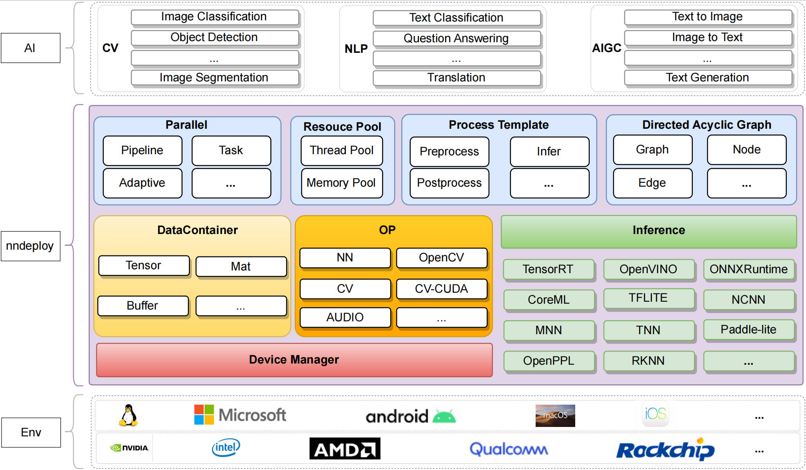

[English](README.md) | 简体中文

## 介绍

`nndeploy`是一款跨平台、高性能、简单易用的模型端到端部署框架。我们致力于屏蔽不同推理软硬件设施差异，提供一致且用户友好的编程体验，同时专注于部署推理性能。

## 架构

## 特性

### 1. 支持多平台和多一致性

只要环境受支持，通过`nndeploy`部署模型的代码无需修改即可跨多个平台以及各多个推理框架使用。
当前支持的环境如下：

| Inference/OS                                               | Linux | Windows | Android | MacOS |  IOS  | developer                                 | remarks |
| :--------------------------------------------------------- | :---: | :-----: | :-----: | :---: | :---: | :---------------------------------------- | :-----: |
| [TensorRT](https://github.com/NVIDIA/TensorRT)             |   √   |    -    |    -    |   -   |   -   | [Always](https://github.com/Alwaysssssss) |         |
| [OpenVI-](https://github.com/openvi-toolkit/openvi-)       |   √   |    √    |    -    |   -   |   -   | [Always](https://github.com/Alwaysssssss) |         |
| [ONNXRuntime](https://github.com/microsoft/onnxruntime)    |   √   |    √    |    -    |   -   |   -   | [Always](https://github.com/Alwaysssssss) |         |
| [MNN](https://github.com/alibaba/MNN)                      |   √   |    √    |    √    |   -   |   -   | [Always](https://github.com/Alwaysssssss) |         |
| [TNN](https://github.com/Tencent/TNN)                      |   √   |    √    |    √    |   -   |   -   | [02200059Z](https://github.com/02200059Z) |         |
| [ncnn](https://github.com/Tencent/ncnn)                    |   -   |    -    |    √    |   -   |   -   | [Always](https://github.com/Alwaysssssss) |         |
| [coreML](https://github.com/apple/coremltools)             |   -   |    -    |    -    |   √   |   -   | [JoDio-zd](https://github.com/JoDio-zd)   |         |
| [paddle-lite](https://github.com/PaddlePaddle/Paddle-Lite) |   -   |    -    |    -    |   -   |   -   | [qixuxiang](https://github.com/qixuxiang) |         |

**通知:** TFLite, TVM, OpenPPL, RKNN, sophgo, MindSpore-lite, Horizon正在开发中，我们正在努力覆盖绝大部分的主流推理框架

### 2. 高性能

- **推理框架的高性能抽象**：每个推理框架也都有其各自的特性，需要足够尊重以及理解这些推理框架，才能在抽象中不丢失推理框架的特性，并做到统一的使用的体验。`nndeploy` 可配置第三方推理框架绝大部分参数，保证了推理性能。可直接操作理框架内部分配的输入输出，实现前后处理的零拷贝，提升模型部署端到端的性能。
  
- 线程池正在开发完善中，可实现有向无环图的流水线并行
  
- 内存池正在开发完善中，可实现高效的内存分配与释放
  
- 一组高性能的算子正在开发中，完成后将加速您模型前后处理速度

### 3. 直接可用的算法

目前已完成 [YOLOV5](https://github.com/ultralytics/yolov5)、[YOLOV6](https://github.com/meituan/YOLOv6)、[YOLOV8](https://github.com/ultralytics) 等模型的部署，可供您直接使用，后续我们持续不断去部署其它开源模型，让您开箱即用

|                      model                      |             Inference             |                                      developer                                       | remarks |
| :---------------------------------------------: | :-------------------------------: | :----------------------------------------------------------------------------------: | :-----: |
| [YOLOV5](https://github.com/ultralytics/yolov5) | TensorRt/OpenVINO/ONNXRuntime/MNN | [02200059Z](https://github.com/02200059Z)、[Always](https://github.com/Alwaysssssss) |         |
|   [YOLOV6](https://github.com/meituan/YOLOv6)   |   TensorRt/OpenVINO/ONNXRuntime   | [02200059Z](https://github.com/02200059Z)、[Always](https://github.com/Alwaysssssss) |         |
|    [YOLOV8](https://github.com/ultralytics)     | TensorRt/OpenVINO/ONNXRuntime/MNN | [02200059Z](https://github.com/02200059Z)、[Always](https://github.com/Alwaysssssss) |         |

### 高性能

- **一套代码多端部署**：通过切换推理配置，一套代码即可在多端部署，算法的使用接口简单易用。
- **算法部署简单**：将 AI 算法端到端（前处理->推理->后处理）的部署抽象为有向无环图 `Graph`，前处理为一个 `Node`，推理也为一个 `Node`，后处理也为一个 `Node`，提供了高性能的前后处理模板和推理模板，上述模板可帮助您进一步简化端到端的部署流程。有向无环图还可以高性能且高效的解决多模型部署的痛点问题。

## 文档
- 更多信息，访问 nndeploy 文档。

## Roadmap
- 有向无环图的各种各种的并行，提升模型性能
- 接入更多的算法，例如ppocr、sam、detr等，一个是去更充分的验证我们这个框架，另一个是让更多人可以知道nndeploy
- 接入更多的推理框架，例如rknn(rknn在工业场景使用的非常非常多)
- 从0到1搭建OP模块，提升性能

## 编译状态
| OS      |                                                                      status                                                                      |
| ------- | :----------------------------------------------------------------------------------------------------------------------------------------------: |
| Linux   |    |
| Macos   |          |
| Windows |  |

## 参考
- [TNN](https://github.com/Tencent/TNN)
- [FastDeploy](https://github.com/PaddlePaddle/FastDeploy)
- [opencv](https://github.com/opencv/opencv)
- [CGraph](https://github.com/ChunelFeng/CGraph)
- [tvm](https://github.com/apache/tvm)
- [mmdeploy](https://github.com/open-mmlab/mmdeploy)
- [FlyCV](https://github.com/PaddlePaddle/FlyCV)
- [ThreadPool](https://github.com/progschj/ThreadPool)
- [torchpipe](https://github.com/torchpipe/torchpipe)

## 加入我们
- `nndeploy`还处于初级阶段，欢迎参与，我们一起打造最简单易用、高性能的模型端到端部署框架
- 微信：titian5566 (可加我微信进nndeploy交流群，备注：nndeploy+姓名)

  

