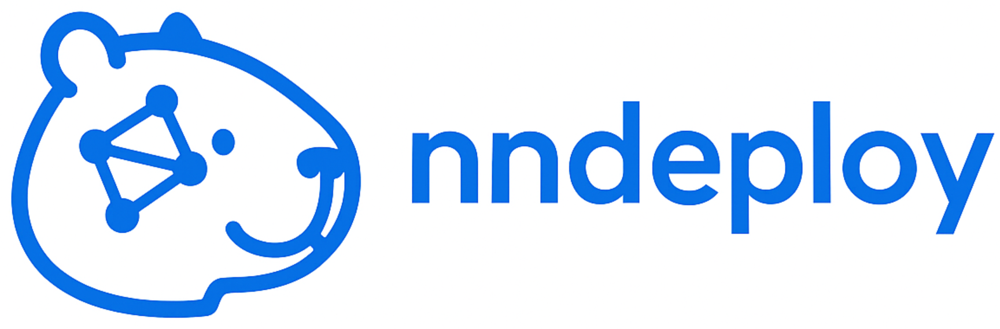
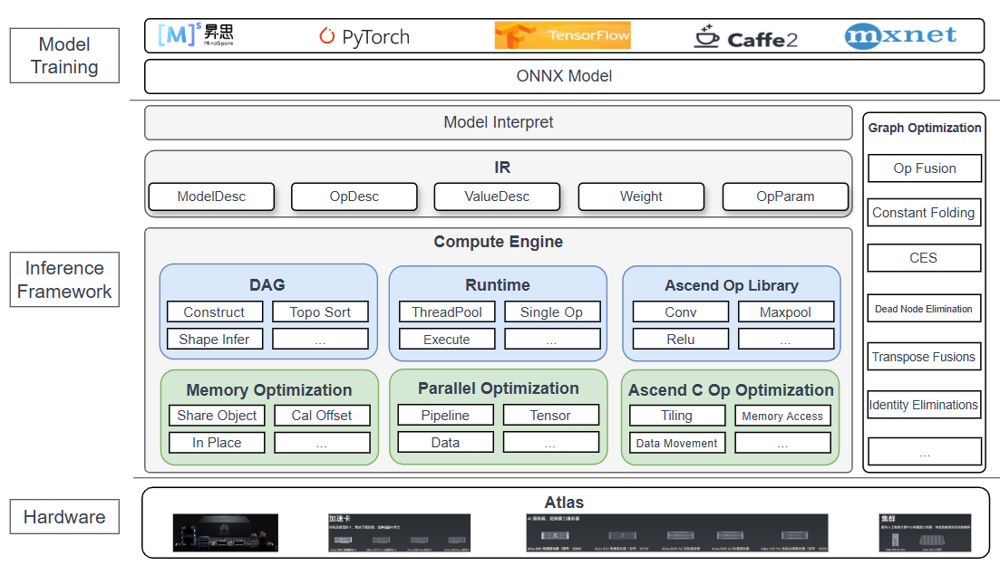

[简体中文](README.md) | English

  <picture>
    <source media="(prefers-color-scheme: dark)" srcset="docs/image/kapybara_logo.png">
    
  </picture>

<h3 align="center">
Easy-to-use, high-performance, multi-platform AI inference deployment framework
</h3>

| <a href="https://nndeploy-zh.readthedocs.io/zh-cn/latest/"><b>Docs</b></a> | <a href="docs/zh_cn/knowledge_shared/wechat.md"><b>WeChat</b></a> | <a href="https://www.zhihu.com/column/c_1690464325314240512"><b>Zhihu</b></a> | <a href="https://discord.gg/9rUwfAaMbr"><b>discord</b></a> | <a href="https://www.bilibili.com/video/BV1HU7CznE39/?spm_id_from=333.1387.collection.video_card.click&vd_source=c5d7760172919cd367c00bf4e88d6f57"><b>bilibili</b></a> | <a href="https://deepwiki.com/nndeploy/nndeploy"><b>ask deepwiki</b></a> | 

---

## News
- [2025/05/29] 🔥 The open-source team behind nndeploy has officially launched the course "Building an Inference Framework from Scratch" in collaboration with Ascend!

## Quick Start

* [How to Build](https://nndeploy-zh.readthedocs.io/zh-cn/latest/quick_start/build.html)
* [How to Get Models](https://nndeploy-zh.readthedocs.io/zh-cn/latest/quick_start/model.html)
* [How to Run](https://nndeploy-zh.readthedocs.io/zh-cn/latest/quick_start/example.html)

## Deployed Models

<table>
  <tr>
    <td><b>Text-to-Image (Stable Diffusion 1.5)</b></td>
    <td><b>Large Language Model (QWen)</b></td>
    <td><b>Image Segmentation (RBMGv1.4)</b></td>
    <td><b>More Models</b></td>
  </tr>
  <tr>
    <td></td>
    <td></td>
    <td></td>
    <td><a href="docs/zh_cn/quick_start/model_list.md">Link</a></td>
  </tr>
</table>

## Introduction

nndeploy is an easy-to-use, high-performance, multi-platform AI inference deployment framework.

It mainly addresses the following pain points in model deployment:

1. **Fragmentation of inference frameworks**: There is no universally superior inference framework in the industry. Different frameworks excel on different platforms and hardware. For example, TensorRT performs best on NVIDIA GPUs, OpenVINO on x86 CPUs, CoreML in the Apple ecosystem, and ncnn/MNN on ARM Android.

2. **Learning, development, and maintenance cost of multiple inference frameworks**: Each framework has different interfaces, hyperparameter settings, Tensors, etc. Deploying one model to multiple platforms requires separate codebases, increasing the burden on engineers.

3. **Model diversity**: From a deployment perspective, models can be single-input, multi-input, single-output, multi-output, static input shape, dynamic input shape, etc. Combining these with zero-copy optimization requires experienced engineers to find optimal solutions efficiently.

4. **High-performance pre/post-processing**: Model deployment involves not only inference but also preprocessing and postprocessing. Inference frameworks often do not provide these, requiring engineers to reimplement them in C++—a repetitive workload.

5. **Complex multi-model scenarios**: Many applications require combining multiple models. Without framework support, this leads to tightly coupled code, low flexibility, and poor parallelism.

### Architecture and Features

### 1. Easy to Use

* **Model deployment based on DAG**: Abstract AI deployment as a Directed Acyclic Graph, where preprocessing, inference, and postprocessing are nodes

* **Inference template (Infer)**: Supports handling various model differences including input/output formats and shapes

* **Efficient handling of multi-model scenarios**: Supports `graph embedding` to divide complex tasks into subgraphs for flexible multi-model composition

* **Quick demo building**: Supports images, folders, videos, etc. as input/output with modular codec nodes for general-purpose demo construction

### 2. High Performance

* **Multiple parallel execution modes**: Supports sequential execution (topological order), pipeline parallelism (map nodes to threads/devices), task parallelism (exploit model-level parallelism), and combinations thereof

* **Thread pool & memory pool**: Improves concurrency and resource utilization via thread pools, supports `parallel_for` for CPU op parallelism, and provides a memory pool for efficient allocation/release (in development)

* **A set of high-performance operators**: Will boost model pre/post-processing speed (in development)

### 3. Supports Multiple Inference Backends

* **Single codebase for multiple backends**: By switching inference config, one codebase can deploy across platforms and frameworks, matching original framework performance

* Currently supported inference frameworks:

  | Inference/OS                                                                     | Linux | Windows | Android | MacOS | IOS | Developer                                                                          |
  | :------------------------------------------------------------------------------- | :---: | :-----: | :-----: | :---: | :-: | :--------------------------------------------------------------------------------- |
  | [TensorRT](https://github.com/NVIDIA/TensorRT)                                   |   √   |    -    |    -    |   -   |  -  | [Always](https://github.com/Alwaysssssss)                                          |
  | [OpenVINO](https://github.com/openvinotoolkit/openvino)                          |   √   |    √    |    -    |   -   |  -  | [Always](https://github.com/Alwaysssssss)                                          |
  | [ONNXRuntime](https://github.com/microsoft/onnxruntime)                          |   √   |    √    |    -    |   -   |  -  | [Always](https://github.com/Alwaysssssss)                                          |
  | [MNN](https://github.com/alibaba/MNN)                                            |   √   |    √    |    √    |   -   |  -  | [Always](https://github.com/Alwaysssssss)                                          |
  | [TNN](https://github.com/Tencent/TNN)                                            |   √   |    √    |    √    |   -   |  -  | [02200059Z](https://github.com/02200059Z)                                          |
  | [ncnn](https://github.com/Tencent/ncnn)                                          |   -   |    -    |    √    |   -   |  -  | [Always](https://github.com/Alwaysssssss)                                          |
  | [coreML](https://github.com/apple/coremltools)                                   |   -   |    -    |    -    |   √   |  -  | [JoDio-zd](https://github.com/JoDio-zd), [jaywlinux](https://github.com/jaywlinux) |
  | [AscendCL](https://www.hiascend.com/zh/)                                         |   √   |    -    |    -    |   -   |  -  | [CYYAI](https://github.com/CYYAI)                                                  |
  | [RKNN](https://www.rock-chips.com/a/cn/downloadcenter/BriefDatasheet/index.html) |   √   |    -    |    -    |   -   |  -  | [100312dog](https://github.com/100312dog)                                          |
  | [tvm](https://github.com/apache/tvm)                                             |   √   |    -    |    -    |   -   |  -  | [youxiudeshouyeren](https://github.com/youxiudeshouyeren)                          |
  | [snpe](https://developer.qualcomm.com/software/qualcomm-neural-processing-sdk)   |   √   |    -    |    -    |   -   |  -  | [yhwang-hub](https://github.com/yhwang-hub)                                        |

### 4. Built-in Inference Submodule

The framework includes an internal default inference backend. It can be used if external backends are not compiled/linked. **For actual applications, we recommend using vendor-specific inference frameworks.**

Currently supports Huawei Ascend NPU and pure CPU ops. Plans to expand to X86, CUDA, ARM, OpenCL, etc.

Supports mainstream vision models: image classification (e.g., ResNet50), object detection (YOLOv11), image segmentation (RMBG1.4). Will support LLM and vision-language models (Dit).

> Technical details of built-in inference submodule
  - [Bilibili Course - Complete AI Inference Framework Video Tutorial](https://www.bilibili.com/video/BV1HU7CznE39?vd_source=c5d7760172919cd367c00bf4e88d6f57&spm_id_from=333.788.videopod.sections)
  - [Zhihu Column](https://www.zhihu.com/column/c_1690464325314240512)

## Future Plans

* Device management

  * Add OpenCL device management
  * Add ROCM device management
  * Add OpenGL device management

* Memory optimization

  * `Master-slave memory copy optimization`: Replace memory copy via memory mapping/sharing
  * `Memory pool`: For Buffer, Mat, Tensor containers across devices
  * `Multi-node shared memory`: For serial DAG execution in multi-model pipeline
  * `Ring buffer reuse`: For pipeline DAG execution, enable edge-level ring buffer reuse

* Operator library integration

  * Integrate oneDNN; implement unsupported ops for x86
  * Integrate cudnn, cutlass; implement unsupported ops for CUDA
  * Integrate XNNPACK, QNNPACK; implement unsupported ops for ARM

* Inference submodule

  * Support LLM
  * Support Stable Diffusion
  * Add communication primitives for distributed inference
  * Improve graph-based memory optimization; explore more optimization strategies

* Deploy more models

  * OCR
  * Tracking
  * ...

## Contact Us

* nndeploy is currently under active development. If you're enthusiastic about open source and innovation, whether for learning or contributing ideas, you're welcome to join us.
* WeChat: titian5566 (Add with brief info to join AI inference deployment discussion group)

  

## Acknowledgements

* We referenced the following projects: [TNN](https://github.com/Tencent/TNN), [FastDeploy](https://github.com/PaddlePaddle/FastDeploy), [opencv](https://github.com/opencv/opencv), [CGraph](https://github.com/ChunelFeng/CGraph), [CThreadPool](https://github.com/ChunelFeng/CThreadPool), [tvm](https://github.com/apache/tvm), [mmdeploy](https://github.com/open-mmlab/mmdeploy), [FlyCV](https://github.com/PaddlePaddle/FlyCV), and [oneflow](https://github.com/Oneflow-Inc/oneflow).

* Thanks to [HelloGithub](https://hellogithub.com/repository/nndeploy/nndeploy) for featuring us

  

## Contributors

