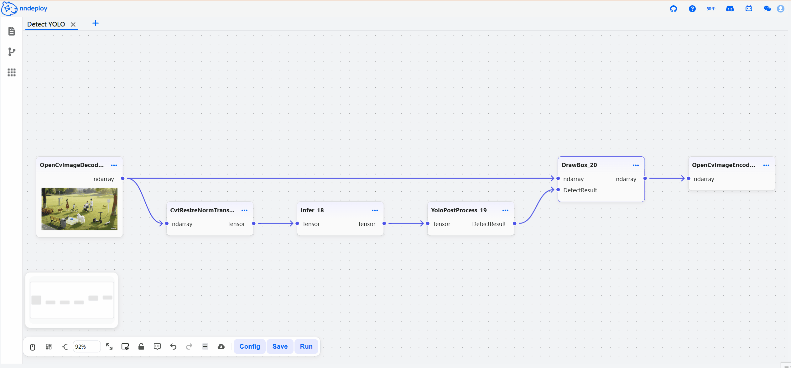
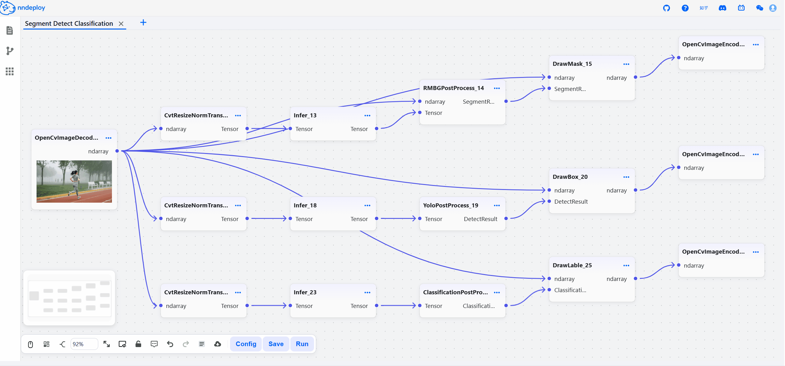
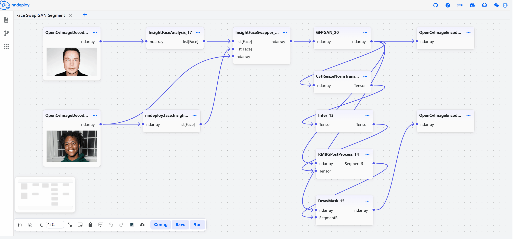

[简体中文](README.md) | English

<h3 align="center">
nndeploy: A Workflow-based Multi-platform AI Inference and Deployment Framework
</h3>

<p align="center">
<a href="https://github.com/nndeploy/nndeploy/actions/workflows/linux.yml">
  
</a>
 <a href="https://github.com/nndeploy/nndeploy/actions/workflows/windows.yml">
  
</a>
 <a href="https://github.com/nndeploy/nndeploy/actions/workflows/android.yml">
  
</a>
 <a href="https://github.com/nndeploy/nndeploy/actions/workflows/macos.yml">
  
</a>
 <a href="https://github.com/nndeploy/nndeploy/actions/workflows/ios.yml">
  
</a>
 <a href="https://pepy.tech/projects/nndeploy">
  
</a>
</p>

---

<p align="center">
  <picture>
    <source media="(prefers-color-scheme: dark)" srcset="docs/image/workflow.png">
    
  </picture>
</p>

**Core Concept**: You only need to write algorithm node logic in familiar Python or C++, and the framework automatically generates visual nodes without front-end hassle. For non-AI developers, we provide out-of-the-box algorithm nodes including LLMs, Stable Diffusion, detection, segmentation, etc. AI applications can be built by drag-and-drop, and we will keep deploying more high-value AI algorithms.

**Complete pipeline from workflow to production**: The visually built workflow can be exported as a JSON config file with one click, and run directly via Python/C++ APIs. The framework integrates mainstream inference engines such as Torch, TensorRT, OpenVINO, CoreML, MNN, AscendCL, RKNN, and deep performance optimization strategies. It supports deployment to cloud servers, desktop, mobile, and edge devices, offering both high development efficiency and production-grade performance.

nndeploy aims to let you turn AI algorithm ideas in your mind into high-performance production-ready applications in the shortest path.

---

## Latest Updates

- [2025/05/29]🔥The free course co-developed by the nndeploy open-source team and Ascend is now live, suitable for beginners and those looking to advance their AI inference deployment skills. [Learn on Ascend Platform](https://www.hiascend.com/developer/courses/detail/1923211251905150977) | [Learn on Bilibili](https://space.bilibili.com/435543077?spm_id_from=333.788.0.0)

---

## Quick Start

### Installation

```bash
pip install --upgrade nndeploy
```

### Launch Visual Workflow

```bash
# Method 1: Use built-in nodes only
nndeploy-app --port 8000

# Method 2: Use user-defined nodes
nndeploy-app --port 8000 --plugin plugin1.py plugin2.py
```

- Command parameters:
  - `--port`: Specify the web server port (default is 8000)
  - `--plugin`: Load user-defined plugin files (optional; if not provided, only built-in nodes are used)
    - Python plugin: Refer to [Python Plugin Template](template/python/template.py)
    - C++ plugin: Refer to [C++ Plugin Template](template/cpp/template.h)
    - Multiple plugins can be loaded: `--plugin plugin1.py plugin2.so`

Once started, open http://localhost:8000 to access the workflow interface.

<p align="left">
  <picture>
    <source media="(prefers-color-scheme: dark)" srcset="quick_start.gif">
    
  </picture>
</p>

### Export and Run Workflow

After building the workflow in the visual interface, save it as a JSON file (e.g., workflow.json), then run it with:

```bash
nndeploy-run-json --json-file workflow.json --plugin plugin.py
```

- Load and run JSON config via API:
  - [Python API Example](python/nndeploy/dag/run_json.py)
  - [C++ API Example](framework/include/nndeploy/dag/graph_runner.h)

> Requires Python 3.10+. PyTorch and ONNXRuntime are included by default. For more backends (e.g., TensorRT, OpenVINO, ncnn, MNN), use developer mode.

> Use `nndeploy-clean` to clean up expired backend resources.

### Documentation
- [How to Build](docs/zh_cn/quick_start/build.md)
- [How to Get Models](docs/zh_cn/quick_start/model.md)
- [How to Run](docs/zh_cn/quick_start/example.md)
- [Python Quick Start](docs/zh_cn/quick_start/python.md)
- [Visual Workflow Quick Start](docs/zh_cn/quick_start/workflow.md)
- [C++ API](https://nndeploy-zh.readthedocs.io/zh-cn/latest/cpp_api/doxygen.html)
- [C++ Plugin Development Guide](docs/zh_cn/quick_start/plugin.md)
- [Python API](https://nndeploy-zh.readthedocs.io/zh-cn/latest/python_api/index.html)
- [Python Plugin Development Guide](docs/zh_cn/quick_start/plugin_python.md)

## Features

### **Algorithm Ecosystem**

We currently support 100+ mainstream AI models including LLMs, AIGC generation, face swapping, object detection, segmentation, etc. We will keep deploying more high-value AI algorithms to build a rich multi-platform AI inference ecosystem for various industries and innovative applications.

| Application | Available Models | Supported Platforms | Notes |
|-------------|------------------|----------------------|-------|
| **LLM** | **QWen-0.5B** | Linux/Windows/macOS/Android/iOS | |
| **Image Generation** | Stable Diffusion 1.5, Stable Diffusion XL, Stable Diffusion 3, HunyuanDiT, Kandinsky, Wuerstchen, Stable Cascade, PixArt Alpha, PixArt Sigma, Sana, AuraFlow, Flux, Lumina, CogView3 Plus, CogView4 etc | Linux/Windows/macOS | Text-to-image, image-to-image, inpainting base on **diffusers** |
| **Face Swap** | **deep-live-cam** | Linux/Windows/macOS | |
| **Object Detection** | **YOLOv5, YOLOv6, YOLOv7, YOLOv8, YOLOv11, YOLOx** | Linux/Windows/macOS/Android/iOS | |
| **Object Tracking** | FairMot | Linux/Windows/macOS/Android/iOS | |
| **Image Segmentation** | RBMGv1.4, PPMatting, **Segment Anything** | Linux/Windows/macOS/Android/iOS | |
| **Classification** | ResNet, MobileNet, EfficientNet, PPLcNet, GhostNet, ShuffleNet, SqueezeNet | Linux/Windows/macOS/Android/iOS | |
| **API LLM** | OPENAI, DeepSeek, Moonshot | Linux/Windows/macOS | |
| **API AIGC** | OPENAI | Linux/Windows/macOS | |

> If you need a specific model deployed, let us know via [issue](https://github.com/nndeploy/nndeploy/issues).

### **Easy to Use**

- **Visual Workflow**: Deploy AI algorithms via drag-and-drop. Adjust all node parameters visually and preview results instantly.
- **Custom Nodes**: Support Python/C++ custom nodes, no front-end code needed, seamlessly integrated into the visual interface.
- **Algorithm Composition**: Flexibly combine different algorithms to build innovative AI applications.
- **One-click Deployment**: Export workflow as JSON and run via Python/C++ APIs, seamless transition from dev to production.

### **High Performance**

- **13 Inference Engines Seamlessly Integrated**: One workflow, multi-platform deployment. Zero-cost abstraction for 13 mainstream inference engines, covering cloud, desktop, mobile, and edge.

  | Inference Engine | Use Case | Status |
  |------------------|----------|--------|
  | [PyTorch](https://pytorch.org/) | R&D, prototyping | ✅ |
  | [ONNXRuntime](https://github.com/microsoft/onnxruntime) | Cross-platform inference | ✅ |
  | [TensorRT](https://github.com/NVIDIA/TensorRT) | NVIDIA GPU high-performance | ✅ |
  | [OpenVINO](https://github.com/openvinotoolkit/openvino) | Intel CPU/GPU optimization | ✅ |
  | [MNN](https://github.com/alibaba/MNN) | Alibaba mobile inference | ✅ |
  | [TNN](https://github.com/Tencent/TNN) | Tencent mobile inference | ✅ |
  | [ncnn](https://github.com/Tencent/ncnn) | Tencent mobile inference | ✅ |
  | [CoreML](https://github.com/apple/coremltools) | iOS/macOS native | ✅ |
  | [AscendCL](https://www.hiascend.com/zh/) | Huawei Ascend AI chip | ✅ |
  | [RKNN](https://www.rock-chips.com/a/cn/downloadcenter/BriefDatasheet/index.html) | Rockchip NPU | ✅ |
  | [SNPE](https://developer.qualcomm.com/software/qualcomm-neural-processing-sdk) | Qualcomm Snapdragon NPU | ✅ |
  | [TVM](https://github.com/apache/tvm) | Deep learning compiler stack | ✅ |
  | [Custom Inference Engine](docs/zh_cn/inference/README_INFERENCE.md) | Custom needs | ✅ |

- **Parallel Optimization**: Support serial, pipeline parallel, and task parallel execution modes.
- **Memory Optimization**: Zero-copy, memory pool, memory reuse strategies.
- **High-performance Ops**: Built-in C++/CUDA/Ascend C/SIMD optimized nodes.

## Demos

### YOLO Visual Tuning & One-click Deployment

Tune detection parameters in real-time via the visual interface without code changes. Switch to TensorRT or other engines for high-performance deployment with one click.

<p align="left">
  <picture>
    <source media="(prefers-color-scheme: dark)" srcset="yolo_edit_param.gif">
    
  </picture>
</p>

### Multi-model Workflow Demo

Visually build detection + segmentation + classification workflows. Switch inference engines and parallel modes. Build once, deploy everywhere.

<p align="left">
  <picture>
    <source media="(prefers-color-scheme: dark)" srcset="seg_detect_class.gif">
    
  </picture>
</p>

### Zero-code Face Swap + Segmentation Workflow

Drag-and-drop to combine face detection, face swap, and portrait segmentation. No coding needed. See parameter changes in 1–2 seconds. Ideal for **PMs, designers, and non-AI developers** to prototype ideas quickly.

<p align="left">
  <picture>
    <source media="(prefers-color-scheme: dark)" srcset="face_swap_seg.gif">
    
  </picture>
</p>

---

## Stay Ahead

Star nndeploy on GitHub to get notified of new releases.

## Roadmap

- [Workflow Ecosystem](https://github.com/nndeploy/nndeploy/issues/191)
- [Edge-side LLM Inference](https://github.com/nndeploy/nndeploy/issues/161)
- [AI Box](https://github.com/nndeploy/nndeploy/issues/190)
- [Architecture Optimization](https://github.com/nndeploy/nndeploy/issues/189)

## Contact Us

nndeploy is in active development. If you love open source and enjoy tinkering—whether for learning or sharing better ideas—join us!

- WeChat: Always031856 (add friend, join active AI inference deployment group, note: nndeploy_name)

## Acknowledgments

Thanks to: [TNN](https://github.com/Tencent/TNN), [FastDeploy](https://github.com/PaddlePaddle/FastDeploy), [OpenCV](https://github.com/opencv/opencv), [CGraph](https://github.com/ChunelFeng/CGraph), [CThreadPool](https://github.com/ChunelFeng/CThreadPool), [TVM](https://github.com/apache/tvm), [MMDeploy](https://github.com/open-mmlab/mmdeploy), [FlyCV](https://github.com/PaddlePaddle/FlyCV), [OneFlow](https://github.com/Oneflow-Inc/oneflow), [Flowgram.ai](https://github.com/bytedance/flowgram.ai), [deep-live-cam](https://github.com/hacksider/Deep-Live-Cam).

Thanks to [HelloGithub](https://hellogithub.com/repository/nndeploy/nndeploy) for the recommendation.

## Contributors

<a href="https://github.com/nndeploy/nndeploy/graphs/contributors">
  
</a>

[](https://star-history.com/#nndeploy/nndeploy)