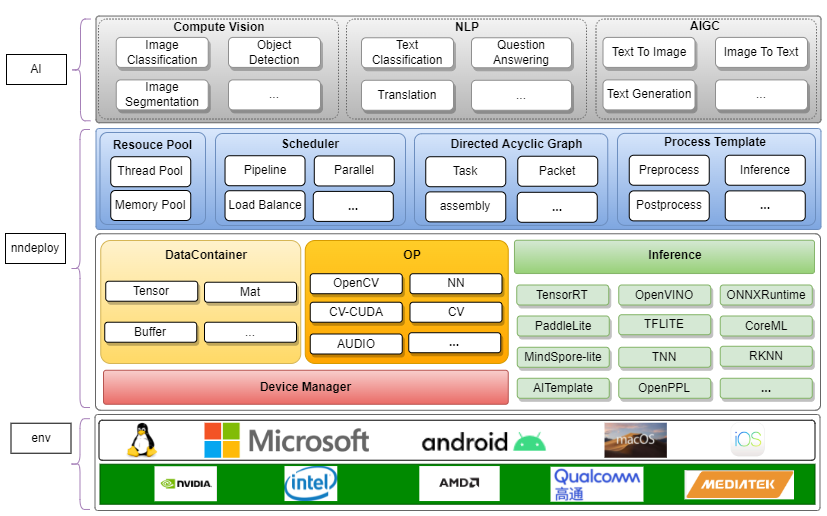

# nndeploy

nndeploy is a cross-platform, high-performing, and user-friendly AI model deployment framework. We strive to deliver a consistent and user-friendly experience across various inference framework backends in complex deployment environments and focus on performance.

# Architecture



# Fetures

## 1. cross-platform and consistent

As long as the environment is supported, the code for deploying models through nndeploy can be used across multiple platforms without modification, regardless of the operating system and inference framework version.

The current supported environment is as follows, which will continue to be updated in the future:

| Inference/OS | Linux | Windows | Android | MacOS |  IOS  |   developer      | remarks |
| :-------------------------------------------------------- | :---: | :-----: | :-----: | :---: | :---: | :--------------------------------------- | :---: |
|       [TensorRT](https://github.com/NVIDIA/TensorRT)       |  √  |   -    |   -    |  -   |  -   | [Always](https://github.com/Alwaysssssss) |       |
|  [OpenVI-](https://github.com/openvi-toolkit/openvi-)   |  √  |   √   |   -    |  -   |  -   | [Always](https://github.com/Alwaysssssss) |       |
|  [ONNXRuntime](https://github.com/microsoft/onnxruntime)   |  √  |   √   |   -    |  -   |  -   | [Always](https://github.com/Alwaysssssss) |       |
|           [MNN](https://github.com/alibaba/MNN)            |  √  |   √   |   √   |  -   |  -   | [Always](https://github.com/Alwaysssssss) |       |
|           [TNN](https://github.com/Tencent/TNN)            |  √  |   √   |   √   |  -   |  -   | [02200059Z](https://github.com/02200059Z) |       |
|          [ncnn](https://github.com/Tencent/ncnn)           |  -   |   -    |   √   |  -   |  -   | [Always](https://github.com/Alwaysssssss) |       |
|       [coreML](https://github.com/apple/coremltools)       |  -   |   -    |   -    |  √  |  -   |  [JoDio-zd](https://github.com/JoDio-zd)  |       |
| [paddle-lite](https://github.com/PaddlePaddle/Paddle-Lite) |  -   |   -    |   -    |  -   |  -   | [qixuxiang](https://github.com/qixuxiang) |       |

**Notice:** TFLite, TVM, OpenPPL, Tengine, AITemplate, RKNN, sophgo, MindSpore-lite, Horizon are also on the agenda as we work to cover mainstream inference frameworks

## 2. High Performance

The difference of model structure, inference framework and hardware resource will lead to different inference performance. nndeploy deeply understands and preserves as much as possible the features of the back-end inference framework without compromising the computational efficiency of the native inference framework with a consistent code experience. In addition, we realize the efficient connection between the pre/post-processing and the model inference process through the exquisitely designed memory zero copy, which effectively guarantees the end-to-end delay of model inference.

What's more, we are developing and refining the following:
* **Thread Pool**: better pipelined parallel optimization
* **Memory Pool**: more efficient memory allocation and release
* **HPC Operators**: optimize pre/post-processing efficiency

## 3. Models built-in

Out-of-the-box AI models are our goal, but our are focusing on development of the system at this time. Nevertheless, [YOLOv5](https://github.com/ultralytics/yolov5), [YOLOv6](https://github.com/meituan/YOLOv6), [YOLOv8](https://github.com/ultralytics) are already supported, and it is believed that the list will soon be expanded.

|   model  |             Inference             |          developer      | remarks |
| :--------------------------------------------- | :------------------------------- | :----------------------------------------------------------------------------------: | :---: |
| [YOLOv5](https://github.com/ultralytics/yolov5) | TensorRt/OpenVINO/ONNXRuntime/MNN | [02200059Z](https://github.com/02200059Z), [Always](https://github.com/Alwaysssssss) |       |
|   [YOLOv6](https://github.com/meituan/YOLOv6)   |   TensorRt/OpenVINO/ONNXRuntime   | [02200059Z](https://github.com/02200059Z), [Always](https://github.com/Alwaysssssss) |       |
|    [YOLOv8](https://github.com/ultralytics)     | TensorRt/OpenVINO/ONNXRuntime/MNN | [02200059Z](https://github.com/02200059Z), [Always](https://github.com/Alwaysssssss) |       |


## 4. user-friendly

nndeploy's primary purpose is user friendliness and high performance. We have built-in support for the major inference frameworks and provide them with a unified interface abstraction on which you can implement platform/framework independent inference code without worrying about performance loss. We now provide additional templates for the pre/post-processing for AI algorithms, which can help you simplify the end-to-end deployment process of the model, and the built-in algorithms mentioned above are also part of the ease of use.

If you have any related questions, feel free to contact us. 😁

# Quick Start
## Support

| OS    | status                                                                                                                               |
| ------- | :------------------------------------------------------------------------------------------------------------------------------------------------: |
| Linux   | [](https://ci.appveyor.com/project/Alwaysssssss/nndeploy-pdc3k)   |
| Macos   | [](https://ci.appveyor.com/project/Alwaysssssss/nndeploy)         |
| Windows | [](https://ci.appveyor.com/project/Alwaysssssss/nndeploy-ovpc5) |

## Build
> We take `Ubuntu 22.04` as an example.

1. download source-code
  
    ```shell
    cd ~/

    # download nndeploy source code
    git clone --recursive https://github.com/Alwaysssssss/nndeploy.git

    # download dependency
    cd ~/nndeploy/third_party
    wget https://huggingface.co/alwaysssss/nndeploy/resolve/main/third_party/ubuntu22.04_x64.tar
    tar -xavf ubuntu22.04_x64.tar
    rm -rf ubuntu22.04_x64.tar
    ```

2. make `cmake/config.cmake` ready

    ```
    mkdir -p ~/nndeploy/build
    cp nndeploy/cmake/config.cmake nndeploy/build
    ```
    then, set `ENABLE_NNDEPLOY_INFERENCE_ONNXRUNTIME` to `"~/nndeploy/third_party/ubuntu22.04_x64/onnxruntime-linux-x64-1.15.1"`

    you can learn more about `config.cmake` to customize  compilation options according to [config.cmake-options](docs\documents\config_cmake-options.md).

3. make
   
     ```
     cd ~/nndeploy/build
     cmake ..
     make -j4
     ```

4. installation
   > nndeploy files will be installed to `build/install/lib/`
   
    ```
    cd ~/nndeploy/build
    make install
    ```

5. deploy model

    > We will show how to run [YOLOv5s.onnx](https://huggingface.co/alwaysssss/nndeploy/resolve/main/test_data/detect/sample.jpg) by nndeploy in Linux with backend of `onnxruntime-CPU`. We use [input.jpg](https://huggingface.co/alwaysssss/nndeploy/resolve/main/test_data/detect/sample.jpg) as model input.

    * prepare environment
    ```shell
    cd ~/nndeploy
    # add library env to system_path
    export LD_LIBRARY_PATH=$(pwd)/build/install/lib:$LD_LIBRARY_PATH

    # install dependencice
    sudo apt install libopencv-dev
    ```
    
    * run
    ```shell

    # run
    cd ~/nndeploy
    ./demo_nndeploy_detect                                                \
      --name NNDEPLOY_YOLOV5                                              \
      --inference_type kInferenceTypeOnnxRuntime                          \
      --device_type kDeviceTypeCodeX86:0                                  \
      --model_type kModelTypeOnnx                                         \
      --is_path                                                           \
      --model_value $your_path/YOLOv5s.onnx                               \
      --input_type kInputTypeImage                                        \
      --input_path $your_path/input.jpg                                   \
      --output_path $your_path/output.jpg
    ```
    You can learn more about the usage of nndeploy by [user manual]().
    


# Blogs
- [nndeploy introduce](https://zhuanlan.zhihu.com/p/656359928)
  - [Always](https://github.com/Alwaysssssss)
  - [02200059Z](https://github.com/02200059Z)
- [How to add inference-framework](https://blog.csdn.net/echoesssss/article/details/132674100?spm=1001.2014.3001.5502)
  - [02200059Z](https://github.com/02200059Z)

# Reference
- [TNN](https://github.com/Tencent/TNN)
- [FastDeploy](https://github.com/PaddlePaddle/FastDeploy)
- [opencv](https://github.com/opencv/opencv)
- [CGraph](https://github.com/ChunelFeng/CGraph)
- [tvm](https://github.com/apache/tvm)
- [mmdeploy](https://github.com/open-mmlab/mmdeploy)
- [FlyCV](https://github.com/PaddlePaddle/FlyCV)
- [ThreadPool](https://github.com/progschj/ThreadPool)


## Contact Us

> nndeploy is still in its infancy, welcome to join us.

* Wechat：titian5566
  

