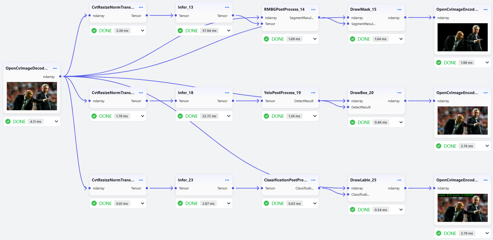

English | [Simplified Chinese](README.md)

<h3 align="center">
nndeploy: An Easy-to-Use, and High-Performance AI Deployment Framework
</h3>

<p align="center">
<a href="https://github.com/nndeploy/nndeploy/actions/workflows/linux.yml">
  
</a>
 <a href="https://github.com/nndeploy/nndeploy/actions/workflows/windows.yml">
  
</a>
 <a href="https://github.com/nndeploy/nndeploy/actions/workflows/android.yml">
  
</a>
 <a href="https://github.com/nndeploy/nndeploy/actions/workflows/macos.yml">
  
</a>
 <a href="https://github.com/nndeploy/nndeploy/actions/workflows/ios.yml">
  
</a>
 <!-- <a href="https://pepy.tech/projects/nndeploy">
  
</a> -->
</p>

<p align="center">
<a href="https://nndeploy-zh.readthedocs.io/zh-cn/latest/"><b>Documentation</b></a> 
| <a href="https://deepwiki.com/nndeploy/nndeploy"><b>Ask DeepWiki</b></a>
| <a href="docs/zh_cn/knowledge_shared/wechat.md"><b>WeChat</b></a> 
| <a href="https://discord.gg/9rUwfAaMbr"><b>Discord</b></a> 
<!-- | <a href="https://www.zhihu.com/column/c_1690464325314240512"><b>Zhihu</b></a>  -->
<!-- | <a href="https://www.bilibili.com/video/BV1HU7CznE39/?spm_id_from=333.1387.collection.video_card.click&vd_source=c5d7760172919cd367c00bf4e88d6f57"><b>Bilibili</b></a>  -->
</p>

<p align="center">
  <picture>
    <source media="(prefers-color-scheme: dark)" srcset="docs/image/workflow.png">
    
  </picture>
</p>

---

## Latest News

- [2025/10/27] 🔥 Workflow deployment on mobile devices. Build AI workflows on desktop, and [mobile APP](app/android) loads and runs workflows through API.
  <table cellpadding="5" cellspacing="0" border="1">
  <tr>
    <td>Build AI workflows on desktop</td>
    <td>Mobile deployment</td>
  </tr>
  <tr>
    <td></td>
    <td></td>
  </tr>
  </table>

- [2025/01/29] 🔥 Collaborated with Ascend officially to launch a free inference framework course! The course provides in-depth explanations based on nndeploy's internal inference framework, helping developers quickly master core AI inference deployment technologies. [Ascend Platform Learning](https://www.hiascend.com/developer/courses/detail/1923211251905150977) | [Bilibili Learning](https://space.bilibili.com/435543077?spm_id_from=333.788.0.0)

---

## Introduction

nndeploy is an easy-to-use, and high-performance AI deployment framework. Based on the design concepts of visual workflows and multi-backend inference, developers can quickly develop SDKs for specified platforms and hardware from algorithm repositories, significantly saving development time. Furthermore, the framework has already deployed numerous AI models including LLM, AIGC generation, face swap, object detection, image segmentation, etc., ready to use out-of-the-box.

### **Simple and Easy to Use**

- **Visual Workflow**: Deploy AI algorithms through drag-and-drop operations. Visually adjust all node parameters of the AI algorithm in the frontend and quickly preview the effect after parameter tuning.
- **Custom Nodes**: Support Python/C++ custom nodes, seamlessly integrated into the visual interface without frontend code.
- **Algorithm Combination**: Flexibly combine different algorithms to quickly build innovative AI applications.
- **One-Click Deployment**: The completed workflow can be exported as a JSON configuration file with one click, supporting direct calls via Python/C++ API, achieving seamless transition from development to production environments, and fully supporting platforms like Linux, Windows, macOS, Android, iOS, etc.

### **High Performance**

- **Parallel Optimization**: Supports execution modes like serial, pipeline parallel, task parallel, etc.
- **Memory Optimization**: Optimization strategies like zero-copy, memory pool, memory reuse, etc.
- **High-Performance Optimization**: Built-in nodes optimized with C++/CUDA/Ascend C/SIMD, etc.
- **Multi-Backend Inference**: One workflow, multi-platform inference. Integrates 13 mainstream inference frameworks, covering full-platform deployment scenarios including cloud, desktop, mobile, and edge. If you have a custom inference framework, it can be used completely independently without relying on any third-party frameworks.

  | Inference Framework                                                                         | Application Scenario              | Status |
  | :----------------------------------------------------------------------------------------- | :-------------------------------- | :----- |
  | [ONNXRuntime](https://github.com/microsoft/onnxruntime)                                    | Cross-platform inference          | ✅     |
  | [TensorRT](https://github.com/NVIDIA/TensorRT)                                             | NVIDIA GPU high-performance inference | ✅     |
  | [OpenVINO](https://github.com/openvinotoolkit/openvino)                                    | Intel CPU/GPU optimization        | ✅     |
  | [MNN](https://github.com/alibaba/MNN)                                                      | Mobile inference engine by Alibaba| ✅     |
  | [TNN](https://github.com/Tencent/TNN)                                                      | Mobile inference engine by Tencent| ✅     |
  | [ncnn](https://github.com/Tencent/ncnn)                                                    | Mobile inference engine by Tencent| ✅     |
  | [CoreML](https://github.com/apple/coremltools)                                             | iOS/macOS native acceleration     | ✅     |
  | [AscendCL](https://www.hiascend.com/zh/)                                                   | Huawei Ascend AI chip inference framework | ✅     |
  | [RKNN](https://www.rock-chips.com/a/cn/downloadcenter/BriefDatasheet/index.html)           | Rockchip NPU inference framework  | ✅     |
  | [SNPE](https://developer.qualcomm.com/software/qualcomm-neural-processing-sdk)             | Qualcomm Snapdragon NPU inference framework | ✅     |
  | [TVM](https://github.com/apache/tvm)                                                       | Deep learning compiler stack      | ✅     |
  | [PyTorch](https://pytorch.org/)                                                            | Rapid prototyping / Cloud deployment | ✅     |
  | [Self-developed Inference Framework](docs/zh_cn/inference/README_INFERENCE.md)             | Default inference framework       | ✅     |

### **Out-of-the-Box Algorithms**

List of deployed models, with **100+ nodes** created. We will continue to deploy more high-value AI algorithms. If you have algorithms you need deployed, please let us know via [issue](https://github.com/nndeploy/nndeploy/issues).

| Application Scenario   | Available Models                                                                              | Remarks                                             |
| ---------------------- | --------------------------------------------------------------------------------------------- | --------------------------------------------------- |
| **Large Language Model** |**QWen-2.5**, **QWen-3**                                                                     |                                                     |
| **Image Generation**   | Stable Diffusion 1.5, Stable Diffusion XL, Stable Diffusion 3, HunyuanDiT, etc.               | Supports text-to-image, image-to-image, inpainting; based on **diffusers** |
| **Face Swap**          | **deep-live-cam**                                                                             |                                                     |
| **OCR**                | **Paddle OCR**                                                                                |                                                     |
| **Object Detection**   | **YOLOv5, YOLOv6, YOLOv7, YOLOv8, YOLOv11, YOLOx**                                           |                                                     |
| **Object Tracking**    | FairMot                                                                                       |                                                     |
| **Image Segmentation** | RBMGv1.4, PPMatting, **Segment Anything**                                                     |                                                     |
| **Classification**     | ResNet, MobileNet, EfficientNet, PPLcNet, GhostNet, ShuffleNet, SqueezeNet                    |                                                     |
| **API Service**        | OPENAI, DeepSeek, Moonshot                                                                    | Supports LLM and AIGC services                      |

> See more details in the [Deployed Model List Details](docs/zh_cn/quick_start/model_list.md)

## Quick Start

+ **Installation**

  ```bash
  pip install --upgrade nndeploy
  ```

+ **Start the Visual Interface**

  ```bash
  nndeploy-app --port 8000
  ```

  After successful startup, open http://localhost:8000 to access the workflow interface.

  <p align="left">
    <picture>
      <source media="(prefers-color-scheme: dark)" srcset="quick_start.gif">
      
    </picture>
  </p>  

+ **Export Workflow and Execute via Command Line**

  After building the workflow, save it as a JSON file and execute via command line:

  ```bash
  # Python CLI
  nndeploy-run-json --json_file path/to/workflow.json
  # C++ CLI
  nndeploy_demo_run_json --json_file path/to/workflow.json
  ```

- **Export Workflow and Load/Run via API**  

  After completing the workflow setup in the visual interface, it can be saved as a JSON file, then loaded and executed via Python/C++ API.

  - Python API loading and running LLM workflow
    ```Python
    graph = nndeploy.dag.Graph("")
    graph.remove_in_out_node()
    graph.load_file("path/to/llm_workflow.json")
    graph.init()
    input = graph.get_input(0)    
    text = nndeploy.tokenizer.TokenizerText()
    text.texts_ = [ "<|im_start|>user\nPlease introduce NBA superstar Michael Jordan<|im_end|>\n<|im_start|>assistant\n" ]
    input.set(text)
    status = graph.run()
    output = graph.get_output(0)
    result = output.get_graph_output()  
    graph.deinit()
    ```
  - C++ API loading and running LLM workflow
    ```C++
    std::shared_ptr<dag::Graph> graph = std::make_shared<dag::Graph>("");
    base::Status status = graph->loadFile("path/to/llm_workflow.json");
    graph->removeInOutNode();
    status = graph->init();
    dag::Edge* input = graph->getInput(0);
    tokenizer::TokenizerText* text = new tokenizer::TokenizerText();
    text->texts_ = {
        "<|im_start|>user\nPlease introduce NBA superstar Michael Jordan<|im_end|>\n<|im_start|>assistant\n"};
    input->set(text, false);
    status = graph->run();
    dag::Edge* output = graph->getOutput(0);
    tokenizer::TokenizerText* result =
        output->getGraphOutput<tokenizer::TokenizerText>();
    status = graph->deinit();
    ```

  More example code: [Python LLM](demo/llm/demo.py) | [C++ LLM](demo/llm/demo.cc) | [Python Object Detection](demo/detect/demo.py) | [C++ Object Detection](demo/detect/demo.cc) | 


**Recommended Development Workflow**

- Development Phase: Design and debug workflows using the visual interface. **Develop custom nodes when necessary**
- Deployment Phase: Export JSON configuration and load via API

Whether through visual interface or API calls, all workflows execute in the unified high-performance C++ compute engine, ensuring consistency between development and deployment environments.

> Requires Python 3.10+, includes PyTorch and ONNXRuntime by default. For more inference backends, please use the developer mode.

### Documentation

- [How to Build](docs/zh_cn/quick_start/build.md)
- [How to Get Models](docs/zh_cn/quick_start/model.md)
- [Visual Workflow](docs/zh_cn/quick_start/workflow.md)
- [Python++ API](https://nndeploy-zh.readthedocs.io/zh-cn/latest/python_api/index.html)
- [Python Custom Node Development Guide](docs/zh_cn/quick_start/plugin_python.md)
- [C++ API](https://nndeploy-zh.readthedocs.io/zh-cn/latest/cpp_api/doxygen.html)
- [C++ Custom Node Development Guide](docs/zh_cn/quick_start/plugin.md)
- [Production Environment Deployment](docs/zh_cn/quick_start/deploy.md)

## Performance Testing

Test Environment: Ubuntu 22.04, i7-12700, RTX3060

- **Pipeline Parallel Acceleration**. Total end-to-end workflow time for YOLOv11s, Serial vs Pipeline Parallel.

  

  | Execution Method\Inference Engine | ONNXRuntime | OpenVINO   | TensorRT |
  | --------------------------------- | ----------- | ---------- | -------- |
  | Serial                            | 54.803 ms   | 34.139 ms  | 13.213 ms|
  | Pipeline Parallel                 | 47.283 ms   | 29.666 ms  | 5.681 ms |
  | Performance Improvement           | 13.7%       | 13.1%      | 57%      |

- **Task Parallel Acceleration**. Total end-to-end time for combined task (Segmentation RMBGv1.4 + Detection YOLOv11s + Classification ResNet50), Serial vs Task Parallel.

  

  | Execution Method\Inference Engine | ONNXRuntime | OpenVINO    | TensorRT |
  | --------------------------------- | ----------- | ----------- | -------- |
  | Serial                            | 654.315 ms  | 489.934 ms  | 59.140 ms|
  | Task Parallel                     | 602.104 ms  | 435.181 ms  | 51.883 ms|
  | Performance Improvement           | 7.98%       | 11.2%       | 12.2%    |

## Follow the Project

If you find nndeploy helpful, we welcome you to give us a Star on GitHub, which will help us continuously improve the project.


## Next Steps

- [Workflow Ecosystem](https://github.com/nndeploy/nndeploy/issues/191)
- [On-Device Large Model Inference](https://github.com/nndeploy/nndeploy/issues/161)
- [Architecture Optimization](https://github.com/nndeploy/nndeploy/issues/189)
- [AI Box](https://github.com/nndeploy/nndeploy/issues/190)

## Contact Us

- nndeploy is currently in the development stage. If you love open source, enjoy tinkering, whether for learning purposes or have better ideas, you are welcome to join us.

- WeChat: Always031856 (Feel free to add as a friend to join the group discussion. Please note: nndeploy\_name)

  

## Acknowledgments

- Thanks to the following projects: [TNN](https://github.com/Tencent/TNN), [FastDeploy](https://github.com/PaddlePaddle/FastDeploy), [opencv](https://github.com/opencv/opencv), [CGraph](https://github.com/ChunelFeng/CGraph), [tvm](https://github.com/apache/tvm), [mmdeploy](https://github.com/open-mmlab/mmdeploy), [FlyCV](https://github.com/PaddlePaddle/FlyCV), [oneflow](https://github.com/Oneflow-Inc/oneflow), [flowgram.ai](https://github.com/bytedance/flowgram.ai), [deep-live-cam](https://github.com/hacksider/Deep-Live-Cam).

- Thanks to [HelloGithub](https://hellogithub.com/repository/nndeploy/nndeploy) for the recommendation.

  <a href="https://hellogithub.com/repository/314bf8e426314dde86a8c62ea5869cb7" target="_blank"></a>

## Contributors

<a href="https://github.com/nndeploy/nndeploy/graphs/contributors">
  
</a>

[](https://star-history.com/#nndeploy/nndeploy)