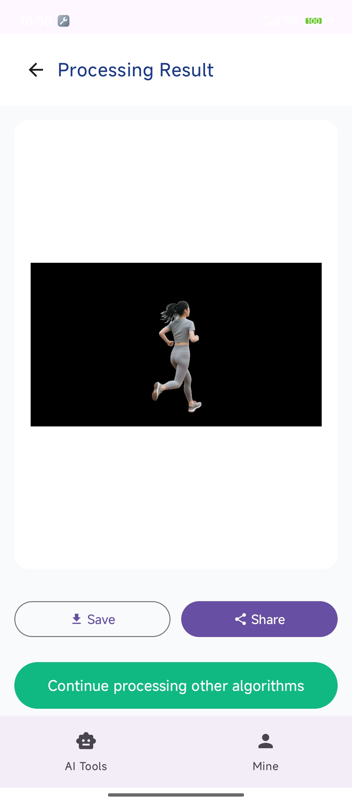

## app运行

<table cellpadding="5" cellspacing="0" border="1">
<tr>
  <td>桌面端搭建AI工作流</td>
  <td>移动端部署</td>
</tr>
<tr>
  <td></td>
  <td></td>
</tr>
<tr>
  <td></td>
  <td></td>
</tr>
</table>

### 配置NDK
```bash
export ANDROID_NDK=/snap/android-ndk-r25c
export ANDROID_SDK=/usr/lib/android-sdk
```

### 安装rust android
```bash
rustup target add aarch64-linux-android
```

### 编译
```bash
cd nndeploy/build
cmake -G Ninja \
            -DCMAKE_TOOLCHAIN_FILE=$ANDROID_NDK/build/cmake/android.toolchain.cmake\
            -DANDROID_ABI=arm64-v8a \
            -DANDROID_PLATFORM=android-21 \
            -DCMAKE_BUILD_TYPE=Release \
            ..
ninja
ninja install
```

### libc++_shared.so
```bash
cp /snap/android-ndk-r25c/toolchains/llvm/prebuilt/linux-x86_64/sysroot/usr/lib/aarch64-linux-android/libc++_shared.so /home/always/github/public/nndeploy/build/nndeploy_2.6.2_Android_aarch64_Release_Clang/lib
```

### 拷贝库到app/src/main/jniLibs中
```bash
python3 ../tool/script/android_install_so.py /home/always/github/public/nndeploy/build/nndeploy_2.6.2_Android_aarch64_Release_Clang /home/always/github/public/nndeploy/app/android/app/src/main/jniLibs/arm64-v8a
```

### 拷贝资源到app/android/app/src/main/assets
```bash
python3 ../tool/script/android_install_resouces.py -r  /home/always/github/public/nndeploy/resources/ -a /home/always/github/public/nndeploy/app/android/app/src/main/assets
```


### 启动Android Studio

- 通过Android Studio，打开path/nndeploy/app/android


## adb运行

### push
```bash
adb push nndeploy_2.6.2_Android_aarch64_Release_Clang/ /data/local/tmp/

adb push /home/always/github/public/nndeploy/app/android/app/src/main/assets/resources/ /data/local/tmp/
```

### export
```bash
export LD_LIBRARY_PATH="/data/local/tmp/nndeploy_2.6.2_Android_aarch64_Release_Clang/third_party/build_64/lib/arm64-v8a:${LD_LIBRARY_PATH}"
export LD_LIBRARY_PATH="/data/local/tmp/nndeploy_2.6.2_Android_aarch64_Release_Clang/third_party/opencv/lib/arm64-v8a:${LD_LIBRARY_PATH}"
export LD_LIBRARY_PATH="/data/local/tmp/nndeploy_2.6.2_Android_aarch64_Release_Clang/lib:${LD_LIBRARY_PATH}"
```

### pull
```bash
adb pull /data/local/tmp/prefill_logits.txt .
```

## 注

> 更换为你自己的目录

> 注意版本信息

