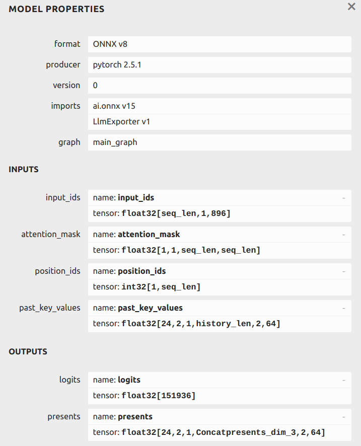
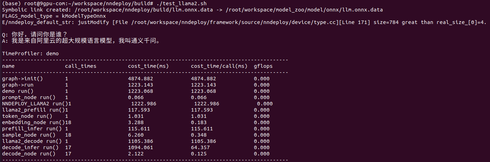
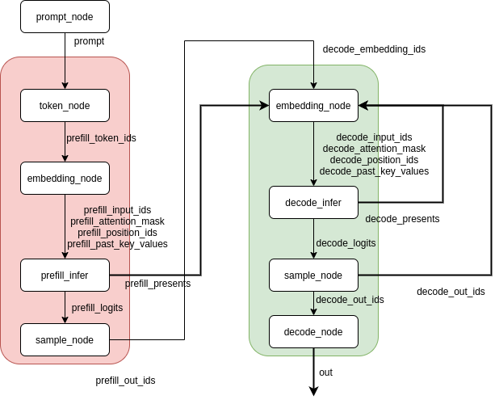

# LLM Onnxruntime Inference


### get model & convert to onnx

Just refer to [llmexport](https://github.com/wangzhaode/llm-export)

* the following fig is the converted input and output of Qwen2-0.5B onnx model



* after convert you will get the following files

  ```shell
  (base) root@9gpu-com:~/workspace/model_zoo/model# tree 
  .
  ├── embeddings_bf16.bin
  ├── llm_config.json
  ├── onnx
  │   ├── llm.onnx
  │   └── llm.onnx.data
  └── tokenizer.txt
  
  1 directory, 6 files
  ```


### edit config file Qwen-0.5_config.json

```json
{
    "hidden_size": 896,
    "layer_nums": 24,
    "max_seq_len": 250,
    "model_path": "/path/to/your/llm.onnx",
    "embedding_file": "/path/to/your/embeddings_bf16.bin",
    "tokenizer_json": "/path/to/your/Qwen2-0.5B-Instruct/tokenizer.json",
    "tokenizer_txt": "/path/to/your/tokenizer.txt",
    "key_value_shape": [
        2,
        1,
        0,
        2,
        64
    ],
    "prompt_template": "<|im_start|>user\n%s<|im_end|>\n<|im_start|>assistant\n",
    "prompt": "你好，请问你是谁？"
}

```
* there is an example in demo/llama


### build llama2 onnxruntime demo

the following params need to append in config.cmake

```cmake
# # llm
set(ENABLE_NNDEPLOY_PLUGIN_LLM ON)
set(ENABLE_NNDEPLOY_PLUGIN_TOKENIZER_CPP ON)

# demo
set(ENABLE_NNDEPLOY_PLUGIN_LLM ON)
```


### Inference shell script

```shell
#!/usr/bin/bash

MODEL_PATH=/root/workspace/model_zoo/model
BUILD_PATH=/root/workspace/nndeploy/build
ONNX_DATA=${MODEL_PATH}/onnx/llm.onnx.data
TARGET_LINK=${PWD}
EXE=${BUILD_PATH}/nndeploy_demo_llama

# symbolic link of llm.onnx.data
if [ -L "${TARGET_LINK}" ]; then
    rm "${TARGET_LINK}"
elif [ -f "${TARGET_LINK}" ]; then
    echo "Error: ${TARGET_LINK} is not a symbolic link. Please remove it manually."
    exit 1
fi

ln -s "${ONNX_DATA}" "${TARGET_LINK}"
echo "Symbolic link created: ${TARGET_LINK} -> current folder"

# params
NAME=NNDEPLOY_LLAMA2
INFER_TYPE=kInferenceTypeOnnxRuntime
DEVICE=kDeviceTypeCodeX86:0
MODEL_T=kModelTypeOnnx
PARALLEL_TYPE=kParallelTypeSequential
CONFIG=${MODEL_PATH}/Qwen-0.5_config.json

# exactue 
${EXE} \
    --name ${NAME} \
    --inference_type ${INFER_TYPE} \
    --device_type ${DEVICE} \
    --model_type ${MODEL_T} \
    --is_path \
    --parallel_type ${PARALLEL_TYPE} \
    --config_path ${CONFIG} \

```

* MODEL_PATH: your converted onnx path
* BUILD_PATH: nndeploy build path
* ONNX_DATA: path of llm.onnx.data
* TARGET_LINK: current folder
* EXE: the exacutable llama2 inference file
* CONFIG: path of Qwen-0.5_config.json


### Result



### Graph Structrue

the whole graph contains two sub-graphs: prefill and decode as follows:




