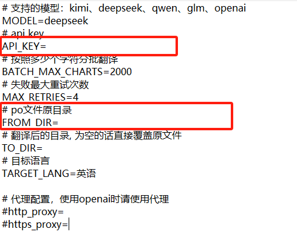
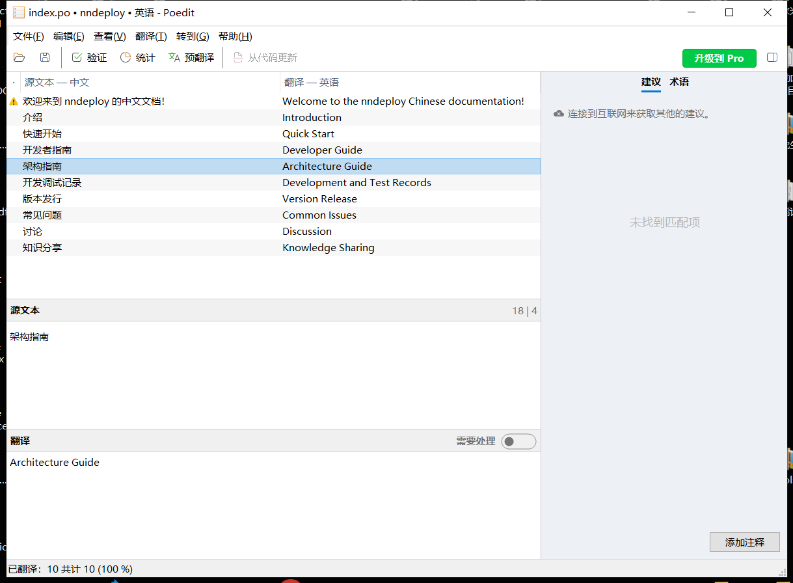

## Install Sphinx

安装构建文档的前置依赖

```
cd docs
pip install -r requirements-docs.txt
```

## Build html

构建网页

```
cd docs
# 中文文档
cd zh_cn
make html

# 英文文档
sphinx-build -b gettext ./ build/gettext
sphinx-intl update -p ./build/gettext -l en
# 以上步骤在docs/locales文件夹生成了en文件夹，包含了待翻译的.po后缀的中间格式 

# 参照 “翻译文档步骤”对.po文件进行翻译

# 构建英文文档页面。结果保存在docs/zh_cn/build/html/en
sphinx-build -b html -D language=en ./ build/html/en
```

## 翻译文档步骤

对于新建的中文.md文件，会生成一个全新的对应的.po文件，可以借助docs目录下的po-translator工具（原仓库：https://github.com/UsenPang/po-translator/）进行翻译。

需要在po-translator文件夹下新建一个.env文件，填写以下内容：

```txt
# 支持的模型：kimi、deepseek、qwen、glm、openai
MODEL=deepseek
# api key
API_KEY=
# 按照多少个字符分批翻译
BATCH_MAX_CHARTS=2000
# 失败最大重试次数
MAX_RETRIES=4
# po文件原目录
FROM_DIR=
# 翻译后的目录, 为空的话直接覆盖原文件
TO_DIR=
# 目标语言
TARGET_LANG=英语

# 代理配置，使用openai时请使用代理
#http_proxy=
#https_proxy=

```

推荐使用deepseek，需要申请API_KEY，充值10块就能用很久，**注意不要将API_KEY上传到公共平台**

可以将新建的.po文件单独放在一个文件夹，翻译好以后复制回去




在借助llm将大部分翻译完成后，使用Poedit软件进行**局部微调**，如下图所示，借助该软件导入需要微调的.po文件，然后一句一句微调



## 文档提交注意事项

- 图片资源存放在docs/images中，需要用英文命名
