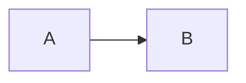
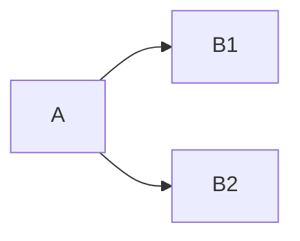
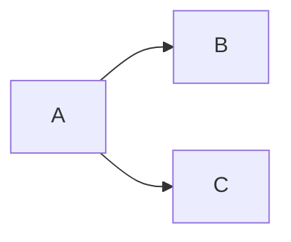

# 图的流水排布和多线程模式
首先讨论一个问题，我们的dag存在数据并行吗？

> 我的感觉是不存在的，按照我个人的理解，所谓的数据并行强调的应该是对于同时给入的数据，然后将其进行分块处理，这样所产生的并行才算是数据并行，但是在我们里面，很明显，每次给入的数据都是整块的，一张完整的graph，然后这个graph来在dag的node上进行执行，所以说不存在数据并行

## 任务并行+流水线———从边的立场来聊聊这个问题
### 单生产者+单消费者
#### case 1: 数据有序

对于这种图，我们希望做到几件事情：

1. A，B，C彼此并行执行，各个节点执行时不会干扰其他节点，这是我们所熟知的任务并行
2. B需要依赖A的输出，C需要依赖B的输出，所以它们之间存在相互依赖关系，也就是流水

功能需求：  

1. node方面我们需要node有一个轮询结构，可以做到不断地消费依赖节点的输出，这样保证资源充分利用
> 个人感觉轮询用while做就好，但是可以利用sleep和wake机制来避免请求超量——————轮询待确定
2.  对于edge，是否要存在上限机制，即任务能生产出来的tensor是存在上限值的，这种可以避免内存占用过大，从而内存交换影响整体性能

#### case 2: 数据无序——输入有序，输出无序，异构

B1和B2逻辑上是同一个任务，但是我们给人为的拆分成了两个任务，输入到B1的tensor和输入到B2的tensor不可能是同一个tensor，对于这种，我们应该将其视为任务并行而非数据并行，这个图和case1的唯一区别就是，这里的处理需要加上顺序判断

功能需求：

1. B1和B2产出的tensor能保证和输入前的tensor顺序一致，它们共用输入edge和输出edge
> 可以采用定长的vector来存储，每个tensor处理后都是放在 id模length 的位置上，如果该位置上有值，则阻塞（要求node内存在一个tensor的cache，用来暂存输出），同时塞入数据时要检查该id是不是比下一个要消费的(id+L)小
2. 需要能存储下一个要取的id的数值，这样当数据准备好后，可以直接通知下一个消费

### 单生产者+多消费者

对于A产生的tensor，B和C都要消费，同时A可以不断产生，每个产生的tensor只有当B，C都消费后，才能完全释放

功能需求：

1. edge本身需要对产生的数据tensor有引用计数，用来衡量该tensor是否要被释放
2. B和C即Node中可能还是需要根据index来进行计算该取用的tensor到底是不是当前tensor