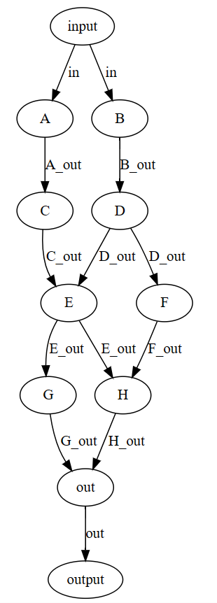
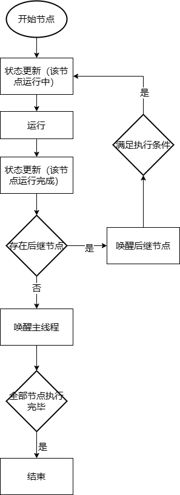
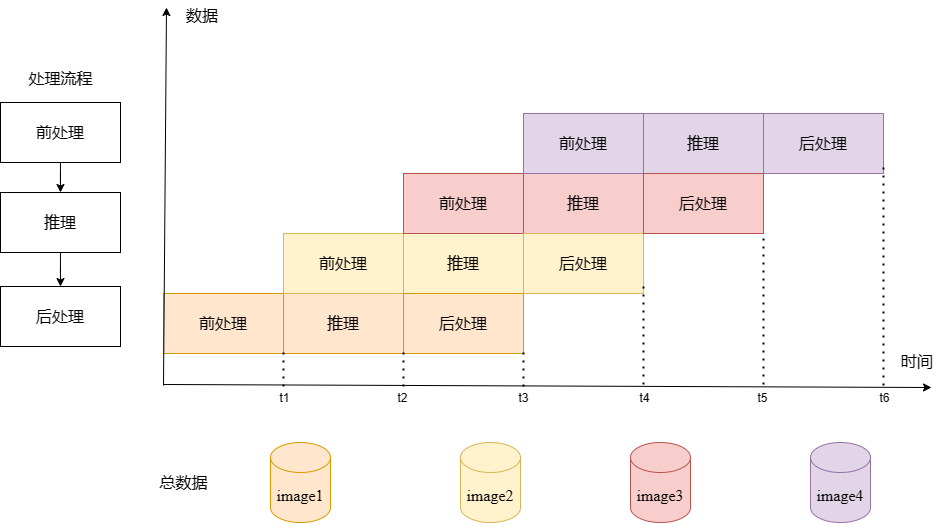
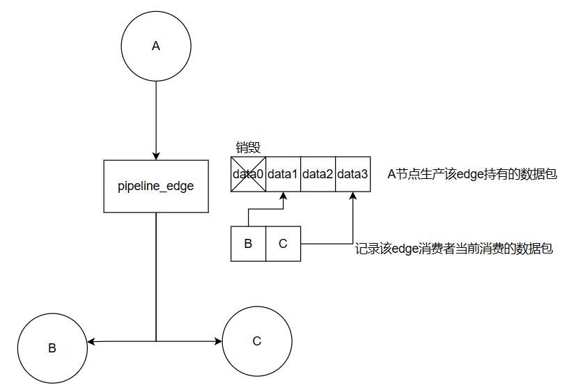
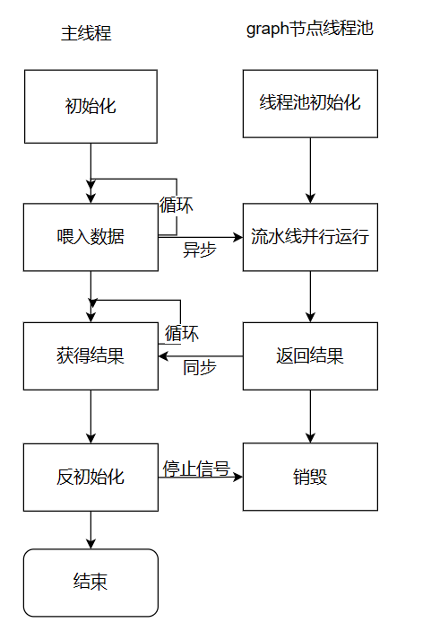

# 并行方式

nndeploy当前支持任务级并行和流水线并行两种并行方式。二者面向的场景不同：

+   任务级并行：在多模型以及多硬件设备的的复杂场景下，基于有向无环图的模型部署方式，可充分挖掘模型部署中的并行性，**缩短单次算法全流程运行耗时。**
+   流水线并行：在处理多帧的场景下，基于有向无环图的模型部署方式，可将前处理 `Node`、推理 `Node`、后处理 `Node`绑定三个不同的线程，每个线程又可绑定不同的硬件设备下，从而三个`Node`可流水线并行处理。在多模型以及多硬件设备的的复杂场景下，更加可以发挥流水线并行的优势，从而可显著**提高整体吞吐量**。

## 任务级并行

代码位于`nndeploy/include/nndeploy/dag/executor/parallel_task_executor.h`

任务级并行利用模型内部节点的并行性，将多个节点调度在多个线程中同时执行。假设有一个9节点的有向无环图，其拓扑架构如下，边表示数据的流向，用边连接的两个节点具有生产者-消费者的依赖关系，当生产者节点运行完毕后，消费者节点才能运行。例如E节点需要等C节点和D节点运行完毕后再运行。

从最初的输入开始。input数据准备好后，A、B节点就可以并行运行，A节点运行完后C节点可以运行，同理B节点运行完后D节点可以运行。从图上看，似乎C、D节点也是并行的。然而在实际运行时，由于A、B节点的运行时间未知，因此C、D节点不一定是并行的，有可能A、C节点都运行结束后，B节点仍在运行。这种运行时间未知带来的问题是无法在编译时就确定哪些节点之间是并行的，因此静态的建立图节点并行计算方式是非常困难的。

nndeploy采用的方式是运行时动态解图，在每个节点计算完毕后再判断其消费者节点是否能执行。主要流程如下：

1.初始化

初始化线程池；

对图进行拓扑排序，返回剔除死节点的排序后图，并记录总任务节点数量；

2.运行

全图运行流程如下：

从开始节点（入度为0，即没有依赖的节点）出发。更改节点状态为运行中，然后将节点的运行函数和运行后处理函数提交线程池，以异步的方式开始执行。节点的运行函数为用户自己实现的运行函数，运行后处理函数为nndeploy添加。

运行后处理函数包含节点状态更新、提交后续节点、唤醒主线程三部分。

节点状态更新将该节点状态更改为运行结束。

提交后续节点将遍历该节点的每一个后续节点，判断该后续节点的所有前驱节点是否都已运行结束，若结束再将该后续节点提交线程池。例如对于上图E节点，其后继节点为G、H。检查G节点的所有前驱即E节点是否运行完毕，运行完毕则加入线程池，检查H节点的所有前驱节点E、F是否执行完毕，运行完毕则加入线程池，若F节点尚未执行完毕，则H节点会在F节点执行后再检查一次是否可以提交执行。这样可以保证所有的节点都能被提交执行。

若该节点是尾节点（出度为0的节点，即没有后继节点），则检查是否完成节点数量达到所有节点数量，若达到，则唤醒主线程，所有节点均执行完毕。

3.运行后处理

将所有节点执行状态恢复为未运行，以便下次的全图运行。

## 流水线并行

 代码位于`nndeploy/include/nndeploy/dag/executor/parallel_pipeline_executor.h`

流水线并行是一种基于流水线思想的并行计算模型，主要用于解决计算密集型任务的并行执行问题，例如图像处理、视频编解码、机器学习等领域。其面向的场景为多批输入数据。流水线并行的原理是将一个大型计算任务拆分为若干个小的子任务，然后将这些子任务分配给不同的计算单元同时执行，每个计算单元只负责执行其中的一个子任务，完成后将结果传递给下一个计算单元，以此类推，直到所有子任务都被执行完成并合并为最终结果。其优点为可以充分利用计算资源，提高整体吞吐量。

在nndeploy中，可以将前处理 `Node`、推理 `Node`、后处理 `Node`绑定三个不同的线程，每个线程又可绑定不同的硬件设备下，从而三个`Node`可流水线并行处理。

以下图为例。共有4张图片需要处理，前处理、推理、后处理具有线性的依赖关系。t0时刻前处理节点处理image1的数据，t1时刻前处理节点处理image2的数据，推理节点处理由前处理计算完毕的image1数据。以此类推，每一个节点在下一时刻处理由上一个节点计算完毕的下一份数据。每一个时间片的大小由最耗时的节点时间开销决定，其余节点时间开销被隐藏。假设推理耗时最大，当数据总量足够大时，总的时间开销约等于数据总量x单个图片推理时延。

nndeploy中流水线并行实现思路如下：

1.初始化

对图进行拓扑排序，返回剔除死节点的排序后图。

初始化线程池，线程数量等于有效节点数量

2.运行

整体流程为每一个节点在其所有前驱节点计算完毕后开始运行，结束本次运行后获取新数据继续运行。

这里有两个关键设计，一个是节点何时开始运行，一个是节点何时结束运行。

节点何时开始运行：当该节点的运行速度小于其前驱节点时，前驱结点生成数据基本能满足该节点的运行。否则，该节点需要等待前驱结点完成计算。在流水线并行中，节点之间数据流动由`PipelineEdge`边控制。每条`PipelineEdge`可能有多个消费者节点，而不同消费者节点消耗数据速度可能不同。因此在`PipelineEdge`维护了两个关键数据容器。一个数据容器为数据包的list，记录了所有还会被消费者消耗的数据包。另一个为<消费者-当前消费数据包>的map，记录了每个消费者当前消费数数据包索引。当某一个数据包永远不会被消耗时，其被销毁。当某个消费者需要的数据还没生产出来时，该消费者的运行会阻塞住，直到前驱生产者节点产生数据后，才能继续运行。

节点何时结束运行：

当所有数据都被消耗结束，且所有结果都已计算得出后，需要结束所有节点线程。主线程与节点线程关系如下图。在主线程获得结果这一步进行同步，保证所有数据的结果都被返回后，进行反初始化操作，给每个节点线程发送停止信号。

3.反初始化

给线程池中所有节点线程发送停止信号，结束运行。

销毁线程池。