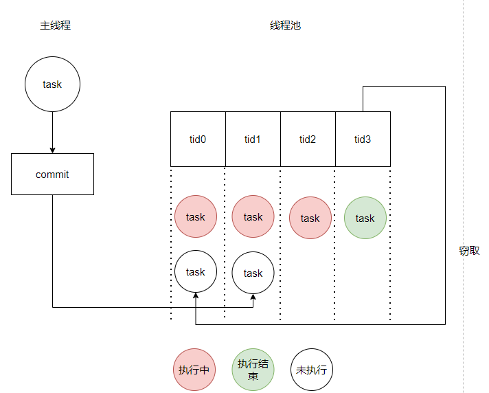

# 资源池

## 线程池

线程池用于管理和复用线程，以提高并发任务的执行效率，是一种常见的并发编程技术。

线程池主要有三大功能：1）任务调度：线程池可以接受多个任务，并根据可用线程资源和调度策略决定何时执行任务。2）线程复用：线程池中的线程可以被重复使用，不需要每次都创建和销毁线程，从而减少线程创建和销毁的开销。3）异步处理：线程池可以在后台异步执行任务，不会阻塞主线程，提高程序的响应性能。

nndeploy的线程池实现参考[ChunelFeng/CThreadPool](https://github.com/ChunelFeng/CThreadPool)，保留了本项目需要的核心功能，代码位于`nndeploy/include/nndeploy/thread_pool/thread_pool.h`。线程池的核心函数为`commit`任务提交函数，可接受普通函数、静态函数、类成员函数等作为任务运行函数，返回一个`std::future`对象。当通过`commit`进行任务提交后，该任务即在线程池内部线程中非阻塞式的异步运行。当调用`std::future`的`get()`函数时，进行同步操作。

如下图所示，线程池的每个线程有属于本线程的任务队列，从主线程提交的任务依次分配给每个线程，以保证线程间的任务负载均衡。当某个线程空闲时，其可以去其他线程尚未执行的任务中窃取一个，减少线程间运行的不平衡。

在线程池中的线程启动后，其会尝试从自己的任务队列弹出任务执行，或者窃取任务执行。若二者都失败，该线程会阻塞一段时间后再次尝试。当有任务添加到该线程的任务队列时，该线程会立即被唤醒，进行执行。在线程池的`destroy`函数被调用后，设立一个flag，当线程执行完任务后检测到该flag即退出任务执行的循环。