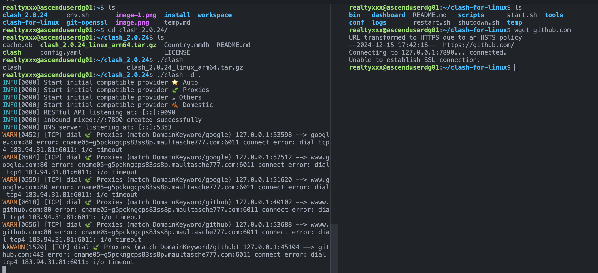

# 开发调试问题记录

## Python

python binding相关，移步`python/README.md`

## 使用safetensors加载的权重修改报错

safetensors方式加载的权重直接mmap到文件，以只读方式打开，无法修改。如果要修改权重，clone一份Tensor修改，并替换。

## Ascend开发环境

### 编译报错，链接错误，undefined reference

需要使用root方式编译

### Vscode终端无路径提示、部分常用命令错误、无法输入等

Vscode默认打开的终端有残缺，需要手动新建终端，选择Bash

### cmake方式
+ 具体步骤
  + 在根目录创建`build`目录，将`cmake/config.cmake`复制到该目录
    ```
    mkdir build
    cp cmake/config.cmake build
    cd build
    ```

  + 编辑`build/config.cmake`自定义编译选项（笔者的自定义编译选项：[path/cmake/config_ascendcl.cmake](../../../cmake/config_ascendcl.cmake)）
    
  + `cmake`
    ```
    cmake ../ -DCMAKE_CXX_COMPILER=g++ -DCMAKE_SKIP_RPATH=TRUE
    ```

### 在开发服务器上，模型以及三方库资源放在`/home/resource`，所有可以登录该服务器的同学都有权限访问该目录

+ 模型资源：`/home/resource/model_zoo`

+ 三方库资源：`/home/resource/third_party`

  + 本地终端起效：export LD_LIBRARY_PATH=/home/resource/third_party/onnxruntime-linux-aarch64-1.20.1/lib:$LD_LIBRARY_PATH
  + 始终有效
    + echo 'export LD_LIBRARY_PATH=/home/resource/third_party/onnxruntime-linux-aarch64-1.20.1/lib:$LD_LIBRARY_PATH' >> ~/.bashrc
    + source ~/.bashrc

+ 图片资源：`/home/resource/data_set`

+ 该开发服务器下，所有开发者具备该目录权限，具体执行命令如下：
  ```shell
  sudo chown -R :nndeploy /home/resource/
  sudo chmod -R g+rwx /home/resource/
  ```

### 关于第三方 tokenizer 在编译时产生的 protobuf 冲突问题

#### 问题描述

直接编译后，执行相关 demo 的可执行文件会发生 segment fault，gdb 查看结果如下

```bash
raymond@ascenduserdg01:~/workspace/nndeploy/build$ gdb ./nndeploy_demo_dag
...
Thread 1 "nndeploy_demo_d" received signal SIGSEGV, Segmentation fault.
0x0000ffffecb9c744 in google::protobuf::Arena::AllocateAlignedNoHook(unsigned long) () from /lib/aarch64-linux-gnu/libprotobuf.so.23
(gdb) bt
#0  0x0000ffffecb9c744 in google::protobuf::Arena::AllocateAlignedNoHook(unsigned long) () from /lib/aarch64-linux-gnu/libprotobuf.so.23
#1  0x0000ffffecc50d08 in google::protobuf::FileDescriptorProto* google::protobuf::Arena::CreateMaybeMessage<google::protobuf::FileDescriptorProto>(google::protobuf::Arena*) ()
   from /lib/aarch64-linux-gnu/libprotobuf.so.23
#2  0x0000ffffecc25d70 in google::protobuf::EncodedDescriptorDatabase::Add(void const*, int) () from /lib/aarch64-linux-gnu/libprotobuf.so.23
#3  0x0000ffffecbf8ac8 in google::protobuf::DescriptorPool::InternalAddGeneratedFile(void const*, int) () from /lib/aarch64-linux-gnu/libprotobuf.so.23
#4  0x0000ffffecc6aaa0 in google::protobuf::internal::AddDescriptors(google::protobuf::internal::DescriptorTable const*) () from /lib/aarch64-linux-gnu/libprotobuf.so.23
#5  0x0000ffffecb8e478 in ?? () from /lib/aarch64-linux-gnu/libprotobuf.so.23
#6  0x0000fffff7fc7624 in call_init (env=0xfffffffff338, argv=0xfffffffff328, argc=1, l=<optimized out>) at ./elf/dl-init.c:70
#7  call_init (l=<optimized out>, argc=1, argv=0xfffffffff328, env=0xfffffffff338) at ./elf/dl-init.c:26
#8  0x0000fffff7fc772c in _dl_init (main_map=0xfffff7fff370, argc=1, argv=0xfffffffff328, env=0xfffffffff338) at ./elf/dl-init.c:117
#9  0x0000fffff7fd9cc8 in _dl_start_user () from /lib/ld-linux-aarch64.so.1
Backtrace stopped: previous frame identical to this frame (corrupt stack?)
```

#### 原因分析

问题发生在 /lib/aarch64-linux-gnu/libprotobuf.so.23，于是查看 nndeploy_demo_dag 的动态链接和符号表

```bash
raymond@ascenduserdg01:~/workspace/nndeploy/build$ ldd nndeploy_demo_dag | grep proto
	libprotobuf.so.23 => /lib/aarch64-linux-gnu/libprotobuf.so.23 (0x0000ffffa5990000)
raymond@ascenduserdg01:~/workspace/nndeploy/build$ nm nndeploy_demo_dag | grep protobuf | grep ' T ' | head -n 5
0000000000135bb0 T _ZN2pb11CppFeaturesC1EPN6google8protobuf5ArenaE
0000000000135bd0 T _ZN2pb11CppFeaturesC1EPN6google8protobuf5ArenaERKS0_
0000000000135bb0 T _ZN2pb11CppFeaturesC2EPN6google8protobuf5ArenaE
0000000000135bd0 T _ZN2pb11CppFeaturesC2EPN6google8protobuf5ArenaERKS0_
000000000003ea60 T _ZN6google8protobuf10DescriptorC1Ev
```

发现 demo 不仅链接了 protobuf 的动态库，因为已经存在 protobuf 中的一些符号定义，应该也链接了protobuf 的静态库；但之前 build 的结果运行并没有任何问题，发生 segment fault 是由于 build 中加入了第三方的 tokenizer，而 tokenizer 中链接了 sentencepiece 的静态库

```cmake
target_link_libraries(tokenizers_cpp PRIVATE tokenizers_c sentencepiece-static ${TOKENIZERS_CPP_LINK_LIBS})
```

sentencepiece 编译时又使用了 protobuf-lite，所以第三方的 tokenizer 库中包含了 protobuf-lite，这就导致 protobuf-lite 与 protobuf 产生了冲突

#### 临时解决方案

* 第一种方式：系统安装需要 libprotobuf，直接跳过 third_party 中 protobuf 的编译，demo 的可执行文件只链接 protobuf 的动态库
* 只修改 protobuf.cmake 如下：

```cmake
include(ExternalProject)
include(cmake/util.cmake)

if (ENABLE_NNDEPLOY_PROTOBUF STREQUAL "OFF")
elseif (ENABLE_NNDEPLOY_PROTOBUF STREQUAL "ON")
  option(protobuf_BUILD_TESTS "" OFF)
  option(protobuf_MSVC_STATIC_RUNTIME "" ${ONNX_USE_MSVC_STATIC_RUNTIME})

  find_package(PkgConfig REQUIRED)
  pkg_check_modules(PROTOBUF REQUIRED protobuf)

  find_package(Protobuf REQUIRED)
  if(Protobuf_FOUND)
    include_directories(${Protobuf_INCLUDE_DIRS})
    set(NNDEPLOY_THIRD_PARTY_LIBRARY ${NNDEPLOY_THIRD_PARTY_LIBRARY} ${Protobuf_LIBRARIES})
  else()
    set(LIBS libprotobuf)
    add_subdirectory_if_no_target(${PROJECT_SOURCE_DIR}/third_party/protobuf ${LIBS})
    include_directories(${PROBUF_ROOT}/src)
    set(NNDEPLOY_THIRD_PARTY_LIBRARY ${NNDEPLOY_THIRD_PARTY_LIBRARY} ${LIBS})
  endif()
else()
endif()
```

* 第二种方式：系统安装 libprotobuf-lite，在编译 tokenizer 的时候链接 libprotobuf-lite.so，demo 的可执行文件既链接 protobuf 的动态库同时也链接 protobuf-lite 的动态库
* 只修改 tokenizer_cpp.cmake 如下：

```cmake
include(ExternalProject)

if (ENABLE_NNDEPLOY_PLUGIN_TOKENIZER_CPP STREQUAL "OFF")
elseif (ENABLE_NNDEPLOY_PLUGIN_TOKENIZER_CPP STREQUAL "ON")
  set(TOKENZIER_CPP_PATH third_party/tokenizers-cpp)
  add_subdirectory(${TOKENZIER_CPP_PATH} tokenizers)
  include_directories(${TOKENZIER_CPP_PATH}/include)
  set(NNDEPLOY_THIRD_PARTY_LIBRARY ${NNDEPLOY_THIRD_PARTY_LIBRARY} tokenizers_cpp)   

  find_library(PROTOBUF_LITE_LIB protobuf-lite REQUIRED)
  if (PROTOBUF_LITE_LIB)
      message(STATUS "Found protobuf-lite: ${PROTOBUF_LITE_LIB}")
      set(NNDEPLOY_THIRD_PARTY_LIBRARY ${NNDEPLOY_THIRD_PARTY_LIBRARY} ${PROTOBUF_LITE_LIB})   
  else()
      message(FATAL_ERROR "protobuf-lite not found! Please install")
  endif()

else()
endif()
```

#### 说明

* 这两种解决方案都是 work around 的方式，都需要在系统上安装相关的 protobuf

* 对于第一种方式而言，第三方的 protobuf 在编译时被直接跳过，所以第三方的 protobuf 显得没有什么意义了

* 对于第二种方式来说存在风险，动态库和静态库都被链接的情况下会优先选择动态库，但依然不确定是否会发生冲突，尤其是在动态库和静态库版本不一致的情况下

## 代理失效，github连接问题等

### github 连接不稳定问题

当我们在Ascend服务器上搭建开发环境的时候会碰到仓库从github.com上clone或者其他行为卡顿特别严重的问题。对于这个现象当前有两个方法处理：

1. 使用ssh连接的方式clone仓库。

2. 通过将服务器挂上代理的方式，让https上的服务更加方便。

当前我暂且只能通过第一种方式走通服务, 第二种方式貌似遇到了一些限制等待有缘人解决了。

**对于第一种方式**主要可以参考github的这篇文章讲述[connecting-to-github-with-ssh](https://docs.github.com/en/authentication/connecting-to-github-with-ssh)。然后，走通了流程之后将会发现仍旧无法使用ssh的方式连接github，`ssh -T git@github.com`无法获得应得结果; 鉴于这个原因，题主发现默认的20端口被限制了，需要使用443端口。需要在根目录中`$HOME/.ssh/config`中增加代码，然后方可走通。

```bash
Host github.com
    Hostname ssh.github.com
    Port 443
    User git
```

除此之外，还需要在`$HOME/.gitconfig`中添加以下代码，以让后面的子模块按照ssh执行

```bash
[url "ssh://git@github.com/"]
	insteadOf = https://github.com/
```
单独使用ssh方案可以解决卡顿问题。

**对于第二种方式**可以通过两种方式在自己的服务器上布置代理：

1. 按照[该文章方式](https://www.noseeflower.icu/)从下载指定的包（对于Accend来说下载这个[arm版本的clash](https://github.com/doreamon-design/clash/releases/#:~:text=clash_2.0.24_linux_arm64.tar.gz)即可。按照文章中讲的方式去进行即可，但是可能会遇到MMDB文件缺失问题，需要自行解决，我解决的方式是把第二种方式中的Country.MMDB文件拷贝过来（MMDB文件中包含了常见的网址到ip的键值对）。
2. 下载[clash-for-linux](https://github.com/wnlen/clash-for-linux)仓库，并根据README开启代理；
   注意：这两种都是题主测试时候使用的方式，是用的linux的clash方法，需要自行购买订阅。到目前为止，题主走通了流程，但是貌似遇到了一些约束（该方法在多个服务器上已验证使用过）：

题主怀疑是否是服务器只有443的端口和一些必要端口可以使用，其他端口则不行，因为如图proxy使用的52984的端口，而第一种方法中，ssh默认使用的20端口。
另题主已经尝试了网络上大部份方法得到一上结果，包括不限于手动编译git等等...