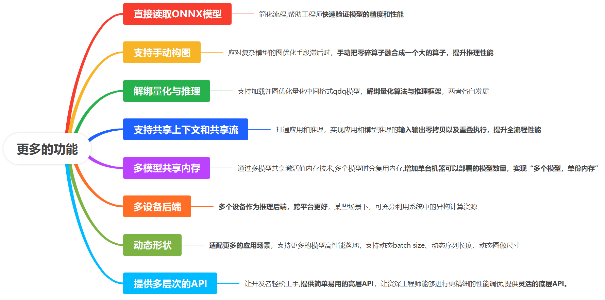

[English](README_INFERENCE_EN.md) | 简体中文

---

## 最新动态

- [2025/05/29] 🔥 与昇腾联合推出 AI 推理框架免费课程[昇腾官方](https://www.hiascend.com/developer/courses/detail/1923211251905150977) | [B 站](https://space.bilibili.com/435543077?spm_id_from=333.788.0.0)！ 从零手搓推理框架，课程基于nndeploy内部推理子模块开发。

---

## 介绍

框架内部开发的推理子模块，作为缺省推理框架，当用户环境未编译链接其他推理框架时可使用此框架，**在实际应用场景中，推荐用户使用对应平台下，芯片厂商提供的推理框架**。

目前主要支持华为昇腾NPU算子后端和纯CPU算子后端，计划扩展至X86、CUDA、ARM、OpenCL等异构计算平台。

在模型支持方面，已适配主流视觉模型，包括图像分类（ResNet50等）、目标检测（YOLOv11等）和图像分割（RMBG1.4等）。未来将拓展支持大语言模型（LLM）和文本图像多模态模型（Dit等）。

## 架构

## 为什么要在内部实现一个推理框架

- **从模型部署角度出发，推理框架需支持更多功能，满足实际应用需求**：我们总结了推理框架需支持的关键功能：

  

- **nndeploy已具备大量推理相关基础组件**：nndeploy在模型部署方面有许多优秀特性。nndeploy背后有大量精心设计和开发工作，为用户提供功能强大、易用、高性能且兼容主流框架的模型推理和部署体验。nndeploy已具备大量推理相关基础组件，因此我们选择先基于华为昇腾生态，开发一个内部推理框架。该框架将从部署角度出发，提供全面、易用的功能。

- **紧跟大模型时代AI基础设施发展**：大模型在各领域展现强大能力，但也对AI基础设施提出更高要求，如更高效内存管理、更强大分布式推理能力、更深度的算子优化等。开发该内部推理框架，将使我们能紧跟大模型时代步伐。

- **提供一个缺省的推理框架**：nndeploy内部推理框架将作为nndeploy的缺省推理框架，当用户没有编译链接推理框架时，可以使用该缺省推理框架，在实际应用场景下，推荐用户使用对应平台芯片公司提供的推理框架。

## 特点

### 1. 功能丰富

- **支持手动构图**：当图优化手段滞后时，通过手动构图方式，手动把零碎算子融合成一个大的算子，可以提升推理性能。
- **支持加载并图优化量化中间格式QDQ模型**：推理框架可以支持加载并图优化QDQ模型，模型量化就可以在训练框架或者ONNX层面完成，推理框架负责加载量化的中间格式QDQ模型，完成后续模型图优化工作。这样就可以解绑量化和推理框架。
- **支持共享上下文和共享流**：打通应用和推理，实现应用和模型推理的输入输出零拷贝以及重叠执行，提升全流程性能。
- **支持动态形状输入**：适配更多的应用场景，支持更多的模型高性能落地，支持动态batch size、动态序列长度、动态图像尺寸
- **支持多设备算子后端**：目前后端算子支持CPU和华为昇腾NPU，未来会逐步扩展支持CUDA、ARM、OpenCL等异构计算平台。

### 2. 简单易用

- **支持直接读取ONNX模型**: 简化流程,帮助工程师快速验证模型的精度和性能。
- **支持直接读取safetensors格式的模型权重文件**: 简化流程,帮助工程师快速验证模型的精度和性能。
- **提供多层次的API**：让开发者轻松上手,提供简单易用的高层API，让资深工程师能够进行更精细的性能调优,提供灵活的底层API。

### 3. 高性能

- **内存复用**：基于计算图的高效的内存复用管理机制
- **多模型推理实例共享内存**：通过多模型共享激活值内存技术,多个模型时分复用内存,增加单台机器可以部署的模型数量，实现“多个模型，单份内存”
- **图优化**：通过对IR/计算图进行一系列优化，如算子融合、常量折叠、公共子表达式消除等，提高模型推理性能。
- **算子优化**：针对不同硬件平台，如CPU、华为昇腾NPU等，对算子进行深度优化，充分利用硬件特性，实现高效计算。

## 关键子模块

- **模型中间表示(IR)**：一组精心设计的数据结构，用于描述模型的结构和权重信息。它是连接模型解释、图优化、计算图构建等推理框架各个关键模块的核心数据结构。IR作为推理框架内部的统一模型表示，在简化框架设计的同时，也方便了各模块之间的交互。

- **模型解释(Model Interpreter)**：是将训练框架模型文件转换为推理框架自定义模型文件的模块。目前支持将onnx模型文件转换为自定义模型文件（模型结构文件JSON,模型权重文件safetensors），也支持自定义模型文件与自定义IR之间的相互转换。通过模型解释模块，可以实现不同格式的模型在推理框架内部的统一表示，简化了推理框架的设计。

- **计算图(DAG)**：由算子(Operator)和张量(Tensor)构成的带执行属性的有向无环图，通过IR和配置参数构建而成。

- **运行时（Runtime）**：负责执行计算图，支持模型推理和单算子执行两种模式。它基于带执行属性的有向无环图，为计算图分配所需资源，写入输入，执行计算图，最终得到推理结果。

- **Ascend算子库（Ascend Operator Library）**：是基于华为昇腾平台的丰富算子库，包括NN、BLAS、AIPP、DVPP等多种类型的高性能算子。算子与计算图紧密关联，是推理框架的核心组成部分。

- **图优化（Graph Optimization）**：在模型推理的各个阶段对IR或计算图进行优化，以提升模型推理性能。它包括算子融合、常量折叠、公共子表达式消除、Transpose消除、恒等算子消除等多种优化手段，并结合硬件特性和具体模型特点选择合适的优化策略。

- **内存优化（Memory Optimization）**：通过分析计算图中Tensor的生命周期，让生命周期不重叠的Tensor进行内存复用，以减少内存占用。

- **并行优化（Parallel Optimization）**：通过合理利用硬件资源的并行能力来提升模型推理性能，包括数据并行、流水线并行、张量并行等并行模式。

- **Ascend C算子开发（Ascend C Operator Development）**：是基于华为昇腾平台的自定义算子开发语言，支持用户根据实际需求自定义和优化算子实现。

