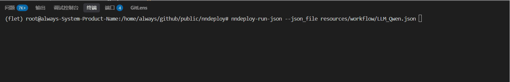

# 生产环境部署指南

nndeploy提供了从拖拉拽开发到生产环境部署的完整解决方案，**推荐流程**：

## 开发流程概述

### 1. 开发自定义节点
- **Python节点开发**：快速实现算法逻辑
- **C++节点开发**：高性能计算节点，适用于性能敏感场景
- **节点注册**：将自定义节点注册到nndeploy框架中，便于可视化界面调用

### 2. 使用可视化界面设计和调试工作流
- **拖拽式搭建**：通过可视化界面拖拽节点，连接数据流，构建完整的AI处理流程
- **参数实时调试**：在界面中实时调整节点参数，观察处理效果
- **工作流验证**：通过测试数据验证工作流的正确性和性能表现
- **多种执行模式**：配置串行、流水线并行、任务并行等执行策略

### 3. 导出JSON配置文件并通过API加载运行
- **工作流导出**：将调试完成的工作流保存为JSON配置文件
- **跨平台部署**：JSON文件可在Linux、Windows、macOS、Android等平台加载运行
- **API集成**：通过Python/C++ API将工作流集成到业务系统中

## 部署优势

- **开发效率高**：可视化开发大幅减少代码编写量
- **调试便捷**：实时参数调整和效果预览
- **部署灵活**：一次开发，多端部署
- **性能优化**：内置多种性能优化策略
- **易于维护**：JSON配置文件便于版本管理和更新

## 部署阶段

在可视化界面中完成工作流搭建后，可保存为 JSON 文件，然后通过 Python/C++ API 加载执行。

### 自定义输入输出模式

**使用场景**：与业务代码交互

**Python大语言模型示例**：

```python
import nndeploy

# 创建并加载工作流
graph = nndeploy.dag.Graph("")
graph.remove_in_out_node()  # 移除输入输出节点以实现自定义数据流
graph.load_file("path/to/llm_workflow.json")
graph.init()

# 设置输入数据
input_edge = graph.get_input(0)
text = nndeploy.tokenizer.TokenizerText()
text.texts_ = ["<|im_start|>user\n请介绍NBA超级巨星迈克尔·乔丹<|im_end|>\n<|im_start|>assistant\n"]
input_edge.set(text)

# 执行推理
status = graph.run()

# 获取输出结果
output_edge = graph.get_output(0)
result = output_edge.get_graph_output()

# 清理资源
graph.deinit()
```

**C++大语言模型示例**：

```cpp
#include "nndeploy/dag/graph.h"

// 创建并加载工作流
std::shared_ptr<dag::Graph> graph = std::make_shared<dag::Graph>("");
base::Status status = graph->loadFile("path/to/llm_workflow.json");
graph->removeInOutNode();  // 移除输入输出节点
status = graph->init();

// 设置输入数据
dag::Edge* input = graph->getInput(0);
tokenizer::TokenizerText* text = new tokenizer::TokenizerText();
text->texts_ = {
    "<|im_start|>user\n请介绍NBA超级巨星迈克尔·乔丹<|im_end|>\n<|im_start|>assistant\n"
};
input->set(text, false);

// 执行推理
status = graph->run();

// 获取输出结果
dag::Edge* output = graph->getOutput(0);
tokenizer::TokenizerText* result = output->getGraphOutput<tokenizer::TokenizerText>();

// 清理资源
status = graph->deinit();
```

### 完整工作流模式

**使用场景**：工作流包含完整的输入输出处理逻辑，无需额外的数据设置

**Python示例**：

```python
import nndeploy

# 加载并执行完整工作流
graph = nndeploy.dag.Graph("")
graph.load_file("path/to/llm_workflow.json")
graph.init()
status = graph.run()  # 工作流内部处理所有输入输出
graph.deinit()
```

**C++示例**：

```cpp
// 加载并执行完整工作流
std::shared_ptr<dag::Graph> graph = std::make_shared<dag::Graph>("");
base::Status status = graph->loadFile("path/to/llm_workflow.json");
status = graph->init();
status = graph->run();  // 工作流内部处理所有输入输出
status = graph->deinit();
```

---

### 更多示例代码

| 算法类型 | Python示例 | C++示例 |
| -------- | ---------- | ------- |
| **大语言模型** | [Python LLM](https://github.com/nndeploy/nndeploy/blob/main/demo/llm/demo.py) | [C++ LLM](https://github.com/nndeploy/nndeploy/blob/main/demo/llm/demo.cc) |
| **目标检测** | [Python Detection](https://github.com/nndeploy/nndeploy/blob/main/demo/detect/demo.py) | [C++ Detection](https://github.com/nndeploy/nndeploy/blob/main/demo/detect/demo.cc) |


## 调试工作流

完成工作流搭建后，保存为 JSON 文件并通过命令行执行，用于调试工作流

```bash
# Python CLI
nndeploy-run-json --json_file path/to/workflow.json
# C++ CLI
cd path/to/nndeploy
./build/nndeploy_demo_run_json --json_file path/to/workflow.json
```



## 文档

- [Python++ API](https://nndeploy-zh.readthedocs.io/zh-cn/latest/python_api/index.html)
- [Python 自定义节点开发手册](docs/zh_cn/quick_start/plugin_python.md)
- [C++ API](https://nndeploy-zh.readthedocs.io/zh-cn/latest/cpp_api/doxygen.html)
- [C++自定义节点开发手册](docs/zh_cn/quick_start/plugin.md)


