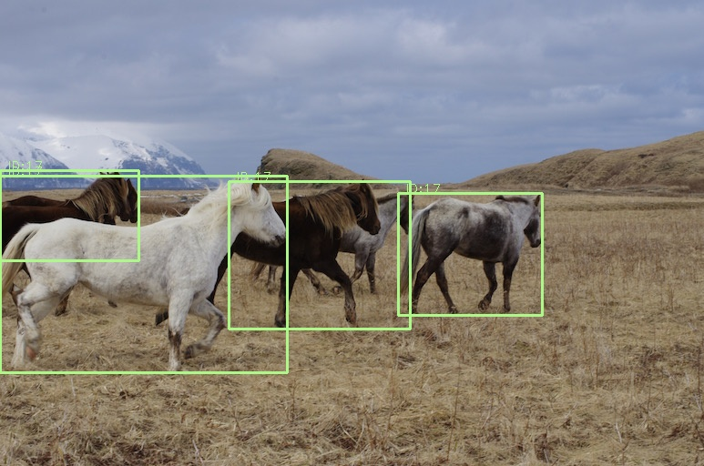

# 示例工程

## 从源码编译

参考编译文档，[编译文档链接](./build.md)

## 基于DAG的模型部署演示示例（采用默认config.cmake即可编译成功）

### Windows 下运行 demo_nndeploy_dag
```shell
cd /home/always/huggingface/nndeploy/nndeploy/build/install/bin
.\demo_nndeploy_dag.exe
```

### Linux 下运行 demo_nndeploy_dag
```shell
cd /home/always/huggingface/nndeploy/nndeploy/build/install/lib
export LD_LIBRARY_PATH=$(pwd):$LD_LIBRARY_PATH
./demo_nndeploy_dag
```

### Andorid 下运行 demo_nndeploy_dag
```shell
cd /home/always/huggingface/nndeploy/nndeploy/build/install/lib

adb push * /data/local/tmp/

adb shell 

cd /data/local/tmp/

export LD_LIBRARY_PATH=$(pwd):$LD_LIBRARY_PATH
./demo_nndeploy_dag
```

### 效果示例
```shell
E/nndeploy_default_str: main [File /home/always/github/public/nndeploy/demo/dag/demo.cc][Line 273] start!
digraph serial_graph {
p0x7ffeec419690[shape=box, label=graph_in]
p0x7ffeec419690->p0x5614d9427700[label=graph_in]
p0x5614d9427700[label=model_0_graph]
p0x5614d9427700->p0x5614d941c230[label=model_0_out]
p0x5614d941c230[label=op_link]
p0x5614d941c230->p0x5614d9428260[label=op_link_out]
p0x5614d9428260[label=model_1_graph]
p0x7ffeec4196c0[shape=box, label=graph_out]
p0x5614d9428260->p0x7ffeec4196c0[label=graph_out]
}
digraph model_0_graph {
p0x7ffeec419690[shape=box, label=graph_in]
p0x7ffeec419690->p0x5614d9420e00[label=graph_in]
p0x5614d9420e00[label=model_0_graph_preprocess]
p0x5614d9420e00->p0x5614d9418e00[label=model_0_graph_preprocess_out]
p0x5614d9418e00[label=model_0_graph_infer]
p0x5614d9418e00->p0x5614d941b100[label=model_0_graph_infer_out]
p0x5614d941b100[label=model_0_graph_postprocess]
p0x5614d94275a0[shape=box, label=model_0_out]
p0x5614d941b100->p0x5614d94275a0[label=model_0_out]
}
digraph model_1_graph {
p0x5614d9427650[shape=box, label=op_link_out]
p0x5614d9427650->p0x5614d9419b60[label=op_link_out]
p0x5614d9419b60[label=model_1_graph_preprocess]
p0x5614d9419b60->p0x5614d94c0b00[label=model_1_graph_preprocess_out]
p0x5614d94c0b00[label=model_1_graph_infer]
p0x5614d94c0b00->p0x5614d94c0d80[label=model_1_graph_infer_out]
p0x5614d94c0d80[label=model_1_graph_postprocess]
p0x7ffeec4196c0[shape=box, label=graph_out]
p0x5614d94c0d80->p0x7ffeec4196c0[label=graph_out]
}
I/nndeploy_default_str: run [File /home/always/github/public/nndeploy/demo/dag/demo.cc][Line 46] running node = [model_0_graph_preprocess]!
I/nndeploy_default_str: run [File /home/always/github/public/nndeploy/demo/dag/demo.cc][Line 46] running node = [model_0_graph_infer]!
I/nndeploy_default_str: run [File /home/always/github/public/nndeploy/demo/dag/demo.cc][Line 46] running node = [model_0_graph_postprocess]!
I/nndeploy_default_str: run [File /home/always/github/public/nndeploy/demo/dag/demo.cc][Line 46] running node = [op_link]!
I/nndeploy_default_str: run [File /home/always/github/public/nndeploy/demo/dag/demo.cc][Line 46] running node = [model_1_graph_preprocess]!
I/nndeploy_default_str: run [File /home/always/github/public/nndeploy/demo/dag/demo.cc][Line 46] running node = [model_1_graph_infer]!
I/nndeploy_default_str: run [File /home/always/github/public/nndeploy/demo/dag/demo.cc][Line 46] running node = [model_1_graph_postprocess]!
E/nndeploy_default_str: main [File /home/always/github/public/nndeploy/demo/dag/demo.cc][Line 350] end!
```


## 基于YOLOV8n的目标的检测

### [下载模型](https://huggingface.co/alwaysssss/nndeploy/blob/main/model_zoo/detect/yolo/yolov8n.onnx)
  ```shell
  wget https://huggingface.co/alwaysssss/nndeploy/blob/main/model_zoo/detect/yolo/yolov8n.onnx
  wget https://huggingface.co/alwaysssss/nndeploy/blob/main/model_zoo/detect/yolo/yolov8n.onnx.mnn
  ```

### [下载测试数据](https://huggingface.co/alwaysssss/nndeploy/resolve/main/test_data/detect/sample.jpg)
  ```shell
  wget https://huggingface.co/alwaysssss/nndeploy/resolve/main/test_data/detect/sample.jpg
  ```

### Windows 下运行 demo_nndeploy_detect
```shell
cd /home/always/huggingface/nndeploy/nndeploy/build/install/bin
.\demo_nndeploy_detect.exe --name NNDEPLOY_YOLOV8 --inference_type kInferenceTypeOpenVino --device_type kDeviceTypeCodeX86:0 --model_type kModelTypeOnnx --is_path --model_value C:\huggingface\nndeploy\model_zoo\detect\yolo\yolov8n.onnx --codec_flag kCodecFlagImage --parallel_type kParallelTypeSequential --input_path C:\huggingface\nndeploy\test_data\detect\sample.jpg --output_path C:\huggingface\nndeploy\temp\sample_output.jpg
```

`注：请将上述PATH更换为自己对应的目录`

### Linux 下运行 demo_nndeploy_detect
```shell
cd /home/always/huggingface/nndeploy/nndeploy/build/install/lib
export LD_LIBRARY_PATH=$(pwd):$LD_LIBRARY_PATH

// TensorRt 部署
./demo_nndeploy_detect --name NNDEPLOY_YOLOV8 --inference_type kInferenceTypeTensorRt --device_type kDeviceTypeCodeCuda:0 --model_type kModelTypeOnnx --is_path --model_value /home/always/huggingface/nndeploy/model_zoo/detect/yolo/yolov8n.onnx --codec_flag kCodecFlagImage --parallel_type kParallelTypeSequential --input_path /home/always/huggingface/nndeploy/test_data/detect/sample.jpg --output_path /home/always/huggingface/nndeploy/temp/sample_output.jpg

// OnnxRuntime 部署
./demo_nndeploy_detect --name NNDEPLOY_YOLOV8 --inference_type kInferenceTypeOnnxRuntime --device_type kDeviceTypeCodeX86:0 --model_type kModelTypeOnnx --is_path --model_value /home/always/huggingface/nndeploy/model_zoo/detect/yolo/yolov8n.onnx --codec_flag kCodecFlagImage --parallel_type kParallelTypeSequential --input_path /home/always/huggingface/nndeploy/test_data/detect/sample.jpg --output_path /home/always/huggingface/nndeploy/temp/sample_output.jpg
```

`注：请将上述PATH更换为自己对应的目录`


### Andorid 下运行 demo_nndeploy_detect
```shell
cd /home/always/huggingface/nndeploy/nndeploy/build/install/lib
adb push ./* /data/local/tmp

cd /home/always/huggingface/nndeploy/model_zoo/detect/yolo/
adb push ./yolov8n.onnx.mnn /data/local/tmp

cd /home/always/huggingface/nndeploy/test_data/detect/
adb push ./sample.jpg /data/local/tmp

cd /data/local/tmp
export LD_LIBRARY_PATH=/data/local/tmp:$LD_LIBRARY_PATH
// mnn 推理
./demo_nndeploy_detect --name NNDEPLOY_YOLOV8 --inference_type kInferenceTypeMnn --device_type kDeviceTypeCodeArm:0 --model_type kModelTypeMnn --is_path --model_value ./yolov8n.onnx.mnn --input_type kInputTypeImage  --input_path ./sample.jpg --output_path ./sample_output.jpg

adb pull /data/local/tmp/sample_output.jpg ./
```

### 效果示例
 
