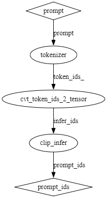
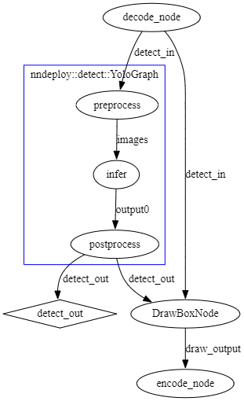

# nndeploy插件开发手册

## 插件开发简介

在nndeploy框架中，插件（plugin）是一种可以组合调用的功能模块，通常表现为继承自`dag::Node`的自定义节点。插件通过DAG进行组织和调用，用于执行开发者自定义的前/后处理逻辑、推理、初始化操作等等。

插件设计的目的是：

- 模块化：将特定的逻辑封装为节点，易于组合和替换；
- 解耦性：将插件节点与调度模块进行解耦；
- 可扩展性：开发者可以轻松接入新的调度算法和数据处理流程；

### 什么是DAG

nndeploy的执行核心是有向无环图（DAG），图由以下两个基本组件组成：

- 节点（node）:代表基本的计算或功能单元，可以是推理、调度、初始化等等；
- 边（edge）:节点之间的连接通道，用于传递张量等数据对象；

图在运行时根据节点输入输出边判断节点的执行顺序，自动调度各个节点执行。

### 插件节点在流水线中的位置

以stable diffusion 1.5为例，推理流程大致如下：


其中：

- tokenizer表示嵌入节点；
- cvt_token_ids_2_tensor表示数据转换节点；
- clip_infer表示clip模型的推理节点；
- concat_node表示数据concat节点；
- init_latents表示数据初始化节点；
- denoise表示stable-diffusion模型运行过程中的去噪节点；
- vae_infer表示vae decoder的执行节点；
- save_node表示数据存储为图片的节点；
- prompt、token_ids、prompt_ids等表示用于传递数据的边；

通过这些插件节点的组合，我们可以构建一个完整的文生图执行流程。

## 插件编写基础

nndeploy中的插件本质上是自定义的DAG节点，继承自`dag::Node`，要实现一个插件节点，一般需要完成以下步骤：

### 1. 定义节点类
```C++
class MyCustomNode : public dag::Node {
 public:
  MyCustomNode(const std::string &name,
               std::vector<dag::Edge *> inputs,
               std::vector<dag::Edge *> outputs)
      : dag::Node(name, inputs, outputs) {
        // 设置节点key，与注册的节点类型名一致，必须要设置  
        key_ = "nndeploy::example::MyCustomNode";
        // 节点参数，继承自base::Param，如果该节点需要参数，则必须要设置  
        param_ = std::make_shared<MyParam>();
        // 设置输入类型，继承自base::TypeInfo，如果该节点有输入，则必须要设置
        this->setInputTypeInfo<device::Tensor>();
        // 设置输出类型，继承自base::TypeInfo，如果该节点有输出，则必须要设置
        this->setOutputTypeInfo<device::Tensor>();
      }

  virtual ~MyCustomNode() {}

  base::Status run() override {
    // 插件逻辑写在这里
    return base::kStatusCodeOk;
  }
};
```
### 2. 注册节点类型

为了将节点注册到框架中，需要使用注册宏：

```C++
REGISTER_NODE("nndeploy::example::MyCustomNode", MyCustomNode);
```

### 3. 节点中的输入输出访问

可以通过以下方式获取输入边中的张量：

```C++
device::Tensor *input_tensor = (device::Tensor *)(this->getInput(0)->getTensor(this));
```

在节点的输出边中创建输出张量（输出张量的内存需要在节点中分配，输入张量的内存由上一个节点分配）：

```C++
device::Tensor *output_tensor = this->getOutput(0)->create(device, tensor_desc);
```

### 4. 设置参数（可选）

你可以为插件定义参数类（继承 base::Param），并通过 setParam() 接口设置：

```C++
class MyParam : public base::Param {
 public:
  int some_value;
  PARAM_COPY(MyParam);
  PARAM_COPY_TO(MyParam);
};

auto param = std::make_shared<MyParam>();
param->some_value = 123;
my_node->setParam(param.get());
```

在节点内部可通过 param_ 成员访问：

```C++
MyParam *p = (MyParam *)(param_.get());
```

### 5. 将插件添加到计算图中

在nndeploy中，有两种方式将插件节点添加到图中：

**方式一：直接创建节点对象**

```C++
dag::Graph *graph = new dag::Graph("my_graph", {input_edge}, {output_edge});
MyCustomNode *node = (MyCustomNode *)graph->createNode<MyCustomNode>(
    "my_node", {input_edge}, {output_edge});
```

**方式二：通过NodeDesc创建**

```C++
dag::NodeDesc desc("nndeploy::example::MyCustomNode", "my_node",
                   {input_edge->getName()}, {output_edge->getName()});
MyCustomNode *node = (MyCustomNode *)graph->createNode(desc);
```

`"nndeploy::example::MyCustomNode"`为node的key，序列化时使用。

## 高级用法

### 创建子图

当插件涉及更复杂的功能逻辑时，例如模型推理、多输入合并策略等，开发者可以通过创建子图（继承 dag::Graph）来组织多个节点为一个整体流程模块：

- 子图类继承自`dag::Graph`；
- 为子图添加自定义构图函数，如`make()`，封装边与节点创建流程；
- 添加自定义参数接口，开发者可以为`Node`提供自定义参数，并在子图类中提供对应的接口；

#### 构图函数

以stable-diffusion-1.5模型的embedding过程为例，需要经历三个部分，首先对提示词进行tokenize，再将分词向量转换成适合clip模型执行的tensor格式，最后将向量输入到clip模型中，进行文本到图像语义空间的转换。在sd的例子中，这三个部分被封装成了三个`Node`，同时封装成了一个`Embedding`子图。子图的构图函数如下：

```C++
  base::Status make(base::InferenceType inference_type) {
    prompt_ = this->getInput(0);
    if (prompt_ == nullptr) {
      NNDEPLOY_LOGE("prompt is nullptr\n");
      return base::kStatusCodeErrorInvalidParam;
    }
    token_ids_ = this->createEdge("token_ids_");
    tokenizer_node_ = (tokenizer::TokenizerEncodeCpp *)this
                          ->createNode<tokenizer::TokenizerEncodeCpp>(
                              "tokenizer", {prompt_}, {token_ids_});

    infer_ids_ = this->createEdge("infer_ids");
    cvt_node_ =
        (CvtTokenIds2TensorNode *)this->createNode<CvtTokenIds2TensorNode>(
            "cvt_token_ids_2_tensor", {token_ids_}, {infer_ids_});

    embedding_ = this->getOutput(0);
    if (embedding_ == nullptr) {
      NNDEPLOY_LOGE("embedding is nullptr\n");
      return base::kStatusCodeErrorInvalidParam;
    }
    clip_infer_node_ = (infer::Infer *)this->createInfer<infer::Infer>(
        "clip_infer", inference_type, {infer_ids_}, {embedding_});
    return base::kStatusCodeOk;
  }
```

实现完自定义子图后，开发者可以通过如下的方法将子图添加到更大的图中：

```C++
EmbeddingGraph *embedding_graph =
      (EmbeddingGraph *)(graph->createNode<EmbeddingGraph>(
          "embedding_subgraph", {prompt}, {prompt_ids}));
embedding_graph->make(inference_type);
```

子图会经过框架的调用，自动实现流水线并行。

#### 自定义参数

在`tokenizer`和`infer`过程中，执行时需要传入一些参数，例如分词器的类型、模型文件的路径等等，这些参数可以通过在自定义子图中添加接口进行传入：

```C++
base::Status setTokenizerParam(tokenizer::TokenizerPraram *param) {
  tokenizer_node_->setParam(param);
  return base::kStatusCodeOk;
}

base::Status setInferParam(inference::InferenceParam *param) {
  clip_infer_node_->setParam(param);
  return base::kStatusCodeOk;
}
```

然后在构建完子图后传入：

```C++
embedding_graph->make(inference_type);

tokenizer::TokenizerPraram *tokenizer_param =
    new tokenizer::TokenizerPraram();
tokenizer_param->tokenizer_type_ = tokenizer::TokenizerType::kTokenizerTypeHF;
tokenizer_param->is_path_ = true;
tokenizer_param->json_blob_ = text2image_param->model_value_[0];
embedding_graph->setTokenizerParam(tokenizer_param);

inference::InferenceParam *infer_param = new inference::InferenceParam();
infer_param->device_type_ = text2image_param->device_type_;
infer_param->model_type_ = text2image_param->model_type_;
infer_param->is_path_ = text2image_param->is_path_;
std::vector<std::string> onnx_path = {text2image_param->model_value_[1]};
infer_param->model_value_ = onnx_path;
embedding_graph->setInferParam(infer_param);
```

#### 打印子图

子图继承自`dag::Node`，同样可以调用`dump()`接口进行图结构的打印：

```C++
embedding_graph->dump();
```

使用[graphviz](https://dreampuf.github.io/GraphvizOnline)进行可视化之后，结果图如下：



### 复合节点

在有些情况下，开发者希望向某个`Node`中添加一些自定义的操作，例如，在`infer`节点之前添加一些格式转换的操作，但是不希望开发`Node`，此时可以通过创建复合节点（Composite Node）来实现所需的功能。

在DAG结构中，为了实现可扩展性，复合节点提供了一种机制：

- 将多个节点组合在一起，形成一个新的节点，从而实现更复杂的功能；
- 对外表现为一个标准的`Node`，可接收输入、提供输出；

开发者可以通过`createNode`或者`createInfer`接口向复合节点中添加节点，复合节点会自动管理节点以及边的创建和销毁。

#### 自定义复合节点

定义一个复合节点类，继承自`dag::CompositeNode`：

```C++
class DenoiseNode : public dag::CompositeNode {
 public:
  DenoiseNode(const std::string &name, std::vector<dag::Edge *> inputs,
              std::vector<dag::Edge *> outputs)
      : CompositeNode(name, inputs, outputs) {
    key_ = "nndeploy::stable_diffusion::DenoiseNode";
    param_ = std::make_shared<DenoiseParam>();
    setInputTypeInfo<device::Tensor>();
    setInputTypeInfo<device::Tensor>();
    setOutputTypeInfo<device::Tensor>();

    scheduler_ = createScheduler(...);  // 自定义的调度器
  }
};
```
实现make函数，构建子图结构，添加子节点及其输入输出边：

```C++
virtual base::Status make() override {
  NodeDesc infer_desc("nndeploy::infer::Infer", "infer",
                      {"text_embeddings", "cfg_latents", "timestep"},
                      {"unet_output"});
  infer_node_ = (infer::Infer *)this->createInfer<infer::Infer>(
      infer_desc, text2image_param_->inference_type_);

  NodeDesc schedule_desc("nndeploy::stable_diffusion::DDIMScheduleNode",
                         "schedule", {"unet_output", "prev_latents", "timestep"},
                         {"latents"});
  schedule_node_ = (DDIMScheduleNode *)this->createNode(schedule_desc);

  return base::kStatusCodeOk;
}
```

在上面的例子中，向复合节点中添加了两个子节点，分别是`infer`节点和`schedule`节点。

实现`init`函数，分配中间张量，设置子节点参数：

```C++
virtual base::Status init() override {
  // 分配cfg_latents张量
  dag::Edge *cfg_latents_edge = this->getEdge("cfg_latents");
  cfg_latents_ = cfg_latents_edge->create(device_, desc);

  // 设置 infer 子节点的推理参数
  infer::InferenceParam *infer_param = new InferenceParam();
  infer_param->device_type_ = ...;
  infer_param->model_value_ = {...};
  infer_node_->setParam(infer_param);
  infer_node_->init();

  // 设置调度器节点
  schedule_node_->setSchedulerParam(...);
  schedule_node_->setScheduler(...);
  schedule_node_->init();

  return base::kStatusCodeOk;
}
```

目前仅支持通过名字来获取`Edge`，`Edge`的名字需要保证在整个图中唯一。

实现`run`函数，即复合节点的执行逻辑，这里和普通的`node`实现是类似的，唯一需要注意的是由于复合节点中的子节点作为节点中单独的执行逻辑，没有加入到`graph`中，因此使用到复合节点`Edge`的子节点
在执行`run`函数前，需要手动执行`updateInput()`函数：

```C++
virtual base::Status run() override {
  std::vector<int> timesteps = scheduler_->getTimesteps();
  infer_node_->updateInput();
  for (const auto &val : timesteps) {
    // 构造 cfg_latents
    if (do_classifier_free_guidance_) {
      op::concat({prev_latents, prev_latents}, ..., cfg_latents_);
    } else {
      prev_latents->copyTo(cfg_latents_);
    }

    timestep_->set((float)val);
    infer_node_->run();
    schedule_node_->run();

    latents->copyTo(prev_latents);
  }
  latents->copyTo(output);
  this->getOutput(0)->notifyWritten(output);

  return base::kStatusCodeOk;
}
```

这里`infer_node_`使用了复合节点的输入边`text_embeddings`，因此需要手动执行`infer_node_->updateInput()`获取输入数据。

创建复合节点并加入到图中：

```C++
dag::NodeDesc denoise_desc(
    "nndeploy::stable_diffusion::DenoiseNode", "denoise",
    {init_latents->getName(), text_embeddings->getName()},
    {latents->getName()});
DenoiseNode *denoise_node =
    (DenoiseNode *)denoise_graph->createNode(denoise_desc);
denoise_node->setParam(denoise_param.get());
denoise_node->make();
```

在复合节点中使用到的节点，需要注册到框架中，才能被复合节点创建：

```C++
REGISTER_NODE("nndeploy::stable_diffusion::DDIMScheduleNode", DDIMScheduleNode);
```

通过`REGISTER_NODE`接口来实现。

## 实际开发案例

接下来我们通过两个实际的部署案例来更加深入地学习一下插件的应用流程。

### 目标检测

实际的[目标检测应用](../../../demo/detect/demo.cc)以及[插件](../../../plugin/source/nndeploy/detect/yolo/yolo.cc)在nndeploy的demo以及plugin目录下，感兴趣的开发者可以自行查看，这里对开发和应用流程进行介绍。



目标检测使用到的全部plugin如上图所示：

- decode_node: 用于对输入图片进行解码，转换成张量；
- preprocess_node: 用于对输入图片进行预处理，包括resize、normalize、transpose等操作；
- infer_node: 用于对输入图片进行推理，得到检测结果；
- postprocess_node: 用于对检测结果进行后处理，包括非极大值抑制、置信度阈值过滤等操作；
- draw_node: 用于将检测结果绘制到输入图片上；
- encode_node: 用于将检测结果保存为图片。

在该部署案例中，使用nndeploy完成了目标检测推理的图构建与运行，其流程大致如下：

#### 配置参数
通过 demo 模块从命令行或配置中读取参数，包括：
- 推理类型（ONNXRuntime、AscendCL 等）
- 设备类型（X86、CUDA、Ascend 等）
- 模型路径与类型（ONNX、MNN 等）
- 输入输出名称、图像路径、并行模式等

```C++
 // 检测模型的有向无环图graph名称，例如:
  // NNDEPLOY_YOLOV5/NNDEPLOY_YOLOV6/NNDEPLOY_YOLOV8
  std::string name = demo::getName();
  // 推理后端类型，例如:
  // kInferenceTypeOpenVino / kInferenceTypeAscendCL / kInferenceTypeTensorRt /
  // kInferenceTypeOnnxRuntime
  base::InferenceType inference_type = demo::getInferenceType();
  // 推理设备类型，例如:
  // kDeviceTypeCodeAscendCL:0/kDeviceTypeCodeX86:0/kDeviceTypeCodeCuda:0/...
  base::DeviceType device_type = demo::getDeviceType();
  // 模型类型，例如:
  // kModelTypeOnnx/kModelTypeMnn/...
  base::ModelType model_type = demo::getModelType();
  // 模型是否是路径
  bool is_path = demo::isPath();
  // 模型路径或者模型字符串
  std::vector<std::string> model_value = demo::getModelValue();
  // input path
  std::string input_path = demo::getInputPath();
  // codec flag
  base::CodecFlag codec_flag = demo::getCodecFlag();
  // output path
  std::string ouput_path = demo::getOutputPath();
  // base::kParallelTypePipeline / base::kParallelTypeSequential
  base::ParallelType pt = demo::getParallelType();
  int version = getVersion();
  std::vector<std::string> model_inputs = demo::getModelInputs();
  NNDEPLOY_LOGE("model_inputs = %s.\n", model_inputs[0].c_str());
  std::vector<std::string> model_outputs = demo::getModelOutputs();
  NNDEPLOY_LOGE("model_outputs = %s.\n", model_outputs[0].c_str());
```

#### 构建DAG

通过如下方式构建整体推理图：

- 创建 dag::Graph 作为顶层图容器
- 创建 YOLO 子图 detect::YoloGraph，并通过 make() 构建内部结构
- 设置推理参数 setInferParam() 与模型版本 setVersion()
- 添加解码节点 decode_node，输出图像原始数据
- 添加画框节点 DrawBoxNode，可根据 YOLO 类型区分输出结构
- 添加编码节点 encode_node，输出保存图像或编码结果

```C++
  // 有向无环图graph的输入边packert
  dag::Edge input("detect_in");
  // 有向无环图graph的输出边packert
  dag::Edge output("detect_out");

  // graph
  dag::Graph *graph = new dag::Graph("demo", {}, {&output});
  if (graph == nullptr) {
    NNDEPLOY_LOGE("graph is nullptr");
    return -1;
  }
  // 创建检测模型有向无环图graph
  detect::YoloGraph *detect_graph =
      new detect::YoloGraph(name, {&input}, {&output});
  dag::NodeDesc pre_desc("preprocess", {"detect_in"}, model_inputs);
  dag::NodeDesc infer_desc("infer", model_inputs, model_outputs);
  dag::NodeDesc post_desc("postprocess", model_outputs, {"detect_out"});
  detect_graph->make(pre_desc, infer_desc, inference_type, post_desc);
  detect_graph->setInferParam(device_type, model_type, is_path, model_value);
  detect_graph->setVersion(version);
  // detect_graph->setTimeProfileFlag(true);
  graph->addNode(detect_graph);

  // 解码节点
  codec::DecodeNode *decode_node = codec::createDecodeNode(
      base::kCodecTypeOpenCV, codec_flag, "decode_node", &input);
  graph->addNode(decode_node);

  // draw box
  dag::Edge *draw_output = graph->createEdge("draw_output");
  dag::Node *draw_box_node;
  if (name == "nndeploy::detect::YoloMultiConvOutputGraph") {
    draw_box_node = graph->createNode<detect::YoloMultiConvDrawBoxNode>(
        "DrawBoxNode", {&input, &output}, {draw_output});
  } else {
    draw_box_node = graph->createNode<detect::DrawBoxNode>(
        "DrawBoxNode", {&input, &output}, {draw_output});
  }

  // 编码节点
  codec::EncodeNode *encode_node = codec::createEncodeNode(
      base::kCodecTypeOpenCV, codec_flag, "encode_node", draw_output);
  graph->addNode(encode_node);
```

#### 设置并行类型

设置DAG的执行模式，如串行或流水线模式`setParallelType()`

```C++
// 设置pipeline并行
base::Status status = graph->setParallelType(pt);
if (status != base::kStatusCodeOk) {
  NNDEPLOY_LOGE("graph setParallelType failed");
  return -1;
}
```

#### 初始化DAG

调用 graph->init() 执行初始化，包括节点构建、模型加载等;

```C++
  // 初始化有向无环图graph
  NNDEPLOY_TIME_POINT_START("graph->init()");
  status = graph->init();
  if (status != base::kStatusCodeOk) {
    NNDEPLOY_LOGE("graph init failed");
    return -1;
  }
  NNDEPLOY_TIME_POINT_END("graph->init()");
```

#### 运行DAG

解码节点设置输入路径，编码节点设置输出路径后，循环运行 graph->run()，每次执行完整的decode → preprocess → infer → postprocess → draw → encode流程。支持设置推理循环次数或迭代大小。

```C++
NNDEPLOY_TIME_POINT_START("graph->run");
decode_node->setPath(input_path);
encode_node->setRefPath(input_path);
encode_node->setPath(ouput_path);
int size = decode_node->getSize();
size = 100;
decode_node->setSize(size);
for (int i = 0; i < size; ++i) {
  status = graph->run();
  if (status != base::kStatusCodeOk) {
    NNDEPLOY_LOGE("graph deinit failed");
    return -1;
  }

  if (pt != base::kParallelTypePipeline) {
    detect::DetectResult *result =
        (detect::DetectResult *)output.getGraphOutputParam();
    if (result == nullptr) {
      NNDEPLOY_LOGE("result is nullptr");
      return -1;
    }
  }
}
```

#### 输出结果

可从输出边 detect_out 获取检测结果结构体 DetectResult，其中包含检测框、类别等信息;

```C++
if (pt == base::kParallelTypePipeline) {
  NNDEPLOY_LOGE("size = %d.\n", size);
  for (int i = 0; i < size; ++i) {
    detect::DetectResult *result =
        (detect::DetectResult *)output.getGraphOutputParam();
    NNDEPLOY_LOGE("%d %p.\n", i, result);
    if (result == nullptr) {
      NNDEPLOY_LOGE("result is nullptr");
      return -1;
    }
  }
}
NNDEPLOY_TIME_POINT_END("graph->run");
```

#### 反初始化DAG

在推理结束后，调用graph->deinit()进行资源释放;

```C++
// 有向无环图graph反初始化
status = graph->deinit();
if (status != base::kStatusCodeOk) {
  NNDEPLOY_LOGE("graph deinit failed");
  return -1;
}
```

### 文生图

Stable Diffusion 是一种基于扩散模型的文本生成图像的算法，其推理过程较长，涉及多个阶段模块，nndeploy将其拆分成多个插件节点并组合为图结构，对插件的详细实现感兴趣的同学可以查看[plugin](../../../plugin/source/nndeploy/stable_diffusion/text2image.cc)目录下的实现。


插件解析：

- prompt / negative_prompt：用户输入的正向与反向文本提示词；
- clip（子图）：文本编码器模块，将文字转换为 latent 空间中的 embedding 表达；
- embedding_subgraph：正向文本编码；
- negative_embedding_subgraph：负向文本编码；
- tokenizer → tensor → clip_infer：完成编码；
- concat_node：将正负 embedding 拼接用于classifier-free guidance；
- denoise_ddim（子图）：主循环去噪模块；
- init_latents：初始化随机 latent 图像；
- denoise：执行 DDIM 多步预测与调度（循环）；
- vae（子图）：图像解码模块；
- scale_latents：数值范围转换；
- vae_infer：vae decoder解码，生成 RGB 图像；
- save_node：图像保存插件，将结果输出为图像文件。

#### 配置参数

通过命令行或配置设置以下关键参数：

- InferenceType：如 ONNX Runtime，用于设置后端推理框架
- DeviceType：如 CUDA、X86 等推理执行设备
- ModelType：如 ONNX
- ModelValue：CLIP、UNet、VAE 等模型路径
- Prompt 与 NegativePrompt：用户输入文本
- ParallelType：图执行模式（串行/流水线）
- OutputPath：输出图像保存路径

此外，还构造了两个重要的参数对象：

Text2ImageParam：文本到图像的配置项，包括模型结构、路径、并行方式等；

DDIMSchedulerParam：调度器参数，控制推理步数、guidance scale、图像大小、beta schedule 等。

#### 构建 DAG 图

通过 createStableDiffusionText2ImageGraph() 接口构建整图，内部流程包含：

- 文本输入编码（CLIP 子图）；
- latent 初始化与DDIM多步去噪（denoise 子图）；
- 图像重建与缩放（VAE 子图）；
- 图像保存（SaveImageNode）。

同时设置图结构的执行模式：

```C++
graph->setParallelType(pt);
graph->setTimeProfileFlag(true);
```

#### 图初始化

调用 graph->init() 完成图构建，包括模型加载、边张量初始化等。

#### 输入设置与推理执行

为输入边prompt和negative_prompt设置对应的TokenizerText对象，执行图：

```C++
prompt->set(prompt_text, true);
negative_prompt->set(negative_prompt_text, true);
graph->run();
```

迭代一次即完成一个图像生成任务。

#### 图资源释放

执行完毕后调用`graph->deinit()`释放所有资源，并销毁输入对象和图对象。
