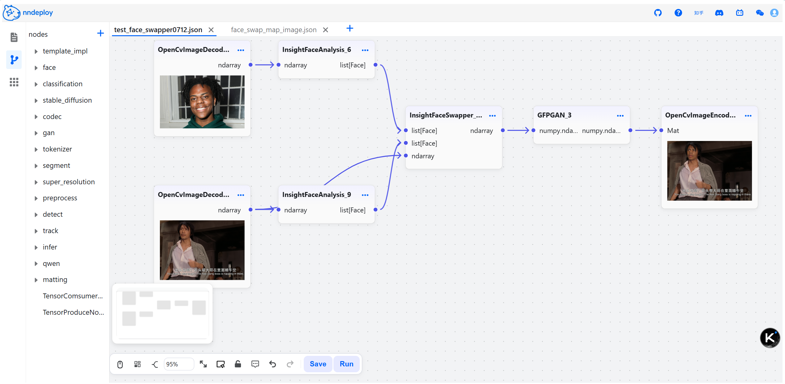

# Python 快速入门

nndeploy 提供了完整的 Python API，支持快速部署和推理各种深度学习模型。

## 环境要求

- Python 3.10+
- 支持的操作系统：Linux(< Python3.13 && x86)、Windows、macOS(OS >=14 && ARM)，其他平台建议采用开发者模式

## 安装方式

### 方式一：PyPI 安装（推荐）

适用于大多数用户的快速安装：

```bash
pip install nndeploy
```

### 方式二：源码编译安装

适用于开发者用户：

首先参照[build文档](build.md)，完成编译安装

```bash
cd ../python
pip install -e .
```

### 安装验证

运行以下命令确认安装成功：

```bash
python -c "import nndeploy; print(nndeploy.__version__)"
```

## 快速上手

### 启动可视化界面

nndeploy 提供了直观的 Web 界面用于模型部署：

```bash
# 启动 Workflow 的 Web 服务
cd /path/nndeploy
python app.py --port 8000

# 或 使用简化命令 启动 Workflow 的 Web 服务
nndeploy-app --port 8000
```

> 注：Windows下命令行启动：nndeploy-app.exe --port 8000

在浏览器中访问 `http://localhost:8000` 开始使用。

<p align="center">
  <picture>
    <source media="(prefers-color-scheme: dark)" srcset="../../image/workflow.png">
    
  </picture>
</p>

### 启动参数说明

`app.py`启动脚本支持以下参数用于自定义Web服务行为：

| 参数名                    | 默认值                          | 说明                                                         |
| ---------------------- | ---------------------------- | --------------------------------------------------------         |
| `--host`               | `0.0.0.0`                    | 指定监听地址                                                       |
| `--port`               | `8888`                       | 指定监听端口                                                       |
| `--resources`          | `./resources`                | 指定资源文件目录路径                                                |
| `--log`                | `./logs/nndeploy_server.log` | 指定日志输出文件路径                                                |
| `--front-end-version`  | `!`                          | 指定前端版本，格式为 `owner/repo@tag`，如 `nndeploy/nndeploy-ui@v1.0.0` |
| `--debug / --no-debug` | `False`                      | 是否启用调试模式，启用后将禁用前端静态文件挂载                           |

### 常见问题

Q1: 浏览器打开 http://localhost:8000 显示404？

A1: 请确认你是否已经构建或下载前端资源，并且未使用--debug启动。

Q2: 启动时download前端资源文件一直失败怎么办？

A2: 从`https://github.com/nndeploy/nndeploy_frontend/releases/`下载对应的dist.zip，将zip解压到`frontend/owner_repo/tag/`目录下（通常下载失败后会自动建立该目录），重新启动服务。

Q3: 如何切换使用不同版本的前端?

A3: 使用 --front-end-version 参数指定版本，例如：
```
python app.py --front-end-version nndeploy/nndeploy-ui@v1.1.0
```

Q4: 前端资源下载完成了，还是无法打开前端界面？

A4: 检查服务端IP以及端口是否正确，如果`localhost`以及`127.0.0.1`都无法访问，替换成局域网IP（如`192.168.x.x`）重试。

### 基于 Python API 部署模型 示例

```python
import nndeploy.base
import nndeploy.device
import nndeploy.dag
import nndeploy.detect
import nndeploy.codec

class YoloPyGraph(nndeploy.dag.Graph):
    """YOLO graph implementation for deploy pipeline, using PyTorch-like style"""
    def __init__(self, name, inputs: [nndeploy.dag.Edge] = [], outputs: [nndeploy.dag.Edge] = []):
        super().__init__(name, inputs, outputs)
        self.set_key(type(self).__name__)
        self.set_desc("YoloPyGraph")
        self.set_input_type(np.ndarray)
        self.set_output_type(nndeploy.detect.DetectResult)
        # Define modules in a PyTorch-like style: preprocess, inference, postprocess
        self.pre = self.create_node("nndeploy::preprocess::CvtResizeNormTrans", "pre")  # Preprocessing module
        self.infer = self.create_node("nndeploy::infer::Infer", "infer")  # Inference module
        self.post = self.create_node("nndeploy::detect::YoloPostProcess", "post")  # Postprocessing module
        
    def forward(self, inputs: [nndeploy.dag.Edge]):
        """Forward pass, similar to PyTorch's forward method"""
        # Forward pipeline: preprocess -> infer -> postprocess
        pre_outputs = self.pre(inputs)  # Preprocessing
        infer_outputs = self.infer(pre_outputs)  # Inference
        post_outputs = self.post(infer_outputs)  # Postprocessing
        return post_outputs
            
    def default_param(self):
        """Set default parameters for preprocessing"""
        pre_param = self.pre.get_param()
        pre_param.h_ = 640
        pre_param.w_ = 640
        return nndeploy.base.StatusCode.Ok
    
    def set_inference_type(self, inference_type):
        """Set inference backend type"""
        self.infer.set_inference_type(inference_type)
        
    def set_infer_param(self, device_type, model_type, is_path, model_value):
        """Configure inference parameters"""
        param = self.infer.get_param()
        param.device_type_ = device_type
        param.model_type_ = model_type 
        param.is_path_ = is_path
        param.model_value_ = model_value
        return nndeploy.base.StatusCode.Ok

    def set_version(self, version):
        """Set YOLO version for postprocessing"""
        param = self.post.get_param()
        param.version_ = version
        return nndeploy.base.StatusCode.Ok

class YoloPyGraphCreator(nndeploy.dag.NodeCreator):
    """Factory class for creating YoloPyGraph instances"""
    def __init__(self):
        super().__init__()
        
    def create_node(self, name: str, inputs: list[nndeploy.dag.Edge], outputs: list[nndeploy.dag.Edge]):
        self.node = YoloPyGraph(name, inputs, outputs)
        return self.node
    
# Register the graph creator
yolo_py_graph_creator = YoloPyGraphCreator()
nndeploy.dag.register_node("nndeploy.detect.YoloPyGraph", yolo_py_graph_creator)

class YoloPyDemo(nndeploy.dag.Graph):
    """End-to-end YOLO demo implementation, using PyTorch-like style"""
    def __init__(self, name = "", inputs: [nndeploy.dag.Edge] = [], outputs: [nndeploy.dag.Edge] = []):
        super().__init__(name, inputs, outputs)
        self.set_key(type(self).__name__)
        self.set_desc("YoloPyDemo")
        self.set_output_type(nndeploy.detect.DetectResult)
        # Create pipeline components
        self.decodec = nndeploy.codec.OpenCvImageDecode("decodec")  # Image decoder
        self.yolo = nndeploy.detect.YoloPyGraph("yolo")  # YOLO graph
        self.drawbox = nndeploy.detect.DrawBox("drawbox")  # Bounding box drawer
        self.encodec = nndeploy.codec.OpenCvImageEncode("encodec")  # Image encoder
        
    def forward(self):
        """Forward pass, similar to PyTorch's forward method"""
        decodec_outputs = self.decodec()
        yolo_outputs = self.yolo(decodec_outputs)
        drawbox_outputs = self.drawbox([decodec_outputs[0], yolo_outputs[0]])
        self.encodec(drawbox_outputs)
        return yolo_outputs
       
    def get_yolo(self):
        """Get YOLO graph instance"""
        return self.yolo
        
    def set_input_path(self, path):
        """Set input image path"""
        self.decodec.set_path(path)
        
    def set_output_path(self, path):
        """Set output image path"""
        self.encodec.set_path(path)
        

if __name__ == "__main__":
    # Main execution for YOLO demo
    yolo_py_demo = YoloPyDemo("yolo_py_demo")

    # Configure YOLO parameters
    yolo = yolo_py_demo.get_yolo()
    yolo.default_param()
    yolo.set_inference_type(nndeploy.base.InferenceType.OnnxRuntime)
    yolo.set_infer_param(nndeploy.base.DeviceType("x86"), nndeploy.base.ModelType.Onnx, True, ["path/yolo11s.sim.onnx"])

    # Set input/output paths
    yolo_py_demo.set_input_path("path/sample.jpg")
    yolo_py_demo.set_output_path("path/sample_output.jpg")

    # Run end-to-end demo
    output = yolo_py_demo()

    # Print detection results
    result = output[0].get_graph_output()
    print(f"yolo_py_demo:")
    for bbox in result.bboxs_:
        print(f"  Class ID: {bbox.label_id_}, Confidence: {bbox.score_:.2f}, Bounding Box: {bbox.bbox_}")

    # Save results to file
    yolo_py_demo.save_file("path/yolo_py_demo.json")
    
    # run YOLO model through json file
    json_model = YoloPyDemo("json_model")
    json_model.load_file("path/yolo_py_demo.json")
    output = json_model()
    result = output[0].get_graph_output()
    print(f"json_model:")
    for bbox in result.bboxs_:
        print(f"  Class ID: {bbox.label_id_}, Confidence: {bbox.score_:.2f}, Bounding Box: {bbox.bbox_}")
```

