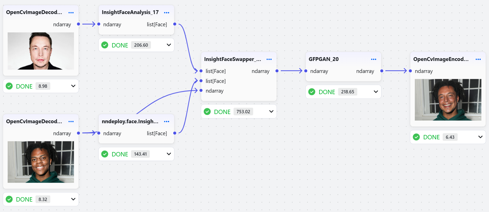

# Python 快速入门

nndeploy 提供了完整的 Python API，支持快速部署和推理各种深度学习模型。

## 环境要求

- Python 3.10+
- 支持的操作系统：Linux、macOS、Windows

## 安装方式

### 方式一：PyPI 安装（推荐）

适用于大多数用户的快速安装：

```bash
pip install nndeploy
```

### 方式二：源码编译安装

适用于开发者用户：

首先参照[build文档](build.md)，完成编译安装

```bash
cd ../python
pip install -e .
```

### 安装验证

运行以下命令确认安装成功：

```bash
python -c "import nndeploy; print(nndeploy.__version__)"
```

## 快速上手

### 启动可视化界面

nndeploy 提供了直观的 Web 界面用于模型管理和推理：

```bash
# 启动 Workflow 的 Web 服务
cd /path/nndeploy
python app.py --port 8000

# 或 使用简化命令 启动 Workflow 的 Web 服务
nndeploy-app --port 8000
```

在浏览器中访问 `http://localhost:8000` 开始使用。

<p align="center">
  <picture>
    <source media="(prefers-color-scheme: dark)" srcset="../../image/workflow.png">
    
  </picture>
</p>

### 基于 Python API 部署模型 示例

```python

```

