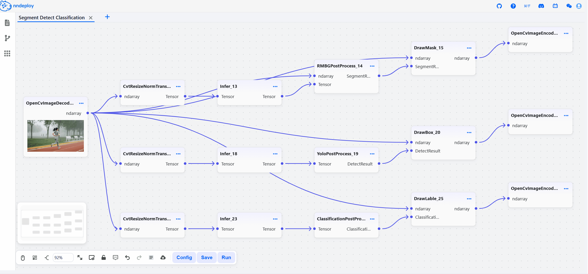

# Visual Workflow Quick Start

> [更多workflow模板](https://github.com/nndeploy/nndeploy-workflow)

## 环境要求

- Python 3.10+
- 支持的操作系统：Linux、Windows、macOS(待进一步测试)


## 启动可视化界面

nndeploy 提供了直观的 Web 界面用于模型部署：

```bash
# pip
pip install nndeploy

# 启动 Workflow 的 Web 服务
cd /path/nndeploy
python app.py --port 8000

# 或 使用简化命令 启动 Workflow 的 Web 服务
nndeploy-app --port 8000
```

> 注：Windows下命令行启动：nndeploy-app.exe --port 8000

在浏览器中访问 `http://localhost:8000` 开始使用。

<p align="center">
  <picture>
    <source media="(prefers-color-scheme: dark)" srcset="../../image/workflow.png">
    
  </picture>
</p>

## 启动参数说明

`app.py`启动脚本支持以下参数用于自定义Web服务行为：

| 参数名                    | 默认值                          | 说明                                                         |
| ---------------------- | ---------------------------- | --------------------------------------------------------         |
| `--host`               | `0.0.0.0`                    | 指定监听地址                                                       |
| `--port`               | `8888`                       | 指定监听端口                                                       |
| `--resources`          | `./resources`                | 指定资源文件目录路径                                                |
| `--log`                | `./logs/nndeploy_server.log` | 指定日志输出文件路径                                                |
| `--front-end-version`  | `!`                          | 指定前端版本，格式为 `owner/repo@tag`，如 `nndeploy/nndeploy-ui@v1.0.0` |
<!-- | `--debug / --no-debug` | `False`                      | 是否启用调试模式，启用后将禁用前端静态文件挂载                           | -->
| `--plugin`             | `[]`                         | 支持传入多个python文件路径或者动态库路径，用于加载用户写好的自定义插件，默认为空 |

## 常见问题

Q1: 浏览器打开 http://localhost:8000 显示404？

A1: 请确认你是否已经下载前端资源。

Q2: 启动时download前端资源文件一直失败怎么办？

A2: 从`https://github.com/nndeploy/nndeploy_frontend/releases/`下载对应的dist.zip，将zip解压到`frontend/owner_repo/tag/`目录下（通常下载失败后会自动建立该目录），重新启动服务。

Q3: 如何切换使用不同版本的前端?

A3: 使用 --front-end-version 参数指定版本，例如：
```
python app.py --front-end-version nndeploy/nndeploy-ui@v1.1.0
```

Q4: 前端资源下载完成了，还是无法打开前端界面？

A4: 检查服务端IP以及端口是否正确，如果`localhost`以及`127.0.0.1`都无法访问，替换成局域网IP（如`192.168.x.x`）重试。

## 案例展示

### YOLO 可视化调参与一键部署

可视化界面实时调整检测参数，无需修改代码即可观察效果变化，支持一键切换到 TensorRT 等推理引擎实现高性能部署。

<p align="left">
  <picture>
    <source media="(prefers-color-scheme: dark)" srcset="yolo_edit_param.gif">
    
  </picture>
</p>

### 多模型工作流演示

可视化搭建检测+分割+分类工作流，支持多推理框架切换和并行模式，实现一次搭建、多端部署。

<p align="left">
  <picture>
    <source media="(prefers-color-scheme: dark)" srcset="seg_detect_class.gif">
    
  </picture>
</p>

### 零代码搭建换脸+分割工作流

通过拖拽操作组合人脸检测、换脸算法、人像分割等 AI 功能，无需编写代码，参数调整 1-2 秒看到效果。让**产品经理、设计师、非 AI 开发者**快速将创意变成原型。

<p align="left">
  <picture>
    <source media="(prefers-color-scheme: dark)" srcset="face_swap_seg.gif">
    
  </picture>
</p>
