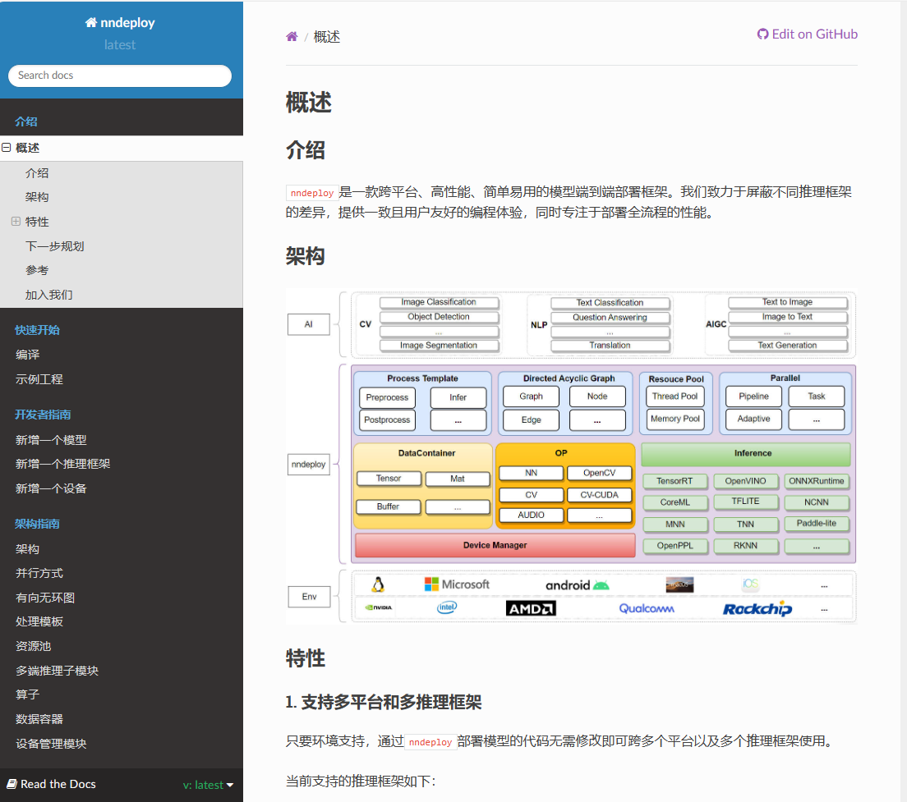

经过几个月的开发，nndeploy完成了预期的诸多目标，架构也趋于稳定，新的架构更加契合我们的目标——支持多平台、高性能、简单易用的机器学习部署框架，做到一个框架就可完成多端(云、边、端)模型的高性能部署。

本次更新完善了基础架构，增加了新的功能，构建了更多用例，我们希望新的版本能够在更多地方实际应用，带来生产价值。欢迎体验新版本，期待你的反馈，更期待你的加入：https://github.com/DeployAI/nndeploy

nndeploy v1.0.0.0 主要包含以下新增特性、功能和优化：

## 1.有向无环图完善

支持的几种构图方式

node 和 edge之间的关联

## 2.数据容器完善

接口

生命周期管理等

## 3.线程池

作为规划中资源池的第一步（另一个是内存池），[线程池](https://github.com/DeployAI/nndeploy/tree/main/include/nndeploy/thread_pool)在 nndeploy 中扮演着至关重要的角色。它支撑nndeploy并行的需求，为任务级并行和流水线并行提供了稳定的基础。线程池的实现让系统能够更高效地管理并发任务，有效利用计算资源，并提升系统整体的性能表现。

## 4.图执行器

依赖先前构建的有向无环图，我们规划了多种图的执行方式，并形成了多种图执行器：

+ SequentialExecutor

面向串行执行的场景，按照拓扑排序方式依次执行图中的每个节点。

+ ParallelTaskExecutor

在多模型以及多硬件设备的的复杂场景下，基于有向无环图的模型部署方式，可充分挖掘模型部署中的并行性，将各个节点并行起来，缩短单次算法全流程运行耗时。

+ ParallelPipelineExecutor

在处理多帧的场景下，基于有向无环图的模型部署方式，可将前处理 Node、推理 Node、后处理 Node绑定三个不同的线程，每个线程又可绑定不同的硬件设备下，从而三个Node可流水线并行处理。在多模型以及多硬件设备的的复杂场景下，更加可以发挥流水线并行的优势，从而可显著提高整体吞吐量。

+ ConditionExecutor

在多个节点运行速度差异较大时，可以将部分耗时大的节点复制多份，在数据级并行工作。例如分别有1个前处理与后处理节点，4个推理节点并行工作，可同时对4张图片处理。

+ ParallelPipelineConditionExecutor

该执行器是ConditionExecutor的流水线并行版本，集成了数据级并行和流水线并行的优势，更加提高吞吐率。

## 5.推理引擎支持

## 6.模型支持

nndeploy目前支持检测、分割两种类型的任务。检测网络包括yolov5、yolov6、yolov8，分割网络包括SAM（segment anything），对于这些网络的模型文件，我们提供了[Model ZOO)](https://huggingface.co/alwaysssss/nndeploy/tree/main/model_zoo)供用户使用。

对于模型推理的输入，目前支持单个图片、多张图片、视频、相机等多个输入源，并提供了编解码节点。除了[计算图的定义](https://github.com/DeployAI/nndeploy/tree/main/source/nndeploy/model)，我们还提供了[demo](https://github.com/DeployAI/nndeploy/tree/main/demo)以供用户测试。当然我们也提供了清晰、易用的API，可以快速搭建新网络的计算图，并构建demo测试。

下图为SAM分割示例：

## 7.设备支持

## 8. 文档

构建了友好、全面的[文档系统](https://nndeploy-zh.readthedocs.io/zh/latest/introduction/README.html)，文档不以事无巨细地讲解API接口及用法为目的，而是侧重于深入原理讲解与教学。文档内容包含概述、开发者指南、架构指南等多个部分，旨在帮助用户更好地理解系统的设计思路和工作原理。

这份文档系统正在逐步完善中，致力于为用户提供清晰、易懂的指导，让他们可以快速上手并充分利用系统功能。通过深入探讨系统背后的原理和设计理念，用户可以更加全面地了解系统的运作方式，从而更好地应用于实际项目中。

在未来的更新中，我们将继续完善文档内容，确保其覆盖范围广泛且深入，使之成为开发者们的可靠指南。感谢您的关注和支持，如果您有任何建议或意见，欢迎随时与我们分享！

## roadmap

+   分布式

    实现系统在多台服务器上的分布式部署，让不同节点共同完成任务，提高系统整体的处理能力和容错性。

+   serving 与 前端

    实现模型的部署和服务化，让用户可以通过简单的接口调用模型，同时支持与前端交互，提供友好的用户体验。

+   部署算法

    支持BEV、InstantID、OCR等多种模型。

+   内存池

    建立内存池机制来管理系统中的内存分配与释放，提高内存的利用效率和系统的稳定性。

## 贡献者

感谢以下贡献者：

@[Alwaysssssss](https://github.com/Alwaysssssss)，@[youxiudeshouyeren](https://github.com/youxiudeshouyeren)，@[02200059Z](https://github.com/02200059Z)，@[JoDio-zd](https://github.com/JoDio-zd)，@[qixuxiang](https://github.com/qixuxiang)，@[100312dog](https://github.com/100312dog)，@[CYYAI](https://github.com/CYYAI)，@[PeterH0323](https://github.com/PeterH0323)，@[zjhellofss](https://github.com/zjhellofss)，@[zhouhao03](https://github.com/zhouhao03)，@[jaywlinux](https://github.com/jaywlinux)，@[ChunelFeng](https://github.com/ChunelFeng)，@[acheerfulish](https://github.com/acheerfulish)，@[wangzhaode](https://github.com/wangzhaode)

## 欢迎志同道合的同学加入

nndeploy还在发展阶段，我们有许多想法正在实现中，如果你也是热爱开源、喜欢折腾的同学，不论是出于学习的目的，抑或是有更好的idea想要实现，欢迎你的加入。我们不定时讨论各种技术的实现，分享行业见解，更能打磨自己的技术，获得有挑战的成就感。欢迎微信联系：**titian5566** ，备注nndeploy。

