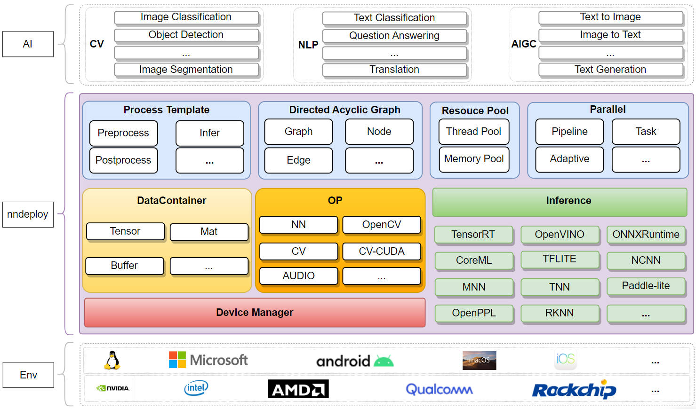
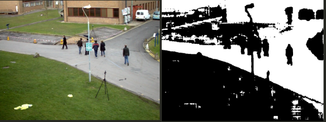
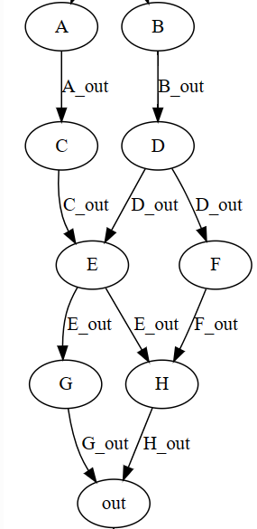

# v1.0.0.0

历时七个月，14位开发者，223次commit，nndeploy迎来了稳定的v1.0.0.0版本。该版本完善了架构，增加了新功能，构建了用例，攥写了文档。当前版本更契合我们的目标——一款支持多平台、高性能、简单易用的机器学习部署框架

我们希望v1.0.0.0版本能够在更多实际场景下应用，产生业务价值。欢迎体验新版本，期待您的反馈，更期待您的加入：https://github.com/DeployAI/nndeploy

nndeploy v1.0.0.0 主要包含以下新增功能、亮点和优化：

## 1. 优化后的全新架构

## 2. 新增模型支持

我们新增对分割模型SAM（segment anything）的支持，下图为SAM分割示例结果：（能将这副图片横过来吗？左边为输入，右边为输出，图片尺寸再小一些呀）

## 3. 新增多种并行模式
- 串行

面向硬件资源受限场景，按照有向无环图的拓扑排序，依次执行每个节点。

- 任务并行

在多模型以及多硬件设备的的复杂场景下，基于有向无环图的模型部署方式，可充分挖掘模型部署中的并行性，缩短单次算法全流程运行耗时。

- 流水线

在处理多帧的场景下，基于有向无环图的模型部署方式，可将前处理 Node、推理 Node、后处理 Node绑定三个不同的线程，每个线程又可绑定不同的硬件设备下，从而三个Node可流水线并行处理。在多模型以及多硬件设备的的复杂场景下，更加可以发挥流水线并行的优势，从而可显著提高整体吞吐量。

- 混合并行

在流水线并行中，当某个节点如推理节点开销过大时，就会成为瓶颈，无法发挥流水线并行的优势。通过并行运行多个推理节点，加快对上一生产者节点产生数据的消耗，同时也加快对下一消费者节点的供给，可以消除流水线并行的瓶颈，提高吞吐率。

**性能结果比对**

+ 串行 vs 流水线并行

*以下数据来自24张图片构成的数据集

| 模型 | 推理引擎 | 运行方式|耗时（ms） |
|-----|-----|-----|-----|
| YoloV5 | onnxruntime | 串行 |936.359 |
| YoloV5 | onnxruntime | 流水线并行 | 796.763  |
| YoloV5 | TensorRT | 串行 | 327.416 |
| YoloV5 | TensorRT | 流水线并行 | 120.463|

+ 串行 vs 任务级并行

*由于当前模型的推理流程内部并行度很小，不足以体现出任务级并行，我们构造了一个虚拟图；当每个节点耗时设置为10ms时，通过任务级并行可以将串行的90ms减少到50ms。

## 4. 新增线程池

[线程池](https://github.com/DeployAI/nndeploy/tree/main/include/nndeploy/thread_pool)在nndeploy中扮演着至关重要的角色。它支撑nndeploy并行的需求，为任务级并行和流水线并行提供了稳定的基础。线程池的实现让框架能够更高效地管理并发任务，有效利用计算资源，并提升框架整体的性能表现。

## 5. 有向无环图的优化与重构
- Node重构与优化

Node是有向无环图中的节点，代表进行某项运算或操作。前处理、推理、后处理、编解码都是节点，整个有向无环图也可以看做一个节点。节点本身不持有任何数据，数据从输入边流入，经过计算后，流出到输出边中。

- Edge的重构与优化

Edge是有向无环图中的边，代表数据流动的方向，每个节点的输出边负责管理内存。Edge中可能持有Mat、Tensor、Buffer等数据。Edge分为固定边和流水线边，在串行、任务级并行中仅使用固定边；在流水线并行中仅使用流水线边。

- Graph的重构与优化

Graph是有向无环图。由一系列Node、Edge及其拓扑关系组成，Graph中也可以嵌入Graph。

- 新增Loop Graph

- 新增Condition Graph

## 6. 推理模板的重构

对推理模板进行重构，基于多端推理模块 `Inference` + 有向无环图节点 `Node` 重新设计功能强大的**推理模板Infer**，Infer推理模板可以帮您在内部处理不同的模型带来差异，例如**单输入、多输出、静态形状输入、动态形状输入、静态形状输出、动态形状输出、是否可操作推理框架内部分配输入输出**等等一系列不同，面对不同的模型带来差异，通常需要具备丰富模型部署经验的工程师才能快速且高性能解决。

## 7. 新增编解码节点化

对于已部署好的模型，需要编写demo展示效果，而demo需要处理多种格式的输入，例如**图片输入输出、文件夹中多张图片的输入输出、视频的输入输出**等，通过将上述编解码节点化，可以更通用以及更高效的完成demo的编写，达到快速展示效果的目的。

## 8.多端推理子模块

当前版本新增如下推理框架的支持：

| Inference/OS                                                                     | Linux | Windows | Android | MacOS |  IOS  | developer                                                                          | remarks |
| :------------------------------------------------------------------------------- | :---: | :-----: | :-----: | :---: | :---: | :--------------------------------------------------------------------------------- | :-----: |
| [ncnn](https://github.com/Tencent/ncnn)                                          |   -   |    -    |    √    |   -   |   -   | [Always](https://github.com/Alwaysssssss)                                          |         |
| [coreML](https://github.com/apple/coremltools)                                   |   -   |    -    |    -    |   √   |   -   | [JoDio-zd](https://github.com/JoDio-zd)、[jaywlinux](https://github.com/jaywlinux) |         |
| [paddle-lite](https://github.com/PaddlePaddle/Paddle-Lite)                       |   -   |    -    |    -    |   -   |   -   | [qixuxiang](https://github.com/qixuxiang)                                          |         |
| [AscendCL](https://www.hiascend.com/zh/)                                         |   √   |    -    |    -    |   -   |   -   | [CYYAI](https://github.com/CYYAI)                                                  |         |
| [RKNN](https://www.rock-chips.com/a/cn/downloadcenter/BriefDatasheet/index.html) |   √   |    -    |    -    |   -   |   -   | [100312dog](https://github.com/100312dog)                                          |         |

## 9. 设备管理模块

当前版本新增如下华为昇腾设备管理模块的支持：

| Device Manager                           | developer                         | remarks |
| :--------------------------------------- | :-------------------------------- | :-----: |
| [AscendCL](https://www.hiascend.com/zh/) | [CYYAI](https://github.com/CYYAI) |         |

## 10. 文档

构建了友好、全面的[文档](https://nndeploy-zh.readthedocs.io/zh/latest/introduction/README.html)，文档不以讲解API接口的用法为目的，而是侧重于探讨框架背后的设计理念和工作原理，用户可以更加全面地了解框架的运作方式，从而更好地发挥nndeploy在模型部署上的开发效率以及高性能的优势。

本次文档包含概述、开发者指南、架构指南等模块的部分内容，在未来的更新中，我们将继续完善文档内容，致力于为用户提供清晰、易懂的文档说明。

## 下一步规划

- 部署算法
  - [BEV](https://github.com/fundamentalvision/BEVFormer)
  - [InstantID](https://github.com/InstantID/InstantID)
  - [OCR](https://github.com/PaddlePaddle/PaddleOCR)
  - ......
- 推理后端
  - 完善已接入的推理框架coreml
  - 完善已接入的推理框架paddle-lite
  - 接入新的推理框架TFLite
- 设备管理模块
  - 新增OpenCL的设备管理模块
  - 新增ROCM的设备管理模块
- 内存优化
  - 针对nndeploy的内部的数据容器Buffer、Mat、Tensor，建立异构设备的内存池，实现高性能的内存分配与释放
  - 基于模型部署的有向无环图，在串行执行的模式下，支持多节点共享内存机制
  - 基于模型部署的有向无环图，在流水线并行执行的模式下，支持边的环形队列共享内存机制
- 高性能op
  - 对opencv高性能算子的补充
  - 对推理框架缺失算子的补充
- 分布式
  - 在多模型共同完成一个任务的场景里，将多个模型调度到多个机器上分布式执行
  - 在大模型的场景下，通过切割大模型为多个子模型的方式，将多个子模型调度到多个机器上分布式执行

## 贡献者

感谢以下贡献者：

@[Alwaysssssss](https://github.com/Alwaysssssss)，@[youxiudeshouyeren](https://github.com/youxiudeshouyeren)，@[02200059Z](https://github.com/02200059Z)，@[JoDio-zd](https://github.com/JoDio-zd)，@[qixuxiang](https://github.com/qixuxiang)，@[100312dog](https://github.com/100312dog)，@[CYYAI](https://github.com/CYYAI)，@[PeterH0323](https://github.com/PeterH0323)，@[zjhellofss](https://github.com/zjhellofss)，@[zhouhao03](https://github.com/zhouhao03)，@[jaywlinux](https://github.com/jaywlinux)，@[ChunelFeng](https://github.com/ChunelFeng)，@[acheerfulish](https://github.com/acheerfulish)，@[wangzhaode](https://github.com/wangzhaode)

## 加入我们

- nndeploy是由一群志同道合的网友共同开发以及维护，我们不定时讨论技术，分享行业见解。当前nndeploy正处于发展阶段，如果您热爱开源、喜欢折腾，不论是出于学习目的，抑或是有更好的想法，欢迎加入我们，收获成就，打磨技术，通过草根的力量，一起共同打造最简单易用、最高性能的模型端到端部署框架。
- 微信：titian5566 (可加我微信进nndeploy交流群，备注：nndeploy+姓名)